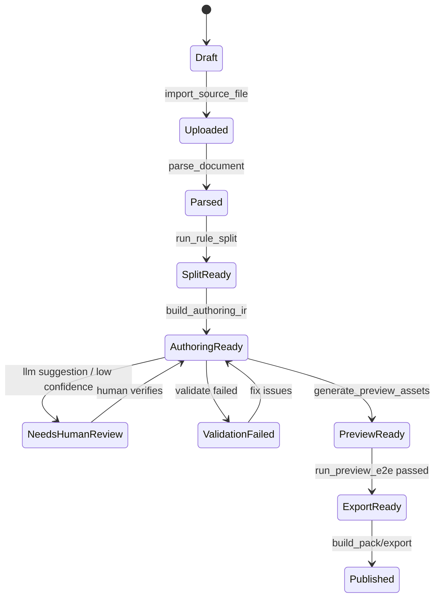

# Epic 8：Tauri 作者端应用详细设计

来源：[[Epic8-作者端Web导题与组卷器工程设计]]

目标项目：`/Users/maziheng/Downloads/0.3.1 working`

最后更新：2026-05-29

## 产品形态

最终作者端建议做成 **Tauri + Rust 后端 + Web UI** 的本地桌面应用：

- Windows 分发：`.exe` / `.msi`
- macOS 分发：`.dmg`
- Web UI 负责复杂人工操作：上传、解析预览、题组切分、修题、LLM diff、统一阅读页预览、Pack 发布。
- Rust 后端负责本地权限边界：文件读写、任务状态机、密钥/设置、sidecar 调度、日志、导出。
- Node sidecar 复用现有项目的 JS 生成器、DOM 校验器、统一阅读页预览/E2E。
- Python sidecar 负责 PDF/Word/OCR/Docling 等文档转换。
- LLM Gateway 统一接 OpenAI compatible API、本地模型或机构代理。

设计原则：作者端是内部生产工具，不随学生端交付；它生成学生端需要的题库 JS/manifest/Pack，但本身可以携带导题、LLM、校验和调试能力。

## 桌面应用结构树

```text
ielts-author-studio/
├─ src-tauri/
│  ├─ Cargo.toml
│  ├─ tauri.conf.json
│  ├─ capabilities/
│  │  └─ default.json
│  ├─ binaries/
│  │  ├─ node-validator-{target}
│  │  ├─ python-parser-{target}
│  │  └─ preview-server-{target}
│  └─ src/
│     ├─ main.rs
│     ├─ app_state.rs
│     ├─ commands/
│     │  ├─ jobs.rs
│     │  ├─ files.rs
│     │  ├─ parser.rs
│     │  ├─ llm.rs
│     │  ├─ authoring.rs
│     │  ├─ validate.rs
│     │  ├─ preview.rs
│     │  ├─ pack.rs
│     │  └─ settings.rs
│     ├─ services/
│     │  ├─ job_service.rs
│     │  ├─ file_service.rs
│     │  ├─ parser_service.rs
│     │  ├─ llm_service.rs
│     │  ├─ authoring_service.rs
│     │  ├─ template_service.rs
│     │  ├─ export_service.rs
│     │  ├─ validation_service.rs
│     │  ├─ preview_service.rs
│     │  ├─ pack_service.rs
│     │  └─ settings_service.rs
│     ├─ models/
│     │  ├─ job.rs
│     │  ├─ document_ir.rs
│     │  ├─ authoring_ir.rs
│     │  ├─ reading_source.rs
│     │  ├─ validation.rs
│     │  ├─ llm.rs
│     │  ├─ pack.rs
│     │  └─ settings.rs
│     └─ storage/
│        ├─ db.rs
│        ├─ migrations/
│        └─ paths.rs
├─ src/
│  ├─ app/
│  │  ├─ router.tsx
│  │  ├─ layout/
│  │  └─ stores/
│  ├─ pages/
│  │  ├─ Dashboard.tsx
│  │  ├─ ImportWizard.tsx
│  │  ├─ DocumentReview.tsx
│  │  ├─ SplitAndAnswers.tsx
│  │  ├─ GroupEditor.tsx
│  │  ├─ LlmReview.tsx
│  │  ├─ UnifiedPreview.tsx
│  │  ├─ PackBuilder.tsx
│  │  ├─ JobAudit.tsx
│  │  └─ Settings.tsx
│  ├─ components/
│  │  ├─ document/
│  │  ├─ authoring/
│  │  ├─ validation/
│  │  ├─ llm/
│  │  └─ preview/
│  ├─ api/
│  │  └─ tauriCommands.ts
│  └─ types/
│     ├─ job.ts
│     ├─ document-ir.ts
│     ├─ authoring-ir.ts
│     ├─ validation.ts
│     └─ settings.ts
└─ sidecars/
   ├─ node-validator/
   ├─ python-parser/
   └─ preview-server/
```

## 本地数据目录

应用只应读写自己的 app data 目录和用户显式选择的导出目录。不要默认扫描用户磁盘。

```text
AppData / Application Support / IELTS Author Studio/
├─ config/
│  ├─ settings.json
│  └─ llm-profiles.json
├─ secrets/
│  └─ keyring-or-stronghold-managed
├─ jobs/
│  └─ import-20260529-001/
│     ├─ job.json
│     ├─ uploads/
│     │  ├─ source.pdf
│     │  └─ answers.docx
│     ├─ document-ir.json
│     ├─ split-candidates.json
│     ├─ authoring-ir.json
│     ├─ revisions.jsonl
│     ├─ llm-calls.jsonl
│     ├─ validation-report.json
│     ├─ preview/
│     │  ├─ manifest.js
│     │  └─ p1-medium-001.js
│     └─ exports/
│        ├─ p1-medium-001.json
│        ├─ p1-medium-001.js
│        └─ manifest.js
├─ packs/
│  └─ pack-20260529-basic/
├─ logs/
│  └─ app-2026-05-29.log
└─ cache/
   ├─ parser/
   ├─ thumbnails/
   └─ preview-server/
```

## Web UI 信息架构

```text
主窗口
├─ 左侧导航
│  ├─ 工作台
│  ├─ 导题任务
│  ├─ 题库草稿
│  ├─ Pack 组卷
│  ├─ 校验报告
│  ├─ LLM 调用记录
│  └─ 设置
└─ 主内容区
   ├─ 顶部 job 状态条
   ├─ 当前步骤面包屑
   ├─ 编辑/预览主体
   └─ 底部操作栏
```

### 页面树

```text
/dashboard
/jobs
/jobs/new
/jobs/:jobId
/jobs/:jobId/document
/jobs/:jobId/split
/jobs/:jobId/groups
/jobs/:jobId/llm-review
/jobs/:jobId/preview
/jobs/:jobId/validate
/jobs/:jobId/export
/packs
/packs/new
/packs/:packId
/settings
/settings/llm
/settings/parsers
/settings/storage
/settings/about
```

## 核心用户流程

### 流程 1：首次配置 LLM

1. 用户打开应用。
2. 进入 `设置 -> 大模型`。
3. 新建 LLM Profile。
4. 填写 Provider、Base URL、API Key、Model、温度、超时、是否强制 JSON。
5. 点击“测试连接”。
6. 后端发起一个轻量 JSON 测试请求。
7. 成功后保存 profile，API Key 进入系统 keychain/stronghold，不进入普通 JSON。

### 流程 2：创建导题任务

1. 用户点击“新建导题任务”。
2. 选择 PDF/Word。
3. 可选上传答案文档或答案页。
4. 设置题目标题、Passage 分类、难度、标签。
5. 点击“开始解析”。
6. Rust 创建 job 目录，复制文件，计算 hash，启动 parser sidecar。
7. 解析完成后进入文档预览页。

### 流程 3：解析预览与粗切

1. 页面左侧展示原文页面缩略图或渲染图。
2. 右侧展示 Document IR 块列表。
3. 用户确认 Passage 区、题组区、答案区。
4. 系统运行规则粗切，生成 split candidates。
5. 用户合并/拆分题组，修正题号范围和答案。

### 流程 4：LLM 辅助结构化

1. 用户在题组编辑器选择“LLM 识别题型”。
2. 前端调用 `llm_classify_group(jobId, groupId, profileId)`。
3. Rust 读取候选文本，拼 prompt，调用模型。
4. 模型返回 JSON。
5. Rust 校验 JSON schema。
6. 前端展示 diff：当前 IR vs LLM 建议。
7. 用户点击“应用建议”或“拒绝”。
8. 所有模型输入输出写入 `llm-calls.jsonl`。

### 流程 5：模板渲染与统一阅读页预览

1. 用户点击“生成预览”。
2. Rust 将 Authoring IR 转成 ReadingExamSourceV1。
3. Rust 调 Node validator 检查 schema 和 DOM 协议。
4. Rust 输出临时 `manifest.js` 和单题 JS 到 job preview 目录。
5. 前端 iframe 打开统一阅读页预览。
6. 用户可手动答题，也可点击“自动填正确答案测试”。
7. E2E 校验通过后进入导出。

### 流程 6：导出 JS / 组 Pack

1. 用户点击“导出题库 JS”。
2. 系统输出：
   - `p1-medium-001.json`
   - `p1-medium-001.js`
   - `manifest.js`
   - `validation-report.json`
3. 用户进入 Pack 组卷。
4. 选择多个已通过题目。
5. 填 Pack 名称、版本、机构、有效期、说明。
6. 点击“生成 Pack”。
7. 系统生成 Pack 目录或 zip。

## 页面详细设计

### 1. 工作台 Dashboard

结构：

```text
Dashboard
├─ 顶部统计
│  ├─ 草稿数
│  ├─ 待人工确认
│  ├─ 校验失败
│  └─ 可发布
├─ 最近任务列表
├─ 最近 Pack
└─ 快捷操作
   ├─ 新建导题任务
   ├─ 打开 Pack 组卷
   └─ LLM 设置
```

主要动作：

- 点击任务进入 `/jobs/:jobId`。
- 点击“新建导题任务”进入上传向导。

### 2. 新建导题任务 ImportWizard

结构：

```text
ImportWizard
├─ Step 1 上传文件
│  ├─ 主文件 PDF/DOCX
│  ├─ 答案文件 可选
│  └─ 解析模式 文本 / OCR / 自动
├─ Step 2 基础信息
│  ├─ 标题
│  ├─ Passage 分类 P1/P2/P3
│  ├─ 难度 low/medium/high
│  └─ 标签
├─ Step 3 LLM 配置
│  ├─ 是否启用 LLM 辅助
│  ├─ LLM Profile
│  └─ 自动识别范围
└─ 底部操作
   ├─ 取消
   └─ 创建并解析
```

表单字段：

| 字段 | 类型 | 说明 |
|---|---|---|
| `sourceFilePath` | file | 用户选择的 PDF/DOCX |
| `answerFilePath` | file? | 可选答案文件 |
| `parseMode` | enum | `auto/text/ocr` |
| `title` | string | 题目标题，可从文档推断 |
| `category` | enum | `P1/P2/P3` |
| `frequency` | enum | `low/medium/high` |
| `tags` | string[] | 机构自定义 |
| `llmEnabled` | boolean | 是否在解析后调用 LLM |
| `llmProfileId` | string? | 使用哪个大模型配置 |

### 3. 文档解析预览 DocumentReview

结构：

```text
DocumentReview
├─ 左侧 DocumentCanvas
│  ├─ 页面缩略图
│  ├─ bbox 高亮
│  └─ 低置信度标记
├─ 右侧 BlockInspector
│  ├─ block 列表
│  ├─ 文本内容
│  ├─ 类型 paragraph/table/image
│  └─ confidence
└─ 底部操作
   ├─ 重新解析
   ├─ 保存修正
   └─ 进入粗切
```

交互：

- 点击 block，高亮原文位置。
- 修改 block 类型。
- 合并 block。
- 标记 block 为 Passage / Question / Answer / Ignore。

### 4. 粗切与答案对齐 SplitAndAnswers

结构：

```text
SplitAndAnswers
├─ Passage 区
│  ├─ 标题候选
│  └─ 正文 block 范围
├─ 题组区
│  ├─ group 列表
│  ├─ 题号范围
│  ├─ 说明文字
│  └─ block 范围
├─ 答案区
│  ├─ answerKey 表格
│  ├─ 自动抽取候选
│  └─ 缺失/冲突提示
└─ 底部操作
   ├─ 运行规则粗切
   ├─ 应用 LLM 初始识别
   └─ 进入题组编辑
```

答案表字段：

| 字段 | 说明 |
|---|---|
| `displayNumber` | 原文题号，如 `27` |
| `internalId` | 运行时题号，如 `q1` |
| `answer` | 标准答案 |
| `answerType` | `text/option/list` |
| `source` | `manual/rule/llm/imported` |
| `confidence` | 抽取置信度 |
| `verified` | 是否人工确认 |

### 5. 题组结构化编辑器 GroupEditor

结构：

```text
GroupEditor
├─ 左栏 GroupNavigator
│  ├─ group-1 Questions 1-8
│  ├─ group-2 Questions 9-13
│  └─ 校验状态
├─ 中栏 GroupForm
│  ├─ kind
│  ├─ instruction
│  ├─ questions
│  ├─ options
│  ├─ answers
│  └─ layout template
├─ 右栏 LiveBodyHtmlPreview
│  ├─ 题组 HTML 预览
│  ├─ DOM 协议检查
│  └─ 采集结果预览
└─ 底部操作
   ├─ LLM 建议
   ├─ 渲染模板
   ├─ 校验当前题组
   └─ 下一组
```

题目编辑字段：

| 字段 | 说明 |
|---|---|
| `id` | 内部题号 `q1` |
| `displayNumber` | 原题号 |
| `prompt` | 题干 |
| `interaction.type` | `radio/checkbox/text/textarea/select/dragdrop/table/diagram` |
| `interaction.options` | 选项数组 |
| `answer` | 标准答案 |
| `sourceBlockIds` | 来源 block |
| `confidence` | 机器识别置信度 |
| `verified` | 人工确认 |

### 6. LLM 建议审阅 LlmReview

结构：

```text
LlmReview
├─ 左侧 CurrentIR
├─ 中间 DiffViewer
├─ 右侧 LlmSuggestion
├─ 顶部 PromptInfo
│  ├─ profile
│  ├─ model
│  ├─ prompt version
│  └─ token/cost
└─ 底部操作
   ├─ 应用全部
   ├─ 逐项应用
   ├─ 拒绝
   └─ 重新调用
```

规则：

- 低置信度建议不能自动应用。
- 修改答案必须额外确认。
- 所有建议以 JSON patch 形式保存。

### 7. 统一阅读页预览 UnifiedPreview

结构：

```text
UnifiedPreview
├─ 顶部预览状态
│  ├─ schema 校验
│  ├─ DOM 校验
│  ├─ E2E 校验
│  └─ 运行时错误
├─ iframe 预览区
│  └─ reading-practice-unified.html?examId=temp
├─ 右侧调试面板
│  ├─ collectedAnswers
│  ├─ answerKey
│  ├─ scoreInfo
│  └─ console errors
└─ 底部操作
   ├─ 重新生成预览
   ├─ 自动填正确答案
   ├─ 跑完整校验
   └─ 导出
```

### 8. PackBuilder

结构：

```text
PackBuilder
├─ 左侧可发布题库
│  ├─ 搜索
│  ├─ P1/P2/P3 筛选
│  ├─ 标签筛选
│  └─ 校验状态筛选
├─ 中间已选题
│  ├─ 顺序
│  ├─ Pack manifest
│  └─ 版本信息
├─ 右侧发布设置
│  ├─ packId
│  ├─ version
│  ├─ institution
│  ├─ validFrom/validTo
│  └─ description
└─ 底部操作
   ├─ 运行发布前检查
   └─ 生成 Pack
```

### 9. 设置 Settings

```text
Settings
├─ 大模型
│  ├─ Profiles
│  ├─ Base URL
│  ├─ API Key
│  ├─ Model
│  ├─ JSON Mode
│  ├─ Timeout
│  └─ Test Connection
├─ 解析器
│  ├─ PDF parser
│  ├─ OCR mode
│  ├─ Python sidecar status
│  └─ Temp cache
├─ 存储
│  ├─ App data path
│  ├─ Export default path
│  └─ Cache cleanup
├─ 预览
│  ├─ 统一阅读页路径
│  ├─ Node validator status
│  └─ Preview server port
└─ 关于
   ├─ 版本
   ├─ sidecar versions
   └─ 日志导出
```

## Rust 后端模型定义

### Job

```rust
#[derive(Serialize, Deserialize, Clone)]
pub struct ImportJob {
    pub job_id: String,
    pub title: String,
    pub status: JobStatus,
    pub category: Option<PassageCategory>,
    pub frequency: Option<Frequency>,
    pub tags: Vec<String>,
    pub source_files: Vec<SourceFile>,
    pub active_llm_profile_id: Option<String>,
    pub created_at: DateTime<Utc>,
    pub updated_at: DateTime<Utc>,
    pub current_step: WorkflowStep,
    pub issue_counts: IssueCounts,
}

pub enum JobStatus {
    Draft,
    Uploaded,
    Parsed,
    SplitReady,
    AuthoringReady,
    NeedsHumanReview,
    ValidationFailed,
    PreviewReady,
    ExportReady,
    Published,
}
```

字段说明：

| 字段 | 功能 |
|---|---|
| `job_id` | 导题任务唯一 ID，也是 job 目录名 |
| `title` | 题目标题，默认从文档识别，可人工修改 |
| `status` | 任务状态机 |
| `category` | P1/P2/P3 |
| `frequency` | low/medium/high |
| `source_files` | 上传文件列表 |
| `active_llm_profile_id` | 当前使用的大模型配置 |
| `current_step` | UI 当前流程步骤 |
| `issue_counts` | 校验错误、警告、待确认数量 |

### SourceFile

```rust
#[derive(Serialize, Deserialize, Clone)]
pub struct SourceFile {
    pub file_id: String,
    pub original_name: String,
    pub stored_name: String,
    pub file_type: SourceFileType,
    pub sha256: String,
    pub size_bytes: u64,
    pub role: SourceFileRole,
    pub imported_at: DateTime<Utc>,
}

pub enum SourceFileRole {
    MainQuestion,
    AnswerKey,
    Explanation,
    Asset,
}
```

字段说明：

| 字段 | 功能 |
|---|---|
| `file_id` | 文件唯一 ID |
| `original_name` | 用户原文件名 |
| `stored_name` | app data 内保存文件名 |
| `file_type` | pdf/docx/image/txt |
| `sha256` | 去重和审计 |
| `role` | 主试题、答案、解析或素材 |

### Document IR

```rust
#[derive(Serialize, Deserialize, Clone)]
pub struct DocumentIr {
    pub schema_version: String,
    pub job_id: String,
    pub pages: Vec<DocumentPage>,
    pub assets: Vec<DocumentAsset>,
    pub parser: ParserInfo,
}

pub struct DocumentPage {
    pub page_index: u32,
    pub width: f32,
    pub height: f32,
    pub blocks: Vec<DocumentBlock>,
}

pub struct DocumentBlock {
    pub block_id: String,
    pub block_type: BlockType,
    pub text: Option<String>,
    pub html: Option<String>,
    pub table: Option<TableIr>,
    pub bbox: Option<[f32; 4]>,
    pub confidence: f32,
    pub role_hint: Option<BlockRole>,
}
```

字段说明：

| 字段 | 功能 |
|---|---|
| `block_type` | paragraph/table/image/list/header/footer |
| `text` | 纯文本抽取结果 |
| `html` | 保留基础格式的 HTML |
| `table` | 表格结构 |
| `bbox` | PDF 页面坐标，用于预览定位 |
| `confidence` | OCR/解析置信度 |
| `role_hint` | passage/question/answer/ignore |

### Authoring IR

```rust
#[derive(Serialize, Deserialize, Clone)]
pub struct ReadingAuthoringIr {
    pub schema_version: String,
    pub job_id: String,
    pub exam: ExamMetaDraft,
    pub passage: PassageDraft,
    pub groups: Vec<QuestionGroupDraft>,
    pub answer_key: BTreeMap<String, AnswerValue>,
    pub question_order: Vec<String>,
    pub question_display_map: BTreeMap<String, String>,
    pub audit: AuthoringAudit,
}

pub struct QuestionGroupDraft {
    pub group_id: String,
    pub kind: GroupKind,
    pub question_range: Option<(u32, u32)>,
    pub instruction: Vec<String>,
    pub questions: Vec<QuestionDraft>,
    pub layout: LayoutSpec,
    pub allow_option_reuse: Option<bool>,
    pub source_block_ids: Vec<String>,
    pub confidence: f32,
    pub verified: bool,
}

pub struct QuestionDraft {
    pub id: String,
    pub display_number: String,
    pub prompt: String,
    pub interaction: InteractionSpec,
    pub answer: Option<AnswerValue>,
    pub source_block_ids: Vec<String>,
    pub confidence: f32,
    pub verified: bool,
}
```

字段说明：

| 字段 | 功能 |
|---|---|
| `groups[].kind` | 映射到 `ReadingExamSourceV1.questionGroups[].kind` |
| `question_range` | 原文题号范围 |
| `interaction` | Web 编辑器和模板渲染器使用 |
| `answer` | 标准答案，发布前必须存在 |
| `layout` | 表格、summary、flow-chart 等模板参数 |
| `allow_option_reuse` | matching/classification 必须明确 |
| `verified` | 是否人工确认 |

### LLM Profile

```rust
#[derive(Serialize, Deserialize, Clone)]
pub struct LlmProfile {
    pub profile_id: String,
    pub name: String,
    pub provider: LlmProvider,
    pub base_url: String,
    pub model: String,
    pub api_key_secret_ref: String,
    pub temperature: f32,
    pub timeout_ms: u64,
    pub force_json: bool,
    pub enabled: bool,
}

pub enum LlmProvider {
    OpenAiCompatible,
    AnthropicCompatible,
    Ollama,
    Custom,
}
```

字段说明：

| 字段 | 功能 |
|---|---|
| `base_url` | API 地址，如 `https://api.openai.com/v1` 或机构代理 |
| `model` | 模型名 |
| `api_key_secret_ref` | 指向系统 keychain/stronghold，不保存明文 |
| `temperature` | 默认建议 0 或 0.1 |
| `force_json` | 强制 JSON 输出 |
| `timeout_ms` | 单次请求超时 |

### ValidationReport

```rust
#[derive(Serialize, Deserialize, Clone)]
pub struct ValidationReport {
    pub job_id: String,
    pub passed: bool,
    pub layers: Vec<ValidationLayerReport>,
    pub issues: Vec<ValidationIssue>,
    pub generated_at: DateTime<Utc>,
}

pub struct ValidationIssue {
    pub issue_id: String,
    pub severity: Severity,
    pub layer: ValidationLayer,
    pub path: String,
    pub message: String,
    pub fix_hint: Option<String>,
}
```

## Tauri Command API

前端只通过 Tauri command 调 Rust，不直接读写任意路径。

### Jobs

```rust
#[tauri::command]
async fn create_import_job(input: CreateJobInput, state: State<'_, AppState>) -> Result<ImportJob>;

#[tauri::command]
async fn list_jobs(filter: JobFilter, state: State<'_, AppState>) -> Result<Vec<ImportJob>>;

#[tauri::command]
async fn get_job(job_id: String, state: State<'_, AppState>) -> Result<JobDetail>;

#[tauri::command]
async fn update_job_meta(job_id: String, patch: JobMetaPatch, state: State<'_, AppState>) -> Result<ImportJob>;

#[tauri::command]
async fn delete_job(job_id: String, state: State<'_, AppState>) -> Result<()>;
```

### Files

```rust
#[tauri::command]
async fn import_source_file(job_id: String, file_path: String, role: SourceFileRole, state: State<'_, AppState>) -> Result<SourceFile>;

#[tauri::command]
async fn reveal_job_folder(job_id: String, state: State<'_, AppState>) -> Result<()>;

#[tauri::command]
async fn choose_export_dir() -> Result<Option<String>>;
```

### Parser

```rust
#[tauri::command]
async fn parse_document(job_id: String, options: ParseOptions, state: State<'_, AppState>, app: AppHandle) -> Result<DocumentIr>;

#[tauri::command]
async fn rerun_ocr(job_id: String, page_indices: Vec<u32>, state: State<'_, AppState>, app: AppHandle) -> Result<DocumentIr>;
```

### Split / Authoring

```rust
#[tauri::command]
async fn run_rule_split(job_id: String, state: State<'_, AppState>) -> Result<SplitCandidates>;

#[tauri::command]
async fn save_split_adjustments(job_id: String, patch: SplitPatch, state: State<'_, AppState>) -> Result<SplitCandidates>;

#[tauri::command]
async fn build_authoring_ir(job_id: String, state: State<'_, AppState>) -> Result<ReadingAuthoringIr>;

#[tauri::command]
async fn update_authoring_ir(job_id: String, patch: AuthoringPatch, state: State<'_, AppState>) -> Result<ReadingAuthoringIr>;

#[tauri::command]
async fn render_group_html(job_id: String, group_id: String, state: State<'_, AppState>) -> Result<GroupRenderResult>;
```

### LLM

```rust
#[tauri::command]
async fn list_llm_profiles(state: State<'_, AppState>) -> Result<Vec<LlmProfilePublic>>;

#[tauri::command]
async fn save_llm_profile(input: SaveLlmProfileInput, state: State<'_, AppState>) -> Result<LlmProfilePublic>;

#[tauri::command]
async fn test_llm_profile(profile_id: String, state: State<'_, AppState>) -> Result<LlmTestResult>;

#[tauri::command]
async fn llm_classify_group(job_id: String, group_id: String, profile_id: String, state: State<'_, AppState>) -> Result<LlmSuggestion>;

#[tauri::command]
async fn llm_extract_group(job_id: String, group_id: String, profile_id: String, state: State<'_, AppState>) -> Result<LlmSuggestion>;

#[tauri::command]
async fn apply_llm_suggestion(job_id: String, suggestion_id: String, selected_paths: Vec<String>, state: State<'_, AppState>) -> Result<ReadingAuthoringIr>;
```

### Validation / Preview / Export

```rust
#[tauri::command]
async fn validate_authoring_ir(job_id: String, state: State<'_, AppState>) -> Result<ValidationReport>;

#[tauri::command]
async fn generate_preview_assets(job_id: String, state: State<'_, AppState>) -> Result<PreviewAssets>;

#[tauri::command]
async fn run_preview_e2e(job_id: String, state: State<'_, AppState>, app: AppHandle) -> Result<ValidationReport>;

#[tauri::command]
async fn export_reading_assets(job_id: String, export_dir: String, state: State<'_, AppState>) -> Result<ExportResult>;

#[tauri::command]
async fn build_pack(input: BuildPackInput, state: State<'_, AppState>) -> Result<PackBuildResult>;
```

## Rust 服务伪代码

### 创建任务

```rust
async fn create_import_job(input: CreateJobInput, state: &AppState) -> Result<ImportJob> {
    let job_id = generate_job_id();
    let job_dir = state.paths.job_dir(&job_id);

    fs::create_dir_all(job_dir.join("uploads"))?;
    fs::create_dir_all(job_dir.join("preview"))?;
    fs::create_dir_all(job_dir.join("exports"))?;

    let job = ImportJob {
        job_id,
        title: input.title.unwrap_or("Untitled Reading".into()),
        status: JobStatus::Draft,
        category: input.category,
        frequency: input.frequency,
        tags: input.tags,
        source_files: vec![],
        active_llm_profile_id: input.llm_profile_id,
        created_at: now(),
        updated_at: now(),
        current_step: WorkflowStep::Upload,
        issue_counts: IssueCounts::default(),
    };

    state.store.save_job(&job).await?;
    state.audit.append(&job.job_id, "job.created", &job).await?;
    Ok(job)
}
```

### 导入文件

```rust
async fn import_source_file(job_id: String, file_path: PathBuf, role: SourceFileRole, state: &AppState) -> Result<SourceFile> {
    let job_dir = state.paths.job_dir(&job_id);
    ensure_inside_app_data(&job_dir, &state.paths)?;

    let original_name = file_path.file_name_as_string()?;
    let file_type = detect_file_type(&file_path)?;
    validate_allowed_source_type(file_type)?;

    let sha256 = hash_file(&file_path).await?;
    let stored_name = format!("{}-{}", short_hash(&sha256), sanitize_filename(&original_name));
    let dest = job_dir.join("uploads").join(&stored_name);

    fs::copy(&file_path, &dest).await?;

    let source = SourceFile {
        file_id: generate_id("file"),
        original_name,
        stored_name,
        file_type,
        sha256,
        size_bytes: fs::metadata(&dest).await?.len(),
        role,
        imported_at: now(),
    };

    state.store.add_source_file(&job_id, source.clone()).await?;
    state.audit.append(&job_id, "file.imported", &source).await?;
    Ok(source)
}
```

### 调用 Python parser sidecar

```rust
async fn parse_document(job_id: String, options: ParseOptions, state: &AppState, app: &AppHandle) -> Result<DocumentIr> {
    let job = state.store.get_job(&job_id).await?;
    let main_file = job.main_source_file()?;
    let input_path = state.paths.job_upload_path(&job_id, &main_file.stored_name);
    let output_path = state.paths.job_dir(&job_id).join("document-ir.json");

    state.store.set_status(&job_id, JobStatus::Uploaded).await?;
    app.emit("job-progress", ProgressEvent::started(&job_id, "parse_document"))?;

    let args = vec![
        "parse".into(),
        "--input".into(), input_path.to_string_lossy().to_string(),
        "--output".into(), output_path.to_string_lossy().to_string(),
        "--mode".into(), options.mode.to_string(),
    ];

    let result = state.sidecars.python_parser.run(args).await?;
    if !result.success {
        return Err(AppError::SidecarFailed(result.stderr));
    }

    let ir: DocumentIr = read_json(&output_path).await?;
    validate_document_ir(&ir)?;

    state.store.save_document_ir(&job_id, &ir).await?;
    state.store.set_status(&job_id, JobStatus::Parsed).await?;
    app.emit("job-progress", ProgressEvent::finished(&job_id, "parse_document"))?;
    Ok(ir)
}
```

### 规则粗切

```rust
async fn run_rule_split(job_id: String, state: &AppState) -> Result<SplitCandidates> {
    let doc = state.store.get_document_ir(&job_id).await?;

    let passage = splitter::detect_passage(&doc);
    let groups = splitter::detect_question_groups(&doc);
    let answers = splitter::detect_answer_key(&doc);

    let candidates = SplitCandidates {
        job_id: job_id.clone(),
        passage_candidates: passage,
        question_group_candidates: groups,
        answer_key_candidates: answers,
        issues: splitter::collect_issues(&doc),
    };

    state.store.save_split_candidates(&job_id, &candidates).await?;
    state.audit.append(&job_id, "split.generated", &candidates.summary()).await?;
    Ok(candidates)
}
```

### LLM 调用

```rust
async fn llm_classify_group(job_id: String, group_id: String, profile_id: String, state: &AppState) -> Result<LlmSuggestion> {
    let profile = state.settings.get_llm_profile(&profile_id).await?;
    let api_key = state.secrets.get(&profile.api_key_secret_ref).await?;
    let ir = state.store.get_authoring_ir(&job_id).await?;
    let group = ir.find_group(&group_id)?;

    let prompt = state.prompts.render("classify_group_v1", json!({
        "allowedKinds": GroupKind::allowed_values(),
        "group": group.to_llm_context()
    }))?;

    let raw = state.llm_client.complete_json(&profile, &api_key, prompt).await?;
    let parsed: ClassifyGroupOutput = parse_and_validate_json(raw.body)?;

    let suggestion = LlmSuggestion::from_classification(job_id.clone(), group_id, parsed, raw.usage);
    state.store.save_llm_suggestion(&job_id, &suggestion).await?;
    state.audit.append(&job_id, "llm.classify_group", &suggestion.redacted()).await?;
    Ok(suggestion)
}
```

### 生成 ReadingExamSourceV1

```rust
async fn export_reading_source(job_id: String, state: &AppState) -> Result<ReadingExamSourceV1> {
    let authoring = state.store.get_authoring_ir(&job_id).await?;
    validate_authoring_ir_or_fail(&authoring)?;

    let passage_html = template_service::render_passage(&authoring.passage)?;
    let question_groups = authoring.groups.iter()
        .map(|group| template_service::render_question_group(group))
        .collect::<Result<Vec<_>>>()?;

    let source = ReadingExamSourceV1 {
        schema_version: "ReadingExamSourceV1".into(),
        exam_id: authoring.exam.exam_id.clone(),
        meta: authoring.exam.to_runtime_meta(),
        passage: Passage {
            blocks: vec![HtmlBlock {
                block_id: "passage-main".into(),
                kind: "html".into(),
                html: passage_html,
            }]
        },
        question_groups,
        answer_key: authoring.answer_key.clone(),
        source_refs: SourceRefs::from_job(&job_id),
        audit: RuntimeAudit::author_verified(),
        question_order: authoring.question_order.clone(),
        question_display_map: authoring.question_display_map.clone(),
    };

    validation_service::validate_reading_source(&source)?;
    Ok(source)
}
```

### 生成预览资产

```rust
async fn generate_preview_assets(job_id: String, state: &AppState) -> Result<PreviewAssets> {
    let source = export_reading_source(job_id.clone(), state).await?;
    let preview_dir = state.paths.job_dir(&job_id).join("preview");

    let js = export_service::build_wrapper(&source);
    let manifest = export_service::build_manifest(vec![&source]);

    write_text(preview_dir.join(format!("{}.js", source.exam_id)), js).await?;
    write_text(preview_dir.join("manifest.js"), manifest).await?;

    let report = validation_service::validate_preview_assets(&preview_dir, &source.exam_id).await?;
    if !report.passed {
        return Err(AppError::ValidationFailed(report));
    }

    Ok(PreviewAssets {
        exam_id: source.exam_id,
        manifest_path: preview_dir.join("manifest.js"),
        script_path: preview_dir.join(format!("{}.js", source.exam_id)),
        preview_url: state.preview_server.url_for(&job_id, &source.exam_id).await?,
    })
}
```

### Pack 发布

```rust
async fn build_pack(input: BuildPackInput, state: &AppState) -> Result<PackBuildResult> {
    let pack_id = input.pack_id;
    let pack_dir = state.paths.pack_dir(&pack_id);
    fs::create_dir_all(pack_dir.join("reading-exams"))?;

    let mut sources = vec![];
    for job_id in input.job_ids {
        let source = export_reading_source(job_id.clone(), state).await?;
        let report = validation_service::run_full_validation(&source).await?;
        if !report.passed {
            return Err(AppError::ValidationFailed(report));
        }
        sources.push(source);
    }

    for source in &sources {
        write_text(
            pack_dir.join("reading-exams").join(format!("{}.js", source.exam_id)),
            export_service::build_wrapper(source)
        ).await?;
    }

    write_text(
        pack_dir.join("reading-exams").join("manifest.js"),
        export_service::build_manifest(sources.iter().collect())
    ).await?;

    write_json(pack_dir.join("pack.json"), &PackManifest::from_input(input, &sources)).await?;
    zip_dir(&pack_dir, state.paths.pack_zip_path(&pack_id)).await?;

    Ok(PackBuildResult { pack_id, output_path: state.paths.pack_zip_path(&pack_id) })
}
```

## 前端调用封装

```ts
import { invoke } from "@tauri-apps/api/core";

export async function createImportJob(input: CreateJobInput): Promise<ImportJob> {
  return invoke("create_import_job", { input });
}

export async function parseDocument(jobId: string, options: ParseOptions): Promise<DocumentIr> {
  return invoke("parse_document", { jobId, options });
}

export async function llmClassifyGroup(jobId: string, groupId: string, profileId: string): Promise<LlmSuggestion> {
  return invoke("llm_classify_group", { jobId, groupId, profileId });
}

export async function generatePreviewAssets(jobId: string): Promise<PreviewAssets> {
  return invoke("generate_preview_assets", { jobId });
}
```

长任务进度事件：

```ts
import { listen } from "@tauri-apps/api/event";

listen<ProgressEvent>("job-progress", (event) => {
  jobStore.updateProgress(event.payload.jobId, event.payload);
});
```

## LLM 设置与安全

### 设置界面字段

| 字段 | 默认 | 说明 |
|---|---|---|
| `name` | OpenAI Compatible | 配置名称 |
| `provider` | OpenAI Compatible | 模型供应商类型 |
| `baseUrl` | `https://api.openai.com/v1` | 可改成机构代理或本地服务 |
| `apiKey` | 空 | 只写入系统密钥存储 |
| `model` | 手动填 | 如 `gpt-4.1`、`claude`、`qwen`、本地模型名 |
| `temperature` | `0` | 导题任务要稳定 |
| `timeoutMs` | `60000` | 单次请求超时 |
| `forceJson` | true | 只接受 JSON |
| `maxRetries` | 2 | JSON 解析失败重试 |

### 密钥存储

- API Key 不写进 `settings.json`。
- `settings.json` 只保存 `api_key_secret_ref`。
- macOS 用 Keychain，Windows 用 Credential Manager，或使用 Tauri Stronghold 类方案。
- 导出诊断包时必须脱敏 baseUrl query、headers、API Key。

### LLM Gateway 输出校验

```rust
async fn complete_json(profile, api_key, prompt) -> Result<JsonValue> {
    let response = http.post(profile.chat_url())
        .bearer_auth(api_key)
        .json(build_openai_compatible_payload(profile, prompt))
        .timeout(profile.timeout_ms)
        .send()
        .await?;

    let text = extract_message_text(response).await?;
    let json = parse_json_only(text)?;
    validate_against_task_schema(&json)?;
    Ok(json)
}
```

## 文件读写权限

### 允许

- App data 目录。
- 用户通过文件选择器明确选择的输入文件。
- 用户通过保存对话框明确选择的导出目录。

### 禁止

- 任意扫描用户磁盘。
- 直接把 API Key 写入普通日志。
- 让前端 Web 直接拼任意路径读文件。
- 让 LLM 接收未必要的整份文档和本地路径。

## 状态机



## 最小 MVP 范围

第一版只做这些：

1. Tauri 壳和本地数据目录。
2. LLM Profile 设置和测试连接。
3. 上传 PDF/DOCX 并创建 job。
4. 调 Python sidecar 输出 Document IR。
5. 手动粗切 Passage/题组/答案。
6. 支持 TFNG、YNNG、单选、文本填空、表格填空。
7. LLM 辅助题型分类和题组抽取。
8. Authoring IR 编辑器。
9. 模板渲染成当前统一阅读页兼容 `bodyHtml`。
10. 生成单题 JS 和 manifest。
11. 统一阅读页 iframe 预览。
12. 正确答案自动填入得 100% 的 E2E 校验。

第二版再做：

- 拖拽 matching/classification。
- summary word bank。
- diagram/flow-chart completion。
- Pack 组卷发布。
- 批量导入。
- 授权元数据和加密 Pack 对接。

## 与 Epic 8 工程任务映射

| Tauri 任务 | 对应 Epic 8 任务 |
|---|---|
| 壳与 app data | E8-ENG-03 |
| PDF/DOCX parser sidecar | E8-ENG-04 |
| 粗切服务 | E8-ENG-05 |
| LLM Gateway 和设置 | E8-ENG-06、E8-ENG-07 |
| Authoring IR 编辑器 | E8-ENG-01、E8-ENG-09 |
| 模板渲染器 | E8-ENG-08 |
| DOM 协议校验器 | E8-ENG-11 |
| 统一阅读页预览 | E8-ENG-12 |
| 自动填答案 E2E | E8-ENG-13 |
| Pack 发布 | E8-ENG-14 |
| 审计记录 | E8-ENG-15 |

## 开发顺序

1. 先做 Tauri shell、设置页、LLM Profile 测试。
2. 再做 job 创建、文件导入、app data 目录。
3. 接 parser sidecar，跑通 PDF/DOCX 到 Document IR。
4. 做手动粗切和 answerKey 编辑。
5. 定义并落地 Authoring IR。
6. 做模板渲染器和单题 JS 导出。
7. 做统一阅读页预览和 E2E。
8. 接入 LLM 分类/抽取/diff。
9. 做复杂题型编辑器。
10. 做 Pack 组卷发布。

