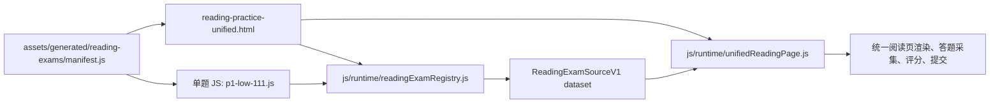
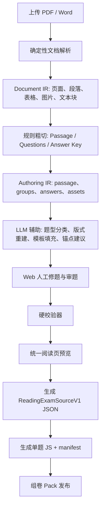
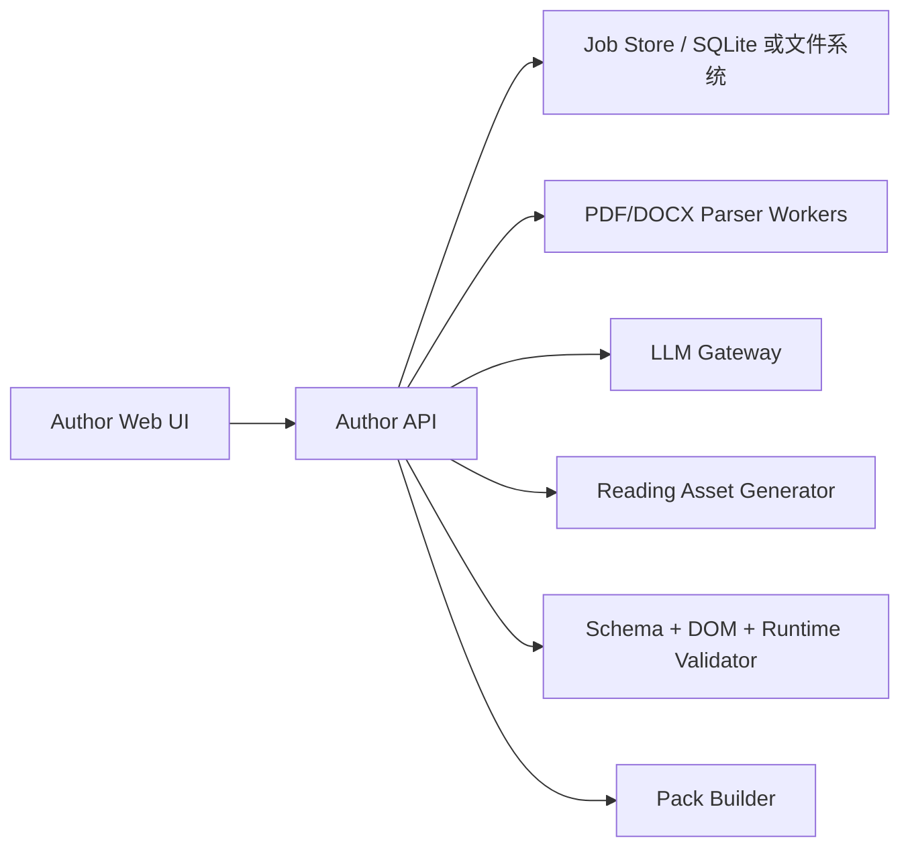

# Epic 8：作者端 Web 导题与组卷器工程设计

来源：[[需求文档]]、[[工程任务追踪]]、[[验收文档]]

目标项目：`/Users/maziheng/Downloads/0.3.1 working`

桌面应用细化：[[Epic8-Tauri作者端应用详细设计]]

最后更新：2026-05-29

## 目标

作者端 Web 的核心目标是让机构只提供 IELTS 阅读题目的 PDF 或 Word 文档，就能在内部完成“文档解析、题型识别、版式重建、人工修题、答案对齐、题库 JS 生成、Pack 组卷发布”的完整流程，并输出当前项目统一阅读页可直接加载的 `assets/generated/reading-exams/*.js` 与 `manifest.js`。

这不是一个“只写 prompt 让 LLM 直接生成 JS”的功能。当前统一阅读页对题库 JS 有明确运行时契约，LLM 可以参与题型分类、版式重建、模板填充和锚点建议，但最终事实来源、题号、答案、DOM 结构和 JS 包装必须由确定性流水线、校验器和人工确认共同保证。

## 当前项目兼容结论

当前项目的阅读题库运行链路如下：



统一阅读页不是读取抽象题型组件来渲染，而是直接渲染：

- `dataset.passage.blocks[].html`
- `dataset.questionGroups[].bodyHtml`

然后通过约定好的 DOM 结构采集答案：

- 单选：`input[type="radio"][name="q1"]`
- 多选：`input[type="checkbox"][name="q1"]` 或范围名
- 文本：`input/textarea/select[name="q1"]` 或 `id="q1_input"`
- 拖拽：`.paragraph-dropzone`、`.match-dropzone`、`.drop-target-summary`
- 拖拽选项：`.drag-item`、`.draggable-word`、`.card`
- 拖拽答案值：`data-heading`、`data-option`、`data-word`、`data-value`、`data-answer-value`

因此作者端最终输出必须满足“数据字段 + HTML DOM 协议 + manifest 包装”三层契约。

## 最终输出契约

### 单题 JS 包装

每个生成题必须输出为：

```js
(function registerReadingExamData(global) {
  'use strict';
  if (!global.__READING_EXAM_DATA__ || typeof global.__READING_EXAM_DATA__.register !== "function") {
    throw new Error("reading_exam_registry_missing");
  }
  global.__READING_EXAM_DATA__.register("exam-id", { /* ReadingExamSourceV1 */ });
})(typeof window !== "undefined" ? window : globalThis);
```

### manifest 条目

```json
{
  "p1-medium-001": {
    "examId": "p1-medium-001",
    "dataKey": "p1-medium-001",
    "script": "./p1-medium-001.js",
    "title": "Passage Title",
    "category": "P1"
  }
}
```

### ReadingExamSourceV1 最小字段

```json
{
  "schemaVersion": "ReadingExamSourceV1",
  "examId": "p1-medium-001",
  "meta": {
    "title": "Passage Title",
    "category": "P1",
    "frequency": "medium",
    "pdfFilename": "source.pdf",
    "legacyPath": "",
    "legacyFilename": "",
    "questionIntroHtml": "<h3>Questions</h3>"
  },
  "passage": {
    "blocks": [
      {
        "blockId": "passage-main",
        "kind": "html",
        "html": "<h2>READING PASSAGE 1</h2>..."
      }
    ]
  },
  "questionGroups": [
    {
      "groupId": "group-1",
      "kind": "true_false_not_given",
      "questionIds": ["q1", "q2"],
      "bodyHtml": "<div class=\"group\" id=\"q1-2-anchor\">...</div>",
      "leadHtml": "<h3>Questions</h3>"
    }
  ],
  "answerKey": {
    "q1": "TRUE",
    "q2": "FALSE"
  },
  "sourceRefs": {
    "primaryHtml": "author-imports/job-id/intermediate.html",
    "primaryProvider": "author_web",
    "shuiHtml": null,
    "shuiPdf": "uploads/source.pdf",
    "ieltsHtml": null
  },
  "audit": {
    "matchStatus": "author_verified",
    "matchConfidence": 1,
    "verifiedAt": "2026-05-29T00:00:00.000Z",
    "notes": "provider:author_web;signature:radio,text,dragdrop,table"
  },
  "questionOrder": ["q1", "q2"],
  "questionDisplayMap": {
    "q1": "1",
    "q2": "2"
  }
}
```

## 总体架构



## 为什么不能只靠 Prompt 直接生成 JS

LLM 直接从 PDF/Word 生成 JS 有四个不可接受的问题：

| 问题 | 后果 | 工程处理 |
|---|---|---|
| 题号和答案可能幻觉 | 成绩错误，客户难以发现 | 题号、答案必须由 OCR/解析结果、人工确认和校验器约束 |
| HTML DOM 结构可能不符合统一阅读页协议 | 页面能显示但不能采集答案 | 模板生成器负责 DOM，LLM 只填结构化字段 |
| 复杂版式不可控 | 表格、流程图、拖拽区域错位 | 用 Authoring IR 表达版式，再模板化渲染 |
| 输出不可审计 | 返工成本高 | 保存每一步中间结果、LLM 输入输出、人工修改记录 |

合理边界是：LLM 不直接写最终 JS。LLM 输出结构化 JSON patch 或 `Authoring IR` 草案，系统校验后再由确定性代码生成 HTML 和 JS。

## 数据流水线设计

### Stage 1：上传与作业管理

**目标**

接收 PDF/Word，创建导题任务，保留原始文件、解析结果、人工修改记录和发布结果。

**输入**

- `.pdf`
- `.docx`
- 可选：答案页、解析页、机构标签、题目分类、难度

**输出**

```json
{
  "jobId": "import-20260529-001",
  "status": "uploaded",
  "sourceFiles": [
    {
      "fileId": "source-main",
      "filename": "reading-passsage.pdf",
      "type": "pdf",
      "sha256": "..."
    }
  ],
  "createdAt": "2026-05-29T00:00:00.000Z"
}
```

**工程任务**

| ID | 任务 | 交付物 |
|---|---|---|
| E8-DOC-01 | 建立导题作业模型与本地文件存储目录 | job schema、上传目录、状态机 |
| E8-DOC-02 | 实现上传 UI 和文件校验 | Web 上传页、类型/大小/重复文件检查 |
| E8-DOC-03 | 保存原始文件哈希和导题日志 | job audit log |

### Stage 2：确定性文档解析

**目标**

把 PDF/Word 转成可追踪的 Document IR。这里优先使用确定性解析工具，LLM 不参与原始文本事实抽取。

**建议实现**

- PDF：优先使用 Docling、PDF parser、OCR fallback。
- Word：使用 docx parser 抽取段落、表格、图片、编号列表。
- 图片或扫描 PDF：进入 OCR 队列，标记置信度。

**Document IR**

```json
{
  "jobId": "import-20260529-001",
  "pages": [
    {
      "pageIndex": 1,
      "width": 595,
      "height": 842,
      "blocks": [
        {
          "blockId": "b001",
          "type": "paragraph",
          "text": "READING PASSAGE 1",
          "bbox": [72, 60, 460, 88],
          "confidence": 0.99
        },
        {
          "blockId": "b002",
          "type": "table",
          "cells": [],
          "bbox": [72, 400, 520, 620],
          "confidence": 0.93
        }
      ]
    }
  ],
  "assets": [
    {
      "assetId": "img001",
      "type": "image",
      "path": "author-imports/job-id/assets/img001.png",
      "bbox": [80, 320, 500, 500]
    }
  ]
}
```

**工程任务**

| ID | 任务 | 交付物 |
|---|---|---|
| E8-DOC-04 | 接入 PDF 解析器，输出 Document IR | PDF parser adapter |
| E8-DOC-05 | 接入 Word 解析器，输出 Document IR | DOCX parser adapter |
| E8-DOC-06 | 支持 OCR fallback 与低置信度标记 | OCR adapter、confidence 字段 |
| E8-DOC-07 | 在 Web 中展示页面块、bbox、文本、表格和图片 | Document IR viewer |

### Stage 3：规则粗切

**目标**

基于 Document IR 用规则先切出 Passage、题组、答案区。规则输出可以错，但必须可解释、可人工修正。

**粗切对象**

```json
{
  "passageCandidates": [
    {
      "range": ["b001", "b020"],
      "title": "The Rise and Fall of Detective Stories",
      "categoryHint": "P1"
    }
  ],
  "questionGroupCandidates": [
    {
      "groupId": "draft-group-1",
      "heading": "Questions 1-8",
      "questionRange": [1, 8],
      "instructionText": "Do the following statements agree...",
      "blockIds": ["b021", "b040"]
    }
  ],
  "answerKeyCandidates": [
    {
      "source": "answer-page",
      "answers": {
        "1": "FALSE",
        "2": "TRUE"
      }
    }
  ]
}
```

**规则来源**

- `READING PASSAGE 1/2/3`
- `Questions 1-8`
- `TRUE/FALSE/NOT GIVEN`
- `YES/NO/NOT GIVEN`
- `Choose ONE WORD ONLY`
- `Complete the table/flow-chart/summary`
- `List of Headings`
- `NB You may use any letter more than once`
- 答案页中的 `1. A`、`1 FALSE`、表格答案列

**工程任务**

| ID | 任务 | 交付物 |
|---|---|---|
| E8-DOC-08 | 实现 Passage/题组/答案区粗切规则 | splitter |
| E8-DOC-09 | 实现题号范围识别与连续性检查 | question range detector |
| E8-DOC-10 | 实现答案候选抽取与人工对齐界面 | answer key editor |
| E8-DOC-11 | 粗切结果可视化与手动拖拽调整 | split review UI |

### Stage 4：Authoring IR

**目标**

建立作者端专用中间 schema。它比最终 `ReadingExamSourceV1` 更结构化，便于 LLM、人工编辑和模板生成器协作。

**Authoring IR 草案**

```json
{
  "schemaVersion": "ReadingAuthoringIRV1",
  "jobId": "import-20260529-001",
  "exam": {
    "examId": "p1-medium-001",
    "title": "The Rise and Fall of Detective Stories",
    "category": "P1",
    "frequency": "medium"
  },
  "passage": {
    "title": "The Rise and Fall of Detective Stories",
    "htmlBlocks": [
      {
        "blockId": "passage-main",
        "html": "<h2>READING PASSAGE 1</h2>..."
      }
    ]
  },
  "groups": [
    {
      "groupId": "group-1",
      "questionRange": [1, 8],
      "kind": "true_false_not_given",
      "instruction": [
        "Do the following statements agree with the information given in Reading Passage 1?"
      ],
      "questions": [
        {
          "number": 1,
          "id": "q1",
          "prompt": "C. Auguste Dupin and Emile Gaboriau were both writers of detective stories.",
          "interaction": {
            "type": "radio",
            "options": ["TRUE", "FALSE", "NOT GIVEN"]
          },
          "answer": "FALSE",
          "sourceBlockIds": ["b021"],
          "confidence": 0.95
        }
      ],
      "layout": {
        "template": "tfng_list"
      }
    }
  ],
  "audit": {
    "llmUsed": false,
    "humanVerified": false,
    "issues": []
  }
}
```

**关键原则**

- `Authoring IR` 是作者端主数据。
- `ReadingExamSourceV1` 是运行时产物。
- 单题 JS 是发布产物，不应该作为人工编辑的唯一来源。

**工程任务**

| ID | 任务 | 交付物 |
|---|---|---|
| E8-DOC-12 | 定义 `ReadingAuthoringIRV1` JSON Schema | schema 文件 |
| E8-DOC-13 | 实现 Document IR 到 Authoring IR 的初始转换 | converter |
| E8-DOC-14 | 保存每次人工修改与 LLM patch | revision log |

## LLM 接入设计

### LLM 的职责边界

| 能让 LLM 做 | 不能让 LLM 做 |
|---|---|
| 判断题组类型 | 直接决定最终答案 |
| 把粗切文本整理成结构化题目 | 直接输出最终 JS 文件 |
| 重建表格、summary、flow-chart 的 HTML 语义 | 绕过 schema 校验 |
| 给 passage 段落和题目建议锚点 | 覆盖人工确认结果 |
| 根据模板补齐缺失字段 | 伪造 PDF/Word 中不存在的信息 |

### LLM 调用模式

LLM 不接收整个项目代码，也不直接写 JS。每次调用只处理一个明确小任务：

1. `classify_group`：题型分类。
2. `extract_questions`：从题组块抽取题目列表。
3. `rebuild_layout`：把题组块重建成结构化布局。
4. `fill_template`：填充指定题型模板。
5. `suggest_anchors`：给题目建议 passage 锚点。
6. `repair_ir`：根据校验错误修复 Authoring IR。

### LLM 输入包

```json
{
  "task": "classify_group",
  "allowedKinds": [
    "single_choice",
    "multi_choice",
    "true_false_not_given",
    "yes_no_not_given",
    "matching",
    "classification",
    "summary_completion",
    "table_completion",
    "diagram_completion",
    "short_answer",
    "sentence_completion"
  ],
  "groupCandidate": {
    "heading": "Questions 1-8",
    "instructionText": "...",
    "plainText": "...",
    "tableText": [],
    "imageRefs": []
  },
  "requiredOutputSchema": "..."
}
```

### LLM 输出要求

LLM 只允许输出 JSON，不允许输出 Markdown、解释性文字或 JS：

```json
{
  "kind": "true_false_not_given",
  "confidence": 0.92,
  "questions": [
    {
      "number": 1,
      "prompt": "...",
      "interaction": {
        "type": "radio",
        "options": ["TRUE", "FALSE", "NOT GIVEN"]
      }
    }
  ],
  "needsHumanReview": false,
  "warnings": []
}
```

### Prompt 模板：题型分类

```text
你是 IELTS 阅读题库结构化助手。你只根据输入文本判断题组类型，不要补充输入中没有的信息。

允许的 kind 只有：
single_choice, multi_choice, true_false_not_given, yes_no_not_given, matching, classification,
summary_completion, table_completion, diagram_completion, short_answer, sentence_completion。

请输出严格 JSON：
{
  "kind": "...",
  "confidence": 0-1,
  "evidence": ["触发判断的原文短句"],
  "warnings": []
}

如果证据不足，kind 选最接近项，confidence 小于 0.65，并在 warnings 说明需要人工确认。
```

### Prompt 模板：题组抽取

```text
你是 IELTS 阅读题组抽取助手。请从输入题组文本中抽取题号、题干、选项、说明文字和版式线索。

硬性规则：
1. 不要编造答案。
2. 不要改写题干含义。
3. 题号必须来自原文。
4. 输出 question.number 使用原题号数字。
5. 输出 interaction 只能使用指定类型。
6. 如果表格、流程图或图片无法还原，保留 layout.warning 并请求人工确认。

只输出 JSON，不输出解释。
```

### Prompt 模板：模板填充

```text
你是 IELTS 阅读 HTML 模板填充助手。请把 Authoring IR 中的题组转换为模板参数 JSON。

不要输出最终 HTML。不要输出 JS。
只输出模板名称和模板参数。

DOM 约束：
- radio/checkbox/text/select 的 name 必须是 q1/q2 形式。
- 文本输入可以使用 id="q1_input"。
- 拖拽 dropzone 必须带 data-question 或 data-question-id。
- 拖拽选项必须带 data-heading/data-option/data-word/data-value 之一。
```

## 模板生成器设计

模板生成器负责把 Authoring IR 转成 `questionGroups[].bodyHtml`。模板生成器必须是确定性的，不能让 LLM 直接拼最终 HTML。

### 题型到模板映射

| kind | 模板 | DOM 重点 |
|---|---|---|
| `true_false_not_given` | `tfng_list` | radio name 为 `qN`，value 为 `TRUE/FALSE/NOT GIVEN` |
| `yes_no_not_given` | `ynng_list` | radio name 为 `qN`，value 为 `YES/NO/NOT GIVEN` |
| `single_choice` | `single_choice_list` | radio name 为 `qN`，value 为 `A/B/C/D` |
| `multi_choice` | `multi_choice_checkbox` | checkbox name 为 `qN` 或 `qN_qM` |
| `sentence_completion` | `inline_text_completion` | input name/id 对齐 `qN` |
| `short_answer` | `short_answer_list` | input name 为 `qN` |
| `summary_completion` | `summary_text_completion` 或 `summary_dragdrop` | text input 或 `.drop-target-summary` |
| `table_completion` | `table_completion` | table 内 input name 为 `qN` |
| `diagram_completion` | `diagram_completion` | 图片/示意图 + input/dropzone |
| `matching` | `matching_dragdrop` 或 `matching_radio` | `.match-dropzone[data-question="qN"]` |
| `classification` | `classification_radio` 或 `classification_dragdrop` | `allowOptionReuse` 必须明确 |

### 统一阅读页 DOM 协议

**文本题**

```html
<strong>9</strong>
<input type="text" id="q9_input" name="q9">
```

**单选题**

```html
<label><input name="q1" type="radio" value="TRUE"> TRUE</label>
```

**多选题**

```html
<label><input name="q14" type="checkbox" value="A"> A</label>
<label><input name="q14" type="checkbox" value="B"> B</label>
```

**拖拽题**

```html
<div class="pool-items">
  <div class="drag-item" draggable="true" data-heading="i">i. Heading text</div>
</div>

<div class="match-dropzone" data-question="q27"></div>
```

**Summary 拖拽空**

```html
<span class="drop-target-summary" data-question="q31"></span>
```

## 校验器设计

校验必须分四层，任何一层失败都不能发布 Pack。

### Layer 1：Authoring IR 校验

- `exam.examId` 唯一。
- `groups[].questionRange` 与 `questions[].number` 一致。
- 所有题号连续或明确允许保留原显示题号。
- 每题必须有 interaction。
- 每题必须有 answer 或标记为待人工补齐。
- LLM 低置信度字段必须进入人工确认队列。

### Layer 2：ReadingExamSourceV1 校验

复用并增强当前 `validate_reading_sources.node.js` 的规则：

- `schemaVersion === "ReadingExamSourceV1"`
- `meta.title/category` 存在。
- `passage.blocks` 非空。
- `questionGroups` 非空。
- `answerKey` 非空。
- `answerKey` 题号连续。
- `questionGroups[].kind` 属于允许集合。
- matching/classification 必须显式 `allowOptionReuse`。
- 每个 `questionIds` 必须在 `answerKey` 中存在。
- 每个 `answerKey` 题号必须被某个题组覆盖。

### Layer 3：DOM 协议校验

新增校验：

- 每个 `qN` 至少能在 `bodyHtml` 中找到一个可采集控件或 dropzone。
- radio/checkbox/text/select 的 `name` 能被 `collectAnswers()` 识别。
- dropzone 必须是 `.paragraph-dropzone`、`.match-dropzone` 或 `.drop-target-summary`。
- dropzone 必须有 `data-question`、`data-question-id`、`data-target` 或 id fallback。
- drag item 必须有 `data-heading`、`data-option`、`data-word`、`data-value` 或可解析文本。
- `questionOrder` 必须与 `answerKey` 一致。
- `questionDisplayMap` 必须保留原题号显示。

### Layer 4：运行时预览校验

使用当前统一阅读页真实加载生成产物：

- 加载 `reading-practice-unified.html?examId=...`
- 等待题目渲染。
- 对每个题号自动填入正确答案。
- 提交后正确率应为 100%。
- 对错误答案样例提交后分数应下降。
- 检查导航按钮数量等于 `questionOrder.length`。

## Web 作者端页面设计

### 页面 1：导题任务列表

用途：管理所有导题 job。

功能：

- 上传新 PDF/Word。
- 查看状态：已上传、已解析、待 LLM、待人工、校验失败、可发布。
- 查看失败原因。
- 复制 job 或重新解析。

### 页面 2：文档解析预览

用途：检查 Document IR。

功能：

- 左侧显示原始页面或渲染图。
- 右侧显示解析出的文本块、表格、图片。
- 支持点击块定位。
- 标记低置信度 OCR 块。

### 页面 3：粗切与答案对齐

用途：人工确认 Passage、题组、答案区。

功能：

- 拖拽选择 passage 范围。
- 合并/拆分题组。
- 编辑题号范围。
- 录入或修正 answerKey。
- 显示题号连续性错误。

### 页面 4：题组结构化编辑器

用途：编辑 Authoring IR。

功能：

- 选择题型 kind。
- 编辑说明文字。
- 编辑题干、选项、答案。
- 表格/summary/flow-chart 可视化编辑。
- 一键调用 LLM 建议，但结果必须 diff 预览后确认。

### 页面 5：统一阅读页预览

用途：确认最终渲染效果。

功能：

- 内嵌当前 `reading-practice-unified.html`。
- 加载临时生成的 JS/manifest。
- 自动填答案测试。
- 查看采集答案 JSON。
- 查看评分结果。

### 页面 6：组卷与发布

用途：生成 Pack。

功能：

- 勾选题目或整套题。
- 设置 Pack 名称、版本、授权元数据。
- 运行全量校验。
- 输出 manifest、单题 JS、Pack 清单。

## 后端/本地服务设计

作者端建议作为内部 Web + 本地服务运行，不随学生端交付。



### 模块拆分

| 模块 | 职责 |
|---|---|
| `author-web` | React/Vue/Svelte 任一 Web UI，负责人工审题 |
| `author-api` | job 管理、文件管理、状态机、权限 |
| `document-parser` | PDF/Word 到 Document IR |
| `splitter` | 规则粗切 |
| `llm-gateway` | prompt 管理、模型调用、JSON schema 校验、重试 |
| `authoring-ir` | schema、版本迁移、修订记录 |
| `template-renderer` | Authoring IR 到 `bodyHtml` |
| `reading-exporter` | `ReadingExamSourceV1` 到单题 JS/manifest |
| `validator` | IR、运行时 schema、DOM、E2E 校验 |
| `pack-builder` | 多题组合、版本化、发布产物 |

## 与现有代码的改造点

### 保留

- `js/runtime/readingExamRegistry.js`
- `js/runtime/unifiedReadingPage.js`
- `assets/generated/reading-exams/reading-practice-unified.html`
- 单题 JS 注册方式
- manifest 懒加载方式

### 需要新增

| 新增项 | 建议路径 | 说明 |
|---|---|---|
| Authoring IR schema | `developer/authoring/schemas/reading-authoring-ir.schema.json` | 作者端主 schema |
| 导题 job 存储 | `developer/authoring/jobs/` 或 app data | 保存中间结果 |
| 模板渲染器 | `developer/authoring/templates/` | 生成 `bodyHtml` |
| LLM prompts | `developer/authoring/prompts/` | 版本化 prompt |
| DOM 协议校验器 | `developer/authoring/validators/validate-reading-dom.node.js` | 补当前校验不足 |
| 作者端导出器 | `developer/authoring/exporters/export-reading-assets.node.js` | 输出 JS/manifest |
| 预览服务 | `developer/authoring/preview-server/` | 临时 manifest 和 JS |

### 需要增强

| 现有项 | 增强方向 |
|---|---|
| `validate_reading_sources.node.js` | 增加 DOM 可采集性校验、答案控件校验、dropzone 校验 |
| `generate_reading_assets.node.js` | 抽离 wrapper/manifest 生成函数，供作者端复用 |
| `templates/question-types.js` | 从演示模板升级为正式模板库，支持复杂题型 |
| `reading-practice-unified.html` | 支持预览模式加载临时 manifest 或 injected dataset |

## 工程任务拆分

| ID | 任务 | 优先级 | 依赖 | 交付物 | 验收 |
|---|---|---|---|---|---|
| E8-ENG-01 | 定义 `ReadingAuthoringIRV1` | P0 | 当前 ReadingExamSourceV1 | JSON Schema、样例 | schema 可校验 |
| E8-ENG-02 | 抽离 ReadingExamSourceV1 导出器 | P0 | 现有生成器 | `buildWrapper`、`buildManifest` 可复用模块 | 生成 JS 可被 registry 加载 |
| E8-ENG-03 | 实现上传 job 与文件存储 | P0 | 无 | job API、上传 UI | 文件可上传并可追踪 |
| E8-ENG-04 | 实现 PDF/DOCX 到 Document IR | P0 | E8-ENG-03 | parser adapters | 样例文档可解析 |
| E8-ENG-05 | 实现规则粗切 | P0 | E8-ENG-04 | splitter、粗切 UI | Passage/题组/答案候选可编辑 |
| E8-ENG-06 | 实现 LLM Gateway | P0 | E8-ENG-01 | prompt registry、JSON mode、schema 校验 | LLM 输出非法 JSON 会被拒绝 |
| E8-ENG-07 | 实现题型分类与题组抽取 prompt | P0 | E8-ENG-06 | prompt v1、测试样例 | 常见题型分类准确可人工修正 |
| E8-ENG-08 | 实现模板渲染器 | P0 | E8-ENG-01 | `bodyHtml` generator | 输出 DOM 可被统一阅读页采集 |
| E8-ENG-09 | 实现 Authoring IR 编辑器 | P1 | E8-ENG-01,E8-ENG-05 | Web 编辑器 | 可修题、改答案、改题型 |
| E8-ENG-10 | 实现表格/summary/flow-chart 编辑能力 | P1 | E8-ENG-09 | 复杂题型编辑器 | 表格和流程图可预览 |
| E8-ENG-11 | 实现 DOM 协议校验器 | P0 | E8-ENG-08 | validator | 缺控件、错 name、错 dropzone 可报错 |
| E8-ENG-12 | 实现统一阅读页预览服务 | P0 | E8-ENG-02,E8-ENG-08 | preview server | 生成题可在统一页打开 |
| E8-ENG-13 | 实现自动填答案 E2E 校验 | P0 | E8-ENG-12 | Playwright 测试 | 正确答案提交得 100% |
| E8-ENG-14 | 实现 Pack 组卷发布 | P1 | E8-ENG-11,E8-ENG-13 | Pack builder | 多题 manifest 正确 |
| E8-ENG-15 | 实现 LLM 调用审计与人工确认记录 | P1 | E8-ENG-06,E8-ENG-09 | audit log | 可追踪模型建议和人工修改 |

## 分阶段实施计划

### Phase 1：最小可用导题链路

目标：先支持清晰排版的 Word/PDF，输出可被统一阅读页加载的阅读题 JS。

范围：

- 上传 job。
- PDF/DOCX 解析。
- 手动粗切 Passage/题组/答案。
- 基础题型：TFNG、YNNG、单选、填空、表格填空。
- Authoring IR。
- 模板渲染。
- JS/manifest 生成。
- 统一阅读页预览和 100% 自动填答案测试。

不做：

- 自动组卷发布。
- 复杂流程图。
- 加密 Pack。
- 全自动导题。

### Phase 2：LLM 辅助与复杂题型

范围：

- LLM 题型分类。
- LLM 题组抽取。
- LLM 版式重建。
- matching/classification 拖拽。
- summary with word bank。
- diagram/flow-chart completion。
- 校验错误自动修复建议。

### Phase 3：组卷与发布

范围：

- 多题 Pack 组卷。
- Pack 版本化。
- 发布记录。
- 与机构授权元数据衔接。
- 批量导入和批量校验。

## 关键验收用例

| 用例 | 输入 | 预期 |
|---|---|---|
| Word 基础题 | 含 passage、TFNG、表格填空、答案 | 输出 JS，统一阅读页可打开，自动填答案 100% |
| PDF 基础题 | 清晰文本 PDF | 输出 Document IR，人工确认后可发布 |
| 扫描 PDF | OCR 低置信度 | 进入人工确认，不能直接发布 |
| 答案缺失 | 只有题目无答案 | 标记待补答案，禁止发布 |
| 题号不连续 | Q1-Q5 但缺 Q3 | 校验失败，定位到题组 |
| 控件 name 错误 | `name="question1"` 但无 displayMap 支持 | DOM 校验失败 |
| 拖拽缺 data-question | dropzone 无题号 | DOM 校验失败 |
| LLM 输出非法 JSON | prompt 返回解释文字 | 被 gateway 拒绝并重试 |
| LLM 低置信度 | confidence < 0.65 | 必须人工确认 |
| 正确答案回归 | 自动填入 answerKey | 提交后得分 100% |

## 残余风险

| 风险 | 说明 | 缓解 |
|---|---|---|
| PDF 排版极复杂 | 流程图、图片题、跨页表格可能无法自动还原 | 进入人工版式编辑器 |
| OCR 错字影响答案 | 扫描件质量差时答案可能被识别错 | 低置信度强制人工确认 |
| LLM 幻觉 | 模型可能补不存在的内容 | JSON schema、证据字段、人工确认、禁止直接发布 |
| 当前统一阅读页 DOM 协议隐式 | 采集规则分散在 JS 中 | 建立 DOM 协议校验器和模板库 |
| 复杂题型模板不足 | 目前模板库偏示例性质 | Phase 2 将模板库产品化 |

## 决策

1. 作者端主数据使用 `ReadingAuthoringIRV1`，不直接编辑最终 JS。
2. LLM 输出结构化 JSON patch，不直接输出 JS。
3. 最终 HTML 由模板渲染器确定性生成。
4. 发布前必须通过 Authoring IR、ReadingExamSourceV1、DOM 协议、统一阅读页 E2E 四层校验。
5. 作者端 Web 是内部工具，不随学生考试端交付。
