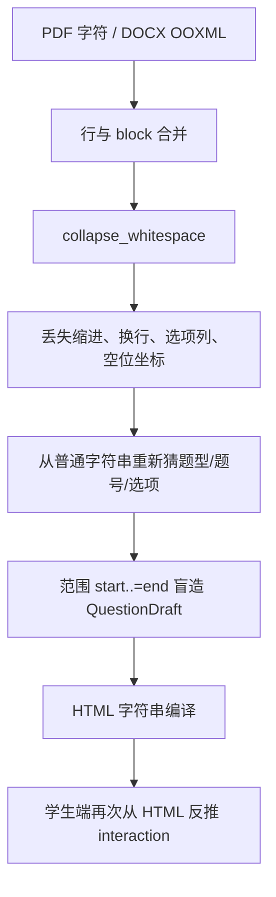

# IELTS PDF/DOCX 题源识别、富版式编辑与 NAS 发布重构实施计划

> 文档版本：v2.0（实施级）  
> 编制日期：2026-08-09  
> 适用代码库：`IELTS-PDF2Test-main`、`IELTS-NASfor-WenDao-main`  
> 目标读者：产品负责人、技术负责人、Rust/Tauri 工程师、React 工程师、Vue/Node/Electron 工程师、QA、内容运营  
> 计划状态：可进入架构评审、数据标注、任务拆分和分阶段实施  
> 核心约束：**PDF 逐题 LLM 修复保持关闭；本计划不依赖 LLM 自动补写、改写或猜测题干。**

---

## 0. 需求复述、核心判断与不可妥协项

### 0.1 基于当前信息，我对需求的理解

本项目不是简单的“把 PDF 文本抄成 JSON”。真正目标是建立一条能够长期维护的考试内容生产链：

1. 用户上传一份不完全可控的 PDF 或 DOCX；文件可能是原生文字、扫描件、混合文本层、双栏、多栏、错位 Word、带表格、图片、流程图、地图、平面图、文本框或 SmartArt。
2. 转换器先忠实恢复文件的**物理视觉结构**，再识别 passage、题组说明、题号、题干、选项、公共选项池、答案位和题型。
3. 转换结果直接以学生端真实渲染效果呈现；该预览本身也是结构化编辑器。用户修改的是结构化题源，而不是一串不可控 HTML。
4. 后端持续保存版本化题源，实时校验；用户点击“导出 NAS”后，得到 manifest、题目 JS、图片/图表/音频等资源，以及学生端可直接加载的完整目录，不再进行手工拼装。
5. 阅读题和听力题共享文档解析、版面结构、资产、编辑器、发布和质量门基础设施；考试语义层分别建模。
6. 自动流程必须尽量减少人工审核，但“减少审核”不能通过猜测或隐藏错误实现。任何无法确定的内容都应定位到具体源区域并进入最小化、问题导向的审核。

### 0.2 核心判断

**【核心判断】✅ 值得做，而且必须先改数据结构，再改识别规则。**

当前最严重的问题不是少几个正则，而是中间表示过于扁平：字符和行在题目结构尚未识别前就被合并、压空白、转成普通字符串，导致后面只能从丢失版式的文本中反向猜题号、题干和选项。继续在 `authoring_pipeline.rs` 中追加更多 `if/else`，只会扩大特殊情况，无法稳定覆盖双栏、公共题干、表格、流程图和听力地图题。

正确改法是：

```text
先建立无损物理层
→ 再建立视觉阅读顺序和区域层
→ 再建立 IELTS 题组语法层
→ 再建立答案位/响应组语义层
→ 最后编译为学生端格式
```

### 0.3 本计划的十二项不可妥协项

1. **不再将 HTML 或折叠后的字符串作为唯一事实源。**
2. **PDFium 原生文字层优先；OCR 只针对扫描页、损坏区域或局部图像。**
3. **PDF 逐题 LLM repair 保持关闭。**任何云端模型只能做只读对照或可选诊断，不得自动修改题源。
4. **题号与答案位分离。**`Questions 14 and 15` 不等于两个独立题干。
5. **共享题干、公共选项池、选择基数、答案顺序规则成为一等字段。**
6. **物理页顺序与最终左右栏展示解耦。**Question 可以在 passage 前、后或中间。
7. **图片、表格、流程图、地图、示意图和音频成为一等资源。**
8. **所有自动识别内容必须有 provenance。**不能证明来源的字段不得标记为“可靠”。
9. **可靠性由硬不变量和覆盖率决定，不由“出现了一个题组范围”决定。**
10. **编辑器、预览器和导出器使用同一套结构化编译器。**
11. **NAS 发布必须是事务：资源先写、题源后写、manifest 最后写、失败回滚。**
12. **旧的 `ReadingExamSourceV1` 继续可读。**V2 采用双读、双编译、可回滚迁移，不破坏现有学生端。

### 0.4 明确非目标

本轮不做以下事情：

- 不从 passage 自动推理正确答案；答案只能来自明确答案页、答案文件、用户输入或可信数据库。
- 不用 LLM 补写丢失题干、猜选项或悄悄改写源文。
- 不要求所有 PDF 都像素级复刻。目标是忠实保留考试语义和必要视觉关系；复杂图形允许使用高分辨率区域图作为安全 fallback。
- 不把整页截图作为所有题目的默认输出；只有不能可靠结构化的视觉对象才使用截图节点。
- 不在第一阶段删除 V1 loader、旧题库或现有 NAS 目录结构。
- 不把“成功生成一个 JS 文件”视为成功；必须通过学生端真实加载、渲染、作答和提交契约。

---

## 1. 证据基础：本地代码、八份样例和官方格式

### 1.1 已审查的代码链路

转换器当前主链路为：

```text
PDF/DOCX
→ parser.rs / pdf_geometry.rs
→ DocumentIRV1（page/block）
→ authoring_pipeline.rs（题组与题目启发式解析）
→ ReadingAuthoringIRV1
→ reading_source.rs（HTML 编译）
→ ReadingExamSourceV1
→ export_nas_library.rs
```

学生端主链路为：

```text
manifest.js / <examId>.js
→ server reading-generated-loader.ts
→ HTML sanitize + 从 HTML 反推 interactionModel
→ Vue ReadingPassagePane / ReadingQuestionPane v-html
```

已确认的结构性问题包括：

- `DocumentIRV1` 只有 page/block 粒度，没有 glyph/span/line/style/object/source-anchor 层。
- `pdf_geometry.rs::collect_chars_with_origin()` 只保留 `char + x + y`，未保留字符框、字体、字号、旋转、Unicode 映射错误、颜色和渲染对象。
- `group_lines_into_blocks()` 会把多行用空格合并；`dynamic_block_text()` 又继续折叠空白。
- `make_dynamic_authoring_ir()` 对题组范围执行 `(start..=end)`，从而默认“一题号 = 一个独立 QuestionDraft”。
- `has_reliable_question_groups()` 目前只要存在一个非手工题组且 `questionRange` 是二元数组，就可能认为 PDF 已经可靠。
- PDF 逐题 LLM repair 被关闭；这是用户确认的预期行为，本计划保留该约束。
- DOCX 解析能读取部分样式、编号和表格，但媒体、浮动图、文本框、SmartArt、真实分页及复杂布局没有进入统一资产/布局模型。
- `ReadingExamSourceV1` 以 `bodyHtml`、`leadHtml` 和 passage HTML 为中心；学生端再从 HTML 中反向解析 input、select、dragdrop。

### 1.2 八份上传 PDF 的版式覆盖

| 样例 | 文件页结构与题型 | 对新引擎的要求 |
|---|---|---|
| Fishbourne Roman Palace | passage 后为 1–6 TFNG，再切换到 7–13 notes completion；末页为图片答案表 | 题组边界、instruction-first、notes 结构、答案图像页排除 |
| Listening to the Ocean | TFNG、段落信息匹配、A–D 单选连续出现 | 同文档多题型、题干与 A–D 完整提取、选项 run 检测 |
| Chili peppers | passage 有多个小标题和一张内嵌图；TFNG + notes completion | passage 图片资产、标题层级、ONE WORD ONLY、bullet/空位 |
| Petri dish | section matching；statements + 独立 List of People；summary completion | 公共 option bank、允许复用、列表与题目主体解耦 |
| Organisational Design | 多个 `Questions 14 and 15` + `Choose TWO letters A–E`；最后为人物匹配 | 共享题干、两个答案位、无序集合评分、公共选项池 |
| western celebrity | 第 1 页先出现 Questions 14–20 和 List of Headings，第 2 页才开始 passage，后面再出现其他题组 | 物理顺序与语义角色彻底解耦、question-before-passage |
| Conformity | Y/N/NG、summary completion、notes completion；末页答案图像 | 快速题型切换、不同 completion 模板、答案/解析页分类 |
| Sleep Study | TFNG、notes completion；答案页和争议说明页为图像 | answer/explanation 角色、避免误入 passage/question |

样例事实支持如下：

- Fishbourne 的第 3 页明确给出 Questions 1–6 的 TFNG instruction，下一页又明确切换为 Questions 7–13 notes completion，说明题型必须由题组 instruction 驱动，而不是按整份文档关键词猜。fileciteturn0file0L67-L99
- Listening to the Ocean 的第 4 页文本层中，第 9–13 题题干和 A/B/C/D 选项都完整存在；若转换后丢选项，主要是结构组装失败，而不是源 PDF 无文字。fileciteturn0file1L100-L129
- Petri dish 的 Questions 20–25 是 statements 配一个独立 `List of People A–D`，不是每题各自拥有四套选项。fileciteturn0file3L81-L96
- Organisational Design 的 Questions 14 and 15、16 and 17 等均为一个公共题干、A–E 公共选项和两个答案位。fileciteturn0file4L86-L105
- western celebrity 的题目列表先于 passage 出现，证明不能用“文件前半段 passage、后半段 questions”的固定顺序。fileciteturn0file5L5-L37

### 1.3 样例的几何预检结论

对八份 PDF 共 47 页进行了渲染和几何统计，主要结论为：

- 正文和题面页大多是 born-digital text；末尾答案/解析页经常是整页或大块 raster image，几乎没有可提取文字。
- Chili 第 1 页在可提取文字之外还存在 passage 内嵌图片，证明“文本层正常”不等于“可以忽略图片对象”。
- Petri、Early Approaches、Celebrity、Conformity、Sleep、Fishbourne 等题面页包含边框、分隔线、表格样式或框线；这些 vector path 对表格、notes、option bank 和 flow layout 识别很有价值。
- 当前八份样例大多是单栏；双栏、三栏、旋转页、隐藏 OCR 层、损坏字体、浮动 Word 文本框等必须通过新增合成 fixture 和更大真实语料补齐，不能因为样例里少见就不设计。

### 1.4 官方 IELTS 格式对数据模型的约束

IELTS 官方说明 Reading 原文可能包含 diagrams、graphs 或 illustrations；Reading 题型包含单选/多选、TFNG、YNNG、matching information/headings/features/sentence endings、sentence completion、summary/note/table/flow-chart completion、diagram label completion 和 short answer。尤其是 multiple choice 可能要求从较长列表中选择多个答案，summary/note/table/flow-chart completion 可能是连续文本、notes、表格或由箭头连接的步骤。citeturn743073view0

IELTS 官方说明 Listening 有四个 Part，每个 Part 10 题，题目顺序与录音信息顺序一致。citeturn100219view0 官方样例列出的形式包括 multiple choice、matching、plan/map/diagram labelling、form/note/table/flow-chart/summary completion 和 sentence completion。citeturn100219view17

官方 Listening 样例的视觉页面进一步证明：

- Form completion 可以在同一框内混合表单字段、空位、普通文本和箱体示意图。citeturn974639view0
- Questions 9 and 10 可以共享一条 instruction，但每题各有 A/B/C 选项。citeturn974639view1
- Short-answer 页面可以有一个公共问题并要求填写两个答案位，例如 `What TWO factors...` 下方是 11、12 两个独立 slot。citeturn974639view2
- Plan/map/diagram labelling 会把答案位直接嵌入地图坐标，并在右侧提供 A–I 公共选项池。citeturn974639view3
- Note completion 的答案位可能位于表格式版面内部，而不只是普通段落末尾。citeturn974639view4

因此，答案位必须有宿主节点和视觉锚点，不能只在普通文本中搜索下划线后生成 input。

### 1.5 外部文档解析最佳实践对本项目的直接启示

1. PDF 内部文本顺序可能与视觉阅读顺序不同；多栏文档通常需要利用 bbox 自行识别列边界，不能只信文本流顺序。citeturn100219view1
2. PDFium 原生 API 能提供字符 bounding box、字符角度、字号和 Unicode map error；当前只取 origin 会主动丢失关键版面证据。citeturn100219view3turn100219view4
3. 表格检测既要处理有边框表格，也要处理无边框、靠文本对齐形成的表格；只依赖 vector line 会漏掉 borderless table。citeturn100219view2
4. OCR 应对 mixed PDF 采用“有可靠文字的页跳过 OCR，缺文字的页或区域再 OCR”的策略，而不是整份文件统一覆盖。citeturn100219view8 对倾斜扫描页应支持 deskew。citeturn100219view9
5. 现代文档理解系统把 layout detection、table recognition、chart/reading-order restoration 分开处理，而不是输出一串纯文本；PP-StructureV3 就明确包含版面、表格、公式、图表与阅读顺序恢复。citeturn100219view6
6. 层次文档结构适合采用 Detect → Order → Construct 分阶段建模，而不是一次性从页面直接生成题目 JSON。citeturn595241academia12
7. DocLayNet 强调多领域、多版式数据的重要性；只在单一来源或单栏样例上调规则会严重过拟合。citeturn595241academia13
8. Table Transformer 的 GriTS 将表格评价分为 cell topology、位置和内容，适合直接转化为本项目的 table regression 指标。citeturn100219view7
9. WordprocessingML 的表格本身有 `tbl/tblPr/tblGrid/tr/tc` 结构，应该优先读取 OOXML 语义，而不是把表格扁平为几行文本。citeturn100219view10 SmartArt/diagram 还通过独立 relationship/part 表达，不能只检查 `<w:drawing>` 后丢弃。citeturn100219view11
10. 结构化编辑器应使用 schema 驱动的文档树和 transaction；ProseMirror 的核心原则就是文档不是任意 HTML blob，而是只包含显式允许节点的自定义数据结构。citeturn595241search1

---

## 2. 当前架构的根因诊断

### 2.1 当前失败链条



这是两次“先压平、再反推”：

- 第一次发生在转换器：物理版面被压成文本后再猜题目结构。
- 第二次发生在学生端：明确的交互模型没有被携带，服务端又从 HTML input/select/dragdrop 反推交互。

这种架构对标准单选还能勉强工作，但对共享题干、公共选项池、表格空位、地图坐标、无序双答案和跨页题组天然不稳定。

### 2.2 `DocumentIRV1` 的结构缺口

当前 `DocumentBlock` 虽有 `bbox`、`blockType`、`text/html/table`，但缺少：

- 字符/glyph 级 bbox、quad、baseline、font、fontSize、fontWeight、rotation；
- span 和 line 的显式层；
- 原始换行、软换行、合成空格与真实空格的区别；
- vector path、rectangle、rule line、image object、text box、shape；
- reading-order graph；
- table/figure 与其 caption、label、answer slot 的包含关系；
- source anchor 和 coverage ledger；
- native text 与 OCR text 的并存、冲突和选择依据。

因此 V1 无法支持“从源位置证明这段题干为什么属于第 9 题”。

### 2.3 PDF 几何抽取过于粗糙

当前 `collect_chars_with_origin()` 只取 glyph pen position。随后的 y 聚类阈值由页面纵向 span/40 计算并限制在 2–6pt，这种全页固定阈值没有考虑字体大小、baseline、旋转文字和上下标。行内分词又依赖 origin 间距，而不是字符 box 的实际 advance。最终 `group_lines_into_blocks()` 按间距和宽度把相邻行拼接成一个文本，永久丢掉行边界。

需要明确：`group_lines_into_blocks()` 不是完全错误；它可以作为**派生的段落视图**。错误在于它成为主数据并覆盖了 line/glyph 事实。

### 2.4 题组语义模型错误地等同于“题号区间内每个数字一题”

当前 `(start..=end)` 模型无法正确表达：

- Questions 14 and 15：一个公共 prompt，一套 A–E，选两个答案；
- 一个短答公共 prompt 下的两个 slot；
- 一张地图内多个编号 slot；
- 一个表格/notes/flowchart 中多个嵌入式 slot；
- 题号顺序不连续或包含示例号；
- 题号显示号与内部 qid 不同；
- 一个响应组对应多个答案位，且答案可能无序。

真正核心对象应该是 `AnswerSlot` 和 `ResponseGroup`，而不是 `QuestionDraft`。

### 2.5 可靠性门过松

当前 `has_reliable_question_groups()` 只证明“发现过一个看起来像题组范围的对象”，没有证明：

- 范围内每个答案位是否存在；
- prompt 是否为空或被截断；
- A–D/A–E 是否完整；
- instruction 与 kind 是否一致；
- 公共选项池是否存在；
- completion 的 blank 数是否等于 slot 数；
- source block 是否覆盖所有显著题面内容；
- asset 是否存在；
- 学生端能否实际加载。

这会制造最危险的状态：**不完整结果被标记为可靠，因而不触发人工定位。**

### 2.6 passage/question 物理顺序假设不成立

western celebrity 已经直接证明 question 可以在 passage 之前。更一般地，一个文件可能是：

```text
page 1: Questions 1–7 + List of Headings
page 2–3: Passage
page 4: Questions 8–13
page 5: Answers
```

最终学生端仍然可以左 passage、右 questions；因此解析时应该根据角色收集和重组，而不是强行保持文件页面顺序。

### 2.7 资产和富版式不是附加功能，而是题目语义

对于 map/diagram/table/flowchart：

- 图形本身是 stimulus；
- 答案位的坐标或 cell 是语义；
- 选项池与图形是并列关系；
- 仅抽取文字会失去题目。

当前 PDF `assets: []` 和 DOCX 媒体 warning 路径无法满足这类题型。

### 2.8 HTML-centric runtime 的维护和安全成本

当前学生端通过 `v-html` 渲染，同时服务端用自定义正则 sanitizer 并从 HTML 解析 input。问题包括：

- 内容、交互和样式混在一串字符串里；
- 修改 HTML 后可能使 interactionModel 与实际 DOM 不一致；
- 表格、figure、caption、diagram hotspot 难以做类型校验；
- 自定义 sanitizer 需要持续追踪复杂 XSS 边界；
- 资源 URL 没有一等 asset manifest 和 resolver。

V2 应改为结构化 node renderer。V1 仍保留 HTML 兼容，但在最终 sink 使用成熟 sanitizer，并避免 sanitize 后再修改 markup；DOMPurify 官方也明确提醒，后处理可能让 sanitization 失效。citeturn100219view14

---

## 3. 目标架构与迁移策略

### 3.1 总体架构

```mermaid
flowchart LR
    A[Secure Ingest] --> B[Source Preflight]
    B --> C[Native PDF/DOCX Extract]
    C --> D[DocumentIRV2 Physical Layer]
    D --> E{Page/Region Quality}
    E -- native reliable --> F[Layout Reconstruction]
    E -- scanned/garbled --> G[Selective OCR/Layout Adapter]
    G --> H[Native/OCR Reconciliation]
    H --> F
    F --> I[Region Role Graph]
    I --> J[IELTS Instruction Grammar]
    J --> K[Question Assembler]
    K --> L[AuthoringIRV2]
    L --> M[Deterministic Reliability Gate]
    M --> N[Schema-aware Editor]
    N --> O[Runtime Compiler]
    O --> P[V1 Compatibility Source]
    O --> Q[V2 Structured Source]
    P --> R[NAS Transaction]
    Q --> R
    R --> S[Student Loader + Render Contract]
```



### 3.2 分层责任

| 层 | 只负责 | 明确不负责 |
|---|---|---|
| Source Preflight | 文件安全、页/对象统计、文本层质量、是否需要 OCR | 题型判断 |
| Physical Extract | 忠实抽取 glyph、line、image、path、OOXML、关系 | passage/question 角色 |
| Layout Reconstruction | 行、区域、列、表格、图形、阅读顺序 | IELTS 题型 |
| Semantic Region | passage/question/instruction/option/answer 页或区域角色 | 生成学生 HTML |
| IELTS Grammar | instruction、range、cardinality、word limit、reuse policy | 猜答案 |
| Question Assembler | shared stem、slot、response group、option bank | 视觉编辑 |
| Reliability Gate | 硬不变量、覆盖率、issue 和状态 | 自动补文本 |
| Authoring Editor | 修改结构化 AST、保存 revision、定位源位置 | 直接改 wrapper JS |
| Compiler | 生成 V1/V2 runtime source | 重新识别源文件 |
| NAS Publisher | 事务写入、校验、回滚 | 修改题目内容 |

### 3.3 双轨迁移

```text
阶段 A：V2 物理/语义 IR → 编译为当前 ReadingExamSourceV1
阶段 B：学生端增加 V2 loader/renderer，仍接受 V1
阶段 C：新导出默认 V2，同时附带或按需生成 V1 compatibility payload
阶段 D：在旧题库迁移完成、指标稳定后，才讨论下线部分 V1 生成逻辑
```

任何阶段都必须能通过 feature flag 回退到旧 loader；但旧解析器不再继续堆叠新规则，只作为回归 oracle 和应急 fallback。

### 3.4 LLM 边界

保持以下策略：

- `should_run_group_repair` 对 PDF 继续为 false。
- 本地确定性解析是唯一可自动写入 AuthoringIR 的来源。
- 可选云端能力只能输出独立的 `DiagnosticComparison`，包含建议和证据，不得覆盖 prompt/options/slots。
- 用户未明确启用时不得上传源文或页面图像。
- 即使启用云端诊断，质量门仍只根据本地结构和用户确认决定导出状态。

---
## 4. 核心数据结构重构

### 4.1 设计原则

数据结构必须做到四件事：

1. **无损**：语义识别失败时，仍能返回原始字符、行、对象和坐标供用户修正。
2. **可证明**：每个题干、选项、答案位和图形都能追溯到源文件具体页、对象和 bbox。
3. **可编辑**：用户修改后的内容不需要反向改 PDF，只需更新 AuthoringIR；原始 source anchor 保留。
4. **可编译**：同一 AuthoringIR 可确定性生成 V1 HTML、V2 structured source、预览和 NAS 包。

### 4.2 `DocumentIRV2`：无损物理层

建议新增 Rust 文件：

```text
src-tauri/src/document_ir_v2.rs
src-tauri/src/geometry.rs
src-tauri/src/source_anchor.rs
```

前端镜像类型：

```text
src/types/document-ir-v2.ts
```

建议接口如下：

```ts
export type ExtractionMode =
  | 'pdf_native'
  | 'pdf_ocr'
  | 'pdf_rendered_crop'
  | 'docx_ooxml'
  | 'docx_rendered_fallback'
  | 'manual';

export interface RectV2 {
  x: number;
  y: number;
  width: number;
  height: number;
  unit: 'pt' | 'emu' | 'px';
  origin: 'top-left' | 'bottom-left';
  pageRotation: 0 | 90 | 180 | 270;
  normalized?: [number, number, number, number]; // [0..1]
}

export interface QuadV2 {
  points: [number, number, number, number, number, number, number, number];
  unit: 'pt' | 'emu' | 'px';
  origin: 'top-left' | 'bottom-left';
}

export interface SourceAnchorV2 {
  sourceFileId: string;
  pageIndex: number;             // 0-based in IR; UI converts to 1-based
  nodeIds: string[];             // glyph/span/line/object/ooxml node ids
  bbox?: RectV2;
  charRange?: { start: number; end: number };
  ooxmlPath?: string;            // e.g. /word/document.xml/body/p[17]/r[2]
  relationshipId?: string;       // rId for media/chart/diagram
  extractionMode: ExtractionMode;
  sourceHash: string;
}

export interface TextStyleV2 {
  fontName?: string;
  fontSizePt?: number;
  weight?: number;               // 100..900
  bold?: boolean;
  italic?: boolean;
  underline?: boolean;
  strike?: boolean;
  color?: string;                // normalized #RRGGBBAA
  backgroundColor?: string;
  superscript?: boolean;
  subscript?: boolean;
  language?: string;
}

export interface GlyphNodeV2 {
  id: string;
  text: string;                  // exactly one Unicode scalar or mapped sequence
  bbox: RectV2;
  quad?: QuadV2;
  origin: { x: number; y: number };
  baseline?: number;
  angleRad?: number;
  style: TextStyleV2;
  unicodeMapError: boolean;
  hidden: boolean;
  confidence: number;
  source: 'native' | 'ocr';
  sourceAnchor: SourceAnchorV2;
}

export interface SpanNodeV2 {
  id: string;
  glyphIds: string[];
  text: string;
  bbox: RectV2;
  style: TextStyleV2;
  whitespaceBefore: 'none' | 'source' | 'synthetic';
  whitespaceAfter: 'none' | 'source' | 'synthetic';
  confidence: number;
  sourceAnchors: SourceAnchorV2[];
}

export interface LineNodeV2 {
  id: string;
  spanIds: string[];
  text: string;
  bbox: RectV2;
  baseline?: number;
  writingMode: 'horizontal-tb' | 'vertical-rl' | 'vertical-lr';
  indentationPt: number;
  hangingIndentPt?: number;
  lineHeightPt?: number;
  hardBreakAfter: boolean;
  sourceOrder: number;
  confidence: number;
  sourceAnchors: SourceAnchorV2[];
}

export type PhysicalRegionKind =
  | 'text'
  | 'title'
  | 'list'
  | 'table'
  | 'figure'
  | 'diagram'
  | 'form'
  | 'header'
  | 'footer'
  | 'page_number'
  | 'rule'
  | 'unknown';

export interface RegionNodeV2 {
  id: string;
  kind: PhysicalRegionKind;
  bbox: RectV2;
  childLineIds: string[];
  childObjectIds: string[];
  columnIndex?: number;
  sectionIndex?: number;
  zIndex?: number;
  readingOrderRank?: number;
  readingOrderAlternatives?: string[][];
  confidence: number;
  sourceAnchors: SourceAnchorV2[];
}

export interface VectorPathV2 {
  id: string;
  bbox: RectV2;
  commands?: Array<
    | { op: 'move'; x: number; y: number }
    | { op: 'line'; x: number; y: number }
    | { op: 'curve'; points: number[] }
    | { op: 'close' }
  >;
  strokeWidth?: number;
  strokeColor?: string;
  fillColor?: string;
  isAxisAlignedRule?: boolean;
  sourceAnchor: SourceAnchorV2;
}

export interface TableCellV2 {
  cellId: string;
  row: number;
  col: number;
  rowSpan: number;
  colSpan: number;
  bbox: RectV2;
  contentRegionIds: string[];
  headerScope?: 'row' | 'column' | 'both' | 'none';
  borderEvidence: string[];
  confidence: number;
  sourceAnchors: SourceAnchorV2[];
}

export interface TableNodeV2 {
  id: string;
  bbox: RectV2;
  rows: number;
  cols: number;
  cells: TableCellV2[];
  detectionMode: 'ooxml' | 'ruling_lines' | 'text_alignment' | 'vision_model' | 'manual';
  captionRegionId?: string;
  visualFallbackAssetId?: string;
  topologyConfidence: number;
  contentConfidence: number;
  sourceAnchors: SourceAnchorV2[];
}

export type AssetKind =
  | 'raster_image'
  | 'vector_render'
  | 'page_crop'
  | 'diagram'
  | 'chart'
  | 'audio'
  | 'thumbnail';

export interface AssetDescriptorV2 {
  assetId: string;
  kind: AssetKind;
  mime: string;
  relativePath: string;
  sha256: string;
  byteLength: number;
  widthPx?: number;
  heightPx?: number;
  durationMs?: number;
  extractionMode:
    | 'embedded'
    | 'page_crop'
    | 'rendered_vector'
    | 'docx_media'
    | 'user_upload';
  altText?: string;
  decorative?: boolean;
  sourceAnchor?: SourceAnchorV2;
}

export interface PageNodeV2 {
  pageIndex: number;
  widthPt: number;
  heightPt: number;
  rotation: 0 | 90 | 180 | 270;
  mediaBox?: RectV2;
  cropBox?: RectV2;
  glyphs: GlyphNodeV2[];
  spans: SpanNodeV2[];
  lines: LineNodeV2[];
  regions: RegionNodeV2[];
  vectorPaths: VectorPathV2[];
  tables: TableNodeV2[];
  assetIds: string[];
  readingOrder: string[];
  quality: PageQualityV2;
}

export interface PageQualityV2 {
  classification: 'born_digital' | 'mixed' | 'scanned' | 'garbled' | 'empty';
  nativeCharacterCount: number;
  unicodeErrorRatio: number;
  duplicateTextRatio: number;
  imageCoverageRatio: number;
  textCoverageRatio: number;
  rotationConfidence: number;
  requiresOcrRegions: RectV2[];
  warnings: string[];
}

export interface CoverageEntryV2 {
  sourceNodeId: string;
  disposition:
    | 'passage'
    | 'question'
    | 'instruction'
    | 'option'
    | 'answer'
    | 'explanation'
    | 'header_footer'
    | 'decorative'
    | 'ignored_with_reason'
    | 'unassigned';
  targetIds: string[];
  reason?: string;
}

export interface DocumentIRV2 {
  schemaVersion: 'DocumentIRV2';
  documentId: string;
  jobId: string;
  sourceFiles: SourceFileRecordV2[];
  pages: PageNodeV2[];
  assets: AssetDescriptorV2[];
  coverageLedger: CoverageEntryV2[];
  parser: {
    provider: string;
    providerVersion: string;
    extractionStartedAt: string;
    extractionCompletedAt: string;
    options: Record<string, unknown>;
    warnings: string[];
  };
}
```

#### 4.2.1 坐标规范

统一规则：

- 物理层保留 `native coordinates`，同时生成 top-left、upright 的标准坐标。
- `normalized` 始终使用 `[x/pageWidth, y/pageHeight, width/pageWidth, height/pageHeight]`。
- 所有旋转页先保留原 rotation，再提供 upright transform；不得只写旋转后的 bbox 而丢失原始矩阵。
- PDF 的 point、DOCX 的 EMU、渲染图的 pixel 不混用；接口中必须显式携带 unit。
- 前端 source overlay 只读取标准 top-left/upright 坐标；调试面板可显示 native 坐标。

#### 4.2.2 不可变性

`DocumentIRV2` 是 extraction snapshot，用户编辑不得修改 glyph/line/region。若用户裁剪图片或重新指定区域，应生成一个新的 `DerivedAsset` 或 `ManualSemanticAnchor`，而不是篡改原始物理节点。

### 4.3 `ContentDocV2`：可编辑富内容树

物理结构不能直接作为编辑器文档。需要一个语义富内容 AST：

```ts
export type ContentNodeV2 =
  | DocNode
  | ParagraphNode
  | HeadingNode
  | TextNode
  | HardBreakNode
  | BulletListNode
  | OrderedListNode
  | ListItemNode
  | TableContentNode
  | TableRowContentNode
  | TableCellContentNode
  | FigureNode
  | ImageNode
  | FigcaptionNode
  | FlowchartNode
  | FlowStepNode
  | DiagramNode
  | AnswerSlotNode
  | OptionBankNode
  | HorizontalRuleNode;

export interface BaseContentNode {
  id: string;
  type: string;
  sourceAnchors: SourceAnchorV2[];
  provenanceStatus: 'source' | 'derived' | 'user_edited' | 'manual';
}

export interface TextNode extends BaseContentNode {
  type: 'text';
  text: string;
  marks?: Array<'bold' | 'italic' | 'underline' | { link: string }>;
}

export interface ParagraphNode extends BaseContentNode {
  type: 'paragraph';
  children: ContentNodeV2[];
  align?: 'left' | 'center' | 'right' | 'justify';
  indentLevel?: number;
}

export interface TableContentNode extends BaseContentNode {
  type: 'table';
  rows: TableRowContentNode[];
  caption?: ContentNodeV2[];
  sourceTableId?: string;
  visualFallbackAssetId?: string;
}

export interface TableCellContentNode extends BaseContentNode {
  type: 'table_cell';
  rowSpan: number;
  colSpan: number;
  headerScope?: 'row' | 'column' | 'both' | 'none';
  children: ContentNodeV2[];
}

export interface FigureNode extends BaseContentNode {
  type: 'figure';
  assetId: string;
  caption?: ContentNodeV2[];
  hotspots?: DiagramHotspotV2[];
  display: {
    widthPercent?: number;
    maxWidthPx?: number;
    align?: 'left' | 'center' | 'right';
  };
}

export interface AnswerSlotNode extends BaseContentNode {
  type: 'answer_slot';
  slotId: string;
  displayLabel: string;
  inline: boolean;
  placeholder?: string;
}

export interface DiagramHotspotV2 {
  hotspotId: string;
  slotId: string;
  normalizedRect: [number, number, number, number];
  labelAnchor?: [number, number];
}
```

关键规则：

- `ContentDocV2` 是编辑器和学生端 V2 renderer 的共同内容模型。
- `AnswerSlotNode` 可以存在于 paragraph、table cell、flow step 或 figure hotspot 中。
- 图形无法可靠拆解时，保留一张 `FigureNode` 图片，加若干 normalized hotspot；不强制把地图重画成 SVG。
- 表格结构置信度不足时，同时保留 semantic table 与 visual fallback，UI 提示用户选择哪种作为最终展示。

### 4.4 `IeltsAuthoringIRV2`：考试语义层

```ts
export type ExamModality = 'reading' | 'listening';

export interface IeltsAuthoringIRV2 {
  schemaVersion: 'IeltsAuthoringIRV2';
  jobId: string;
  exam: ExamMetaV2;
  modality: ExamModality;
  passage?: ReadingPassageV2;
  listening?: ListeningStructureV2;
  taskGroups: TaskGroupV2[];
  answerSlots: Record<string, AnswerSlotV2>;
  answerKey: Record<string, AnswerValueV2>;
  assets: AssetDescriptorV2[];
  sourceDocumentId: string;
  quality: QualityReportV2;
  audit: AuthoringAuditV2;
}

export interface ExamMetaV2 {
  examId: string;
  title: string;
  category?: 'P1' | 'P2' | 'P3';
  frequency?: 'low' | 'medium' | 'high';
  language: string;
  tags: string[];
  sourceFiles: Array<{
    sourceFileId: string;
    role: 'question_paper' | 'answer_key' | 'audio' | 'transcript' | 'supplement';
  }>;
}

export interface ReadingPassageV2 {
  title?: string;
  content: ContentNodeV2[];
  paragraphMap?: Record<string, string>; // A/B/C or section id -> content node id
  sourceAnchors: SourceAnchorV2[];
}

export type TaskTypeV2 =
  | 'single_choice'
  | 'multiple_choice'
  | 'true_false_not_given'
  | 'yes_no_not_given'
  | 'matching_information'
  | 'matching_headings'
  | 'matching_features'
  | 'matching_sentence_endings'
  | 'classification'
  | 'sentence_completion'
  | 'summary_completion'
  | 'note_completion'
  | 'table_completion'
  | 'form_completion'
  | 'flowchart_completion'
  | 'diagram_label_completion'
  | 'plan_map_label_completion'
  | 'short_answer';

export interface TaskGroupV2 {
  taskId: string;
  displayRange: QuestionNumberExpressionV2;
  taskType: TaskTypeV2;
  instructions: ContentNodeV2[];
  instructionSignature: InstructionSignatureV2;
  stimulus?: ContentNodeV2[];       // shared stem/form/table/figure
  optionBank?: OptionBankV2;
  responseGroups: ResponseGroupV2[];
  sourceAnchors: SourceAnchorV2[];
  quality: GroupQualityV2;
  reviewState: 'unreviewed' | 'confirmed' | 'edited';
}

export type QuestionNumberExpressionV2 =
  | { kind: 'range'; start: number; end: number }
  | { kind: 'set'; values: number[] }
  | { kind: 'mixed'; values: Array<number | { start: number; end: number }> };

export interface InstructionSignatureV2 {
  normalizedText: string;
  taskType: TaskTypeV2;
  expectedQuestionNumbers: number[];
  expectedSlotCount: number;
  optionAlphabet?: 'A-D' | 'A-E' | 'A-I' | 'roman' | 'paragraph_letters' | string;
  selectionCardinality?: { min: number; max: number; exact?: number };
  answerAssignment?: 'per_slot' | 'unordered_set' | 'ordered_slots';
  allowOptionReuse?: boolean;
  wordLimit?: {
    maxWords?: number;
    maxNumbers?: number;
    wordsAndOrNumber?: boolean;
  };
  evidenceAnchors: SourceAnchorV2[];
  confidence: number;
}

export interface OptionV2 {
  optionId: string;
  label: string;
  content: ContentNodeV2[];
  sourceAnchors: SourceAnchorV2[];
}

export interface OptionBankV2 {
  optionBankId: string;
  title?: ContentNodeV2[];
  options: OptionV2[];
  allowReuse: boolean;
  sourceAnchors: SourceAnchorV2[];
}

export interface ResponseGroupV2 {
  responseGroupId: string;
  kind:
    | 'choice'
    | 'text_entry'
    | 'matching'
    | 'diagram_hotspot'
    | 'composite';
  prompt?: ContentNodeV2[];
  slotIds: string[];
  options?: OptionV2[];
  optionBankRef?: string;
  cardinality: { min: number; max: number; exact?: number };
  assignment: 'per_slot' | 'unordered_set' | 'ordered_slots';
  allowOptionReuse: boolean;
  sourceAnchors: SourceAnchorV2[];
}

export interface AnswerSlotV2 {
  slotId: string;
  questionNumber: number;
  displayLabel: string;
  hostNodeId?: string;
  hostType: 'prompt' | 'paragraph' | 'table_cell' | 'figure_hotspot' | 'flow_step';
  interaction:
    | 'radio'
    | 'checkbox'
    | 'text'
    | 'select'
    | 'dragdrop'
    | 'hotspot';
  constraints?: {
    maxWords?: number;
    maxCharacters?: number;
    acceptedOptionLabels?: string[];
  };
  sourceAnchors: SourceAnchorV2[];
  confidence: number;
}

export type AnswerValueV2 =
  | { kind: 'text'; values: string[]; normalization?: 'ielts_default' | 'exact' }
  | { kind: 'option'; labels: string[]; assignment: 'per_slot' | 'unordered_set' | 'ordered' }
  | { kind: 'unresolved' };
```

### 4.5 为什么必须有 `AnswerSlot`、`ResponseGroup` 和 `TaskGroup`

#### 4.5.1 Organisational Design 14/15

正确结构：

```json
{
  "taskId": "task-14-15",
  "displayRange": { "kind": "set", "values": [14, 15] },
  "taskType": "multiple_choice",
  "stimulus": [{ "type": "paragraph", "children": ["According to the writer..."] }],
  "responseGroups": [{
    "responseGroupId": "rg-14-15",
    "kind": "choice",
    "slotIds": ["slot-14", "slot-15"],
    "cardinality": { "min": 2, "max": 2, "exact": 2 },
    "assignment": "unordered_set",
    "allowOptionReuse": false,
    "options": ["A", "B", "C", "D", "E"]
  }]
}
```

不正确结构：

```json
[
  { "questionNumber": 14, "prompt": "同一公共题干", "type": "checkbox" },
  { "questionNumber": 15, "prompt": "同一公共题干", "type": "checkbox" }
]
```

后一种会导致：

- 选项重复渲染两次；
- 每个“题”都可能允许选两个，最终选择数变成四；
- 无法表达两个答案位共享一个无序答案集合；
- 学生端只能靠特殊 name `q1_2` 修补。

#### 4.5.2 Petri 20–25

正确结构是六个 slot + 一个 option bank；每个 slot 选择 option bank 中一个值，并允许复用。选项池不是六次复制的 per-question options。

#### 4.5.3 Completion

notes/table/flowchart 中，题号只是嵌在内容树中的 `AnswerSlotNode`。prompt 不应被拆成六个重复字符串，而应保留原始 notes/table 结构，并把 slot 挂在准确位置。

### 4.6 `ReviewIssueV2` 和质量状态

```ts
export type ReviewSeverity = 'info' | 'warning' | 'blocking';
export type ReadinessState = 'ready' | 'review_required' | 'blocked';

export interface ReviewIssueV2 {
  issueId: string;
  code: string;
  severity: ReviewSeverity;
  message: string;
  targetType: 'document' | 'page' | 'region' | 'task' | 'response_group' | 'slot' | 'asset';
  targetId: string;
  sourceAnchors: SourceAnchorV2[];
  suggestedActions: Array<
    | 'assign_role'
    | 'edit_text'
    | 'merge_lines'
    | 'split_prompt'
    | 'attach_option_bank'
    | 'confirm_table'
    | 'confirm_figure'
    | 'replace_asset'
    | 'enter_answer'
    | 'ignore_with_reason'
  >;
  details?: Record<string, unknown>;
}

export interface QualityReportV2 {
  state: ReadinessState;
  documentScore: number;
  sourceCoverage: number;
  taskScores: Record<string, number>;
  hardFailures: string[];
  issues: ReviewIssueV2[];
  metrics: Record<string, number>;
  evaluatedAt: string;
  evaluatorVersion: string;
}
```

### 4.7 Schema 管理

建议将 JSON Schema 作为跨仓库契约：

```text
contracts/
  document-ir-v2.schema.json
  content-doc-v2.schema.json
  ielts-authoring-ir-v2.schema.json
  reading-exam-source-v2.schema.json
  listening-exam-source-v2.schema.json
  nas-asset-manifest-v2.schema.json
```

两个仓库各自复制生成的 TypeScript/Rust 类型，但 schema 文件需通过脚本校验 hash 一致，避免必须建立跨仓库 npm package 才能发布。

---

## 5. PDF 物理版面提取实施方案

### 5.1 新增模块

```text
src-tauri/src/source_preflight.rs
src-tauri/src/pdf_physical_extractor.rs
src-tauri/src/pdf_page_classifier.rs
src-tauri/src/text_line_builder.rs
src-tauri/src/layout_graph.rs
src-tauri/src/reading_order.rs
src-tauri/src/table_reconstruction.rs
src-tauri/src/asset_extractor.rs
src-tauri/src/ocr_engine.rs
src-tauri/src/native_ocr_reconciler.rs
src-tauri/src/coverage_ledger.rs
```

现有 `pdf_geometry.rs` 不应一次删除。第一阶段将其改为 V1 compatibility adapter：

```text
parse_pdf_with_pdfium_v2() -> DocumentIRV2
DocumentIRV2 -> DocumentIRV1 adapter（仅供旧管线回归）
```

### 5.2 PDF 预检

每份 PDF 先执行轻量预检，不做语义解析：

```rust
struct PdfPreflightReport {
    encrypted: bool,
    page_count: usize,
    page_reports: Vec<PagePreflight>,
    embedded_file_count: usize,
    has_javascript: bool,
    warnings: Vec<PreflightWarning>,
}

struct PagePreflight {
    page_index: usize,
    width_pt: f32,
    height_pt: f32,
    rotation: i32,
    native_char_count: usize,
    unicode_error_ratio: f32,
    image_coverage_ratio: f32,
    text_bbox_coverage_ratio: f32,
    vector_object_count: usize,
    duplicate_text_ratio: f32,
    class: PageClass,
}
```

分类规则示意：

```rust
fn classify_page(p: &PagePreflight) -> PageClass {
    if p.native_char_count == 0 && p.image_coverage_ratio > 0.25 {
        return PageClass::Scanned;
    }
    if p.native_char_count < 20 && p.image_coverage_ratio > 0.45 {
        return PageClass::MixedOrScanned;
    }
    if p.unicode_error_ratio > 0.15 || p.duplicate_text_ratio > 0.35 {
        return PageClass::Garbled;
    }
    if p.native_char_count > 100 {
        return PageClass::BornDigital;
    }
    PageClass::Mixed
}
```

阈值必须通过 corpus 统计调优，不应硬编码后不再观察。所有阈值放入版本化 `ExtractionProfileV2`。

### 5.3 字符提取

当前只取 origin，V2 至少要读取：

- Unicode 文本；
- `GetCharBox` 或 binding 对应的 tight/loose bbox；
- origin、angle、font size；
- font name、font flags（若 binding 支持）；
- Unicode map error；
- fill/stroke color、render mode（可选，取决于 binding）；
- page object/source order；
- hidden/zero-size/clip 状态。

伪代码：

```rust
fn extract_native_glyphs(page: &PdfPage, page_meta: &PageMeta) -> Vec<GlyphNodeV2> {
    let text_page = page.text()?;
    let mut out = Vec::new();

    for (index, ch) in text_page.chars().iter().enumerate() {
        let unicode = ch.unicode_char_or_replacement();
        let native_box = ch.loose_bounds_or_char_box()?;
        let angle = ch.angle_radians().unwrap_or(0.0);
        let font_size = ch.font_size().unwrap_or_default();
        let unicode_error = ch.has_unicode_map_error().unwrap_or(false);

        let normalized_box = normalize_pdf_rect(
            native_box,
            page_meta.width_pt,
            page_meta.height_pt,
            page_meta.rotation,
        );

        out.push(GlyphNodeV2 {
            id: stable_id("glyph", page_meta.index, index),
            text: unicode.to_string(),
            bbox: normalized_box,
            quad: ch.quad_points().map(normalize_quad),
            origin: normalize_origin(ch.origin(), page_meta),
            baseline: estimate_baseline(&ch),
            angle_rad: angle,
            style: extract_text_style(&ch),
            unicode_map_error: unicode_error,
            hidden: is_hidden_glyph(&ch),
            confidence: glyph_confidence(&ch),
            source: Native,
            source_anchor: anchor_for_char(...),
        });
    }
    out
}
```

### 5.4 重复文字层与不可见 OCR 层处理

常见 PDF 会同时包含：

- 可见原生文字；
- 隐藏 OCR 文字；
- 同一字出现两次，位置几乎重叠；
- 字体 ToUnicode 损坏，但画面看起来正常。

需要先聚类重叠 glyph，再选主候选：

```rust
fn deduplicate_glyphs(glyphs: Vec<GlyphNodeV2>) -> DedupResult {
    let clusters = spatial_cluster(glyphs, overlap_iou = 0.80, center_tol = 1.5pt);
    for cluster in clusters {
        let winner = cluster.max_by(score =
            visible * 3.0
          + valid_unicode * 2.0
          + nonzero_font * 1.0
          + source_order_consistency * 0.5
        );
        preserve_losers_as_alternatives(winner, cluster - winner);
    }
}
```

禁止直接删除 loser 而不记录；调试时需要知道 PDF 存在双层文字。

### 5.5 行聚类

行聚类不应使用全页 y-span/40。建议按书写方向和 font metric 自适应：

```rust
fn build_lines(glyphs: &[GlyphNodeV2]) -> Vec<LineNodeV2> {
    let horizontal = glyphs.filter(|g| near_zero(g.angle_rad));
    let vertical = glyphs.filter(|g| is_vertical(g.angle_rad));

    let baseline_clusters = dbscan(
        horizontal,
        distance = |a, b| {
            weighted(
                baseline_delta(a,b) / median_font_size(a,b),
                vertical_overlap_penalty(a,b),
                angle_delta(a,b)
            )
        },
        eps = adaptive_eps
    );

    baseline_clusters
      .map(sort_by_inline_axis)
      .map(split_on_large_gap_or_style_discontinuity)
      .map(build_line_node)
}
```

要保留：

- 原始 line sequence；
- 每个 gap 的实际宽度；
- 是否存在源空格 glyph；
- 插入的 synthetic space；
- hard line break 与 soft wrap 的置信度。

### 5.6 行内分词

不能只看相邻 origin 差。建议：

```text
gap = next.bbox.left - current.bbox.right
reference = median positive glyph advance or fontSize * 0.28
```

规则：

- 源中有空格 glyph：保留为 source whitespace。
- 无空格但 gap > `wordGapFactor * reference`：插入 synthetic space，并记录 gap。
- A/B/C/D 标签与正文间的对齐 gap 不应被误当成多个 column；保留 label span。
- 连字符换行需要保留原字符并在段落组装阶段决定是否 join。
- OCR 中 `I`/`1`、`O`/`0`、`B`/`8` 不在物理层自动纠正；仅记录候选。

### 5.7 版面分区与列检测

目标不是简单“左列/右列”，而是构建 region graph。

建议组合：

1. full-width header/title 检测；
2. whitespace projection / XY-cut；
3. line bbox adjacency graph；
4. text alignment clusters；
5. vector separators；
6. region overlap/z-order；
7. optional layout model adapter。

伪代码：

```rust
fn segment_page(page: &PagePhysical) -> LayoutGraph {
    let separators = detect_whitespace_gutters(page.lines)
        + detect_axis_aligned_rules(page.vector_paths);

    let initial_regions = recursive_xy_cut(page.bounds, page.lines, separators);
    let refined = merge_small_regions(initial_regions, criteria =
        same_column
        && compatible_font
        && small_vertical_gap
        && no_separator_between
    );

    build_adjacency_graph(refined)
}
```

边界要求：

- 不写死最多 2 或 3 列；列数是 section 属性。
- 一页可以先 full-width instruction，再进入两栏题目，再回到 full-width footer。
- 表格/图形区域可跨列。
- 右侧 option bank 不应被排到所有左侧题目之后；reading order 需要由包含关系和局部关系决定。

### 5.8 阅读顺序图

不要直接产出一个不可解释的排序。先创建约束边：

```text
A above B in same column       => A -> B
A is full-width heading above columns => A -> each column first node
caption immediately below figure => figure -> caption
question prompt above options => prompt -> option run
left column and right column separated by gutter => finish left region -> start right region
```

若约束冲突，记录 ambiguity：

```rust
struct ReadingOrderResult {
    primary: Vec<RegionId>,
    alternatives: Vec<Vec<RegionId>>,
    cycle_edges_removed: Vec<OrderEdge>,
    confidence: f32,
}
```

只有高置信度才自动 topological sort；低置信度页面进入 source overlay 的“阅读顺序”轻量编辑模式。

### 5.9 跨页页眉页脚检测

通过跨页重复模式识别：

- 相同或高度相似文本；
- 位于 top/bottom 固定区域；
- 字号和位置相近；
- 多页出现率达到阈值。

```rust
if repeat_ratio >= 0.60 && in_margin_band && normalized_text_similarity >= 0.92 {
    role = HeaderOrFooter;
}
```

但 `Questions 1–13` 可能只出现一次，不能因位于页顶就误删。重复性和语义模式必须共同判断。

### 5.10 表格重建

采用多路检测：

#### A. 有边框表格

- 从 vector path/rectangle 提取水平/垂直线；
- 合并近似共线线段；
- 找交点；
- 建立 cell grid；
- 将文本 region 分配到 cell。

#### B. 无边框表格

- 检测多行共享 x 对齐簇；
- 检测稳定 column gaps；
- 用行内文本与空位位置推断 cell；
- 结合标题/表头样式。

#### C. 视觉模型可选插件

当 native 规则失败且区域明显是 table，可调用本地或可选外部 adapter；接口返回 cells/bbox/置信度，不直接返回 HTML。

```rust
trait TableRecognizer {
    fn recognize(&self, crop: &Image, hints: &TableHints) -> Result<TableHypothesis>;
}
```

#### D. 双表示

即使 semantic table 识别成功，也建议保留区域 crop。若 topology confidence < 0.97：

```text
semantic table = editable
visual fallback = parity reference
review issue = TABLE_TOPOLOGY_UNCERTAIN
```

### 5.11 图片、图形和流程图

#### 5.11.1 内嵌 raster

优先提取原始 encoded bytes，避免重复压缩；记录 transform 和 bbox。

#### 5.11.2 Vector/composite diagram

若由多条 path + 文本 label 组成：

- 保留 object graph；
- 第一阶段将整个 bbox 渲染成 2x/3x crop；
- 同时保留位于其中的 text labels 和潜在 answer slots；
- 后续若需要可升级为 SVG，但 P0 不强制。

#### 5.11.3 Flowchart

结构可靠时输出 `flowchart -> flow_step -> answer_slot`；箭头只作为 edge。结构不可靠时输出 figure + hotspots。

### 5.12 Selective OCR

OCR 触发粒度为 page 或 region，不是整文档：

```rust
fn regions_requiring_ocr(page: &PageNodeV2) -> Vec<RectV2> {
    page.quality.requires_ocr_regions
      .filter(|r| native_text_quality(r) < threshold)
      .filter(|r| image_or_render_coverage(r) > minimum)
}
```

处理顺序：

1. 正确应用 rotation/cropbox；
2. 以 200–300 DPI 渲染 region；
3. 检测倾斜并 deskew；
4. OCR 输出 word/line bbox；
5. 坐标映射回 PDF point；
6. 与 native glyph 比对；
7. 只补空缺或明显损坏区域；
8. 标记 source=`ocr`、engine/version/language/confidence。

不允许：

- OCR 文本无条件覆盖 native text；
- OCR 产生的正常化文本悄悄替换原文拼写；
- 同时保留 native 和 OCR 两层却不去重。

### 5.13 Native/OCR reconciliation

```rust
fn reconcile(native: &[LineNodeV2], ocr: &[LineNodeV2]) -> ReconciledLines {
    for ocr_line in ocr {
        let candidates = native.spatial_overlaps(ocr_line.bbox);
        match best_text_geometry_match(candidates, ocr_line) {
            Some(native_line) if native_line.quality >= 0.85 => {
                keep_native_with_ocr_alternative(native_line, ocr_line);
            }
            Some(native_line) if unicode_corrupt(native_line) && ocr_line.confidence >= 0.90 => {
                keep_ocr_primary_with_native_evidence(ocr_line, native_line);
            }
            None => append_ocr_line(ocr_line),
            _ => emit_conflict_issue(),
        }
    }
}
```

### 5.14 页面/区域角色初判

物理层完成后再判断：

```text
passage_title
passage_body
question_heading
instruction
question_body
option_bank
answer_key
explanation
copyright_notice
decorative
unknown
```

特征来源：

- 关键词和题号 pattern；
- page/region 文本密度；
- answer 表常见列头（题号/答案/解析）；
- 中文解析比例；
- 图片覆盖；
- 与前后页的结构关系；
- 题组声明范围是否已在其他页出现。

角色只是概率和证据，不直接删除内容。answer/explanation 页从 passage/questions 排除，但保留为 source role 以便答案抽取或用户查看。

### 5.15 覆盖账本

所有显著源节点必须被归属：

```rust
for node in significant_source_nodes {
    assert coverage_ledger.contains(node.id)
        || issue(UNASSIGNED_SOURCE_CONTENT, node.anchor);
}
```

“显著”可排除：空白、微小装饰线、重复页码、页眉页脚。不能用“没有被 parser 用到”作为忽略理由。

---
## 6. DOCX 物理结构提取实施方案

### 6.1 目标

DOCX 不应被当成“比 PDF 更容易的纯文本”。它的优势是 OOXML 自带结构；它的风险是分页、浮动对象、文本框、SmartArt 和兼容性布局依赖 Word 渲染器。方案必须同时利用 OOXML 语义和可选视觉 fallback。

### 6.2 新增模块

```text
src-tauri/src/docx_package.rs
src-tauri/src/docx_physical_extractor.rs
src-tauri/src/docx_style_resolver.rs
src-tauri/src/docx_numbering.rs
src-tauri/src/docx_table.rs
src-tauri/src/docx_media.rs
src-tauri/src/docx_drawing.rs
src-tauri/src/docx_render_fallback.rs
```

现有 `parser.rs` 中 DOCX 逻辑可逐步迁移，不要求一次性重写。

### 6.3 安全打开 ZIP package

必须防止 zip-slip、压缩炸弹和异常 part：

```rust
fn open_docx(path: &Path, limits: PackageLimits) -> Result<DocxPackage> {
    validate_extension_and_magic(path, "PK")?;
    let zip = ZipArchive::new(...)?;
    ensure_entry_count(zip.len() <= limits.max_entries)?;
    ensure_total_uncompressed_size <= limits.max_uncompressed_bytes?;
    for entry in zip.entries() {
        reject_absolute_or_parent_path(entry.name())?;
        reject_symlink_like_entry(entry)?;
    }
    load_content_types_and_relationships(zip)
}
```

### 6.4 OOXML part 清单

至少读取：

```text
[Content_Types].xml
_rels/.rels
word/document.xml
word/_rels/document.xml.rels
word/styles.xml
word/numbering.xml
word/settings.xml
word/fontTable.xml
word/theme/theme1.xml
word/header*.xml
word/footer*.xml
word/footnotes.xml
word/endnotes.xml
word/comments.xml（只做警告或可选导入）
word/media/*
word/drawings/*
word/diagrams/*
word/charts/*
word/embeddings/*（默认不执行、不导入）
```

### 6.5 样式级联

Word 样式不是单层属性。需要解析：

```text
document defaults
→ basedOn style chain
→ paragraph style
→ run style
→ direct formatting
```

输出统一 `TextStyleV2` 和 paragraph layout：

```rust
struct ResolvedParagraphStyle {
    alignment: Alignment,
    spacing_before_pt: f32,
    spacing_after_pt: f32,
    line_spacing: LineSpacing,
    left_indent_pt: f32,
    right_indent_pt: f32,
    first_line_indent_pt: f32,
    keep_next: bool,
    keep_lines: bool,
    page_break_before: bool,
    outline_level: Option<u8>,
    columns: Option<SectionColumns>,
}
```

### 6.6 段落和 run

必须区分：

- `<w:t xml:space="preserve">` 中的真实空格；
- `<w:tab/>`；
- `<w:br/>` 与 page break；
- `<w:cr/>`；
- soft hyphen、non-breaking hyphen、NBSP；
- field code；
- hyperlink；
- tracked changes。

建议默认策略：

- 接受最终显示文本：读取 `<w:ins>`，忽略 `<w:del>`，同时产生 warning 表明文件含修订。
- field code 若可解析（页码、超链接）则解析；不可解析则保留显示 result。
- tabs 不转普通空格，保留为 `TabNode` 或 line gap evidence，后续可用于表格式对齐。
- 不在段落结束时执行全局 `collapse_whitespace()`。

### 6.7 编号和列表

解析 `abstractNum -> num -> ilvl`，保留：

- numId、level、format（decimal/letter/roman/bullet）；
- level text；
- start override；
- indentation/hanging；
- paragraph 与 numbering 的 source relationship。

题号检测不能看到一个 Word 编号就认定是考试题号；必须结合题组 instruction 和 expected range。

### 6.8 表格

OOXML 表格直接使用 `tblGrid/tr/tc`：

- `gridSpan` → colSpan；
- `vMerge restart/continue` → rowSpan；
- cell width、vertical alignment、shading、border；
- cell 内可包含多个段落、列表、嵌套表格、图片和答案位；
- 表格前后 caption/heading 通过邻接关系连接。

伪代码：

```rust
fn parse_table(tbl: XmlNode, ctx: &DocxContext) -> TableNodeV2 {
    let grid = parse_tbl_grid(tbl.child("tblGrid"));
    let mut logical_rows = Vec::new();
    let mut vertical_merges = HashMap::new();

    for (r, tr) in tbl.children("tr").enumerate() {
        let mut col = 0;
        for tc in tr.children("tc") {
            let span = read_grid_span(tc).unwrap_or(1);
            let merge = read_vmerge(tc);
            let cell = parse_cell_content(tc, ctx);
            apply_vertical_merge(&mut vertical_merges, r, col, span, merge, cell);
            col += span;
        }
    }
    finalize_table(grid, logical_rows, vertical_merges)
}
```

### 6.9 图片和 DrawingML

解析：

- `wp:inline`：随文对象，顺序清晰；
- `wp:anchor`：浮动对象，读取 positionH/positionV、extent、wrap、relativeHeight；
- `a:blip r:embed`：通过 relationship 提取 `word/media/*`；
- crop、rotation、flip、alt text、title；
- 图片与 paragraph/text box 的关系。

资产直接提取原始 bytes，生成 hash 命名，不依赖 Word 临时路径。

### 6.10 文本框、VML、Shape、SmartArt、Chart

#### 文本框

读取 `w:txbxContent`，将其作为独立 region；如果有 anchor 坐标则放入页面/section 空间，没有可靠坐标时保留 OOXML order 并标记 layout uncertainty。

#### VML

旧 DOCX 可能使用 `<w:pict>` 和 VML shape。最低要求：提取其中图片、文本框和 shape bbox；复杂 shape 可渲染 fallback。

#### SmartArt

SmartArt 由多个 diagram parts 和 relationships 组成；第一阶段不要求完全还原其布局算法。方案：

1. 提取可访问文本和关系；
2. 若存在可用 preview/image，提取；
3. 可选调用 LibreOffice/Word 渲染为 PDF，再对指定页/区域使用视觉 fallback；
4. 若无渲染器，生成 `UNSUPPORTED_DOCX_COMPOSITE_DRAWING` blocking 或 review issue，不能静默丢失。

#### Chart

提取 chart XML、标题、系列文本和 embedded workbook；P0 可优先生成渲染图，保留结构数据供后续升级。

### 6.11 分节、栏和分页

解析 `<w:sectPr>`：

- page size/margins；
- column count、column widths、spacing、separator；
- orientation；
- header/footer；
- page break 与 section break。

纯 OOXML 通常不能保证像 Word 一样精确分页，因此定义两种模式：

```text
semantic-only mode：依赖 OOXML 顺序和 section/column metadata
render-assisted mode：LibreOffice/Word → PDF；PDF 仅用于坐标/视觉对照，文本仍以 OOXML 为主
```

Windows/macOS 默认小包体不强制内置 LibreOffice；render provider 是可选能力。没有 provider 时，复杂浮动版式进入 review_required，而不是假装准确。

### 6.12 错位 Word 的恢复策略

用户可能上传：

- 每行被手工回车截断；
- 选项 A/B/C/D 用 tab 对齐；
- 题号和题干在不同文本框；
- 表格被拆成多个空格；
- 图片浮动覆盖文字；
- 内容从网页粘贴导致嵌套 style span。

恢复原则：

1. 原始 paragraph/run/tab 永久保留。
2. 用视觉/样式证据生成 `DerivedLine`，不覆盖 source paragraph。
3. 相邻短段合并只在以下条件满足时自动进行：同样式、同缩进、前段无终止标点、后段非新题号/选项/标题、间距接近行距。
4. 若 A/B/C/D 分别位于独立 text box，通过共同 y 对齐、相同 x label 列和近邻 content box 建立 option pair。
5. 任何合并均保留 `derivationTrace`，编辑器可一键拆回。

---

## 7. IELTS 题组语法与题目结构解析

### 7.1 新增模块

```text
src-tauri/src/semantic_regions.rs
src-tauri/src/ielts_task_grammar.rs
src-tauri/src/question_number_parser.rs
src-tauri/src/instruction_parser.rs
src-tauri/src/question_assembler.rs
src-tauri/src/option_run_detector.rs
src-tauri/src/completion_slot_detector.rs
src-tauri/src/passage_assembler.rs
src-tauri/src/answer_key_parser.rs
```

现有 `authoring_pipeline.rs` 应逐步退化为 V1 adapter，不再继续承担物理排序、语义分类、题目拆分和 HTML 布局四种责任。

### 7.2 解析顺序

正确顺序：

```text
1. 找题组标题 / range expression
2. 找 instruction zone
3. 解析 instruction signature
4. 根据 signature 确定 expected answer slots
5. 在后续区域中定位题号/空位/选项/option bank
6. 组装 shared stimulus + response groups + slots
7. 运行结构不变量
```

错误顺序：

```text
先找所有数字 → 每个数字生成一题 → 再猜它是什么题型
```

### 7.3 题号表达式解析

支持：

```text
Questions 1–6
Questions 1 - 6
Questions 14 and 15
Questions 11, 12 and 13
Questions 27–30 and 36–40（罕见但模型应允许）
Question 8
Questions 1 to 5
```

伪代码：

```rust
fn parse_question_expression(text: &str) -> Option<QuestionNumberExpressionV2> {
    let normalized = normalize_dashes_and_spacing(text);
    let body = capture_after_question_word(normalized)?;
    let tokens = tokenize_numbers_ranges_and_conjunctions(body);
    let values = parse_tokens(tokens)?;
    reject_if_embedded_in("boxes 1-6", "Passage 1", "Part 1")?;
    Some(compact_expression(values))
}
```

关键限制：

- `In boxes 1–6` 不是新题组标题；
- `Reading Passage 1` 不是题号；
- 一个 range heading 的数字只声明答案位，不代表每个 slot 都有独立 prompt；
- 内部 qid 应稳定，例如 `q-14`；display number 另存。

### 7.4 Instruction zone 识别

从题组标题之后开始，直到第一个明确 question item、option list、completion body 或图形 stimulus 之前。

Instruction zone 可包含多行：

```text
Do the following statements agree with the information...
In boxes 1–6 on your answer sheet, write
TRUE if...
FALSE if...
NOT GIVEN if...
```

不能只取第一行；也不能把后面的第一道题拼进 instruction。

```rust
fn collect_instruction_zone(regions: &[SemanticRegion], start: usize) -> InstructionZone {
    let mut out = Vec::new();
    for region in regions.iter().skip(start + 1) {
        if is_first_question_body(region)
            || is_option_run_start(region)
            || is_completion_stimulus(region)
            || is_figure_task_body(region)
        {
            break;
        }
        out.push(region.clone());
    }
    InstructionZone::new(out)
}
```

### 7.5 外置、可测试的 Task Grammar

不要继续把所有分类写在一个长函数里。建议用 Rust 结构或 YAML/JSON 数据定义：

```rust
struct TaskGrammarRule {
    id: &'static str,
    task_type: TaskTypeV2,
    required_patterns: Vec<Pattern>,
    optional_patterns: Vec<Pattern>,
    forbidden_patterns: Vec<Pattern>,
    structural_requirements: Vec<StructuralRequirement>,
    signature_builder: fn(&InstructionZone) -> InstructionSignatureV2,
    priority: u16,
}
```

示例：

```yaml
- id: multiple_choice_choose_two
  taskType: multiple_choice
  priority: 100
  required:
    - "choose\\s+(two|three|four)\\s+(letters|answers)"
  structural:
    - optionAlphabetPresent
    - sharedOptionRun
  forbidden:
    - "match each"
  extraction:
    selectionCount: captureWordNumber
    assignment: unordered_set
    reuse: false

- id: matching_features
  taskType: matching_features
  priority: 90
  required:
    - "match each"
    - "list of"
  structural:
    - optionBankPresent
  extraction:
    reuse: parseNBMayUseAnyLetterMoreThanOnce
```

### 7.6 题型目录和必要签名

#### True/False/Not Given

必备：statement agreement prompt + TRUE/FALSE/NOT GIVEN legend。输出固定 option bank，不需要从每题下方寻找 A/B/C。

#### Yes/No/Not Given

同上，但 prompt 指 views/claims，legend 为 YES/NO/NOT GIVEN。

#### Single choice

需要：明确 `Choose the correct letter` 或同义 instruction；每个 item 应有完整 option run。不能仅因题干出现 `according to` 就判定 single choice。

#### Multiple choice / Choose TWO

需要：selection cardinality + 共享或局部 option run。`Questions X and Y` 常表示两个 slot；答案 assignment 通常为 unordered set。

#### Matching information

需要：paragraph/section letters 与 item statements；可能允许重复。

#### Matching headings

需要：List of Headings（通常 Roman numerals）+ paragraph identifiers；heading 不重复使用；题目可能出现在 passage 前。

#### Matching features/classification

需要：statements + List of People/Features/Categories；option bank 可能复用。

#### Matching sentence endings

需要：sentence beginnings + 独立 endings option bank；不要误判成普通 A–D 单选。

#### Sentence completion

每个句子有一个或多个 slot；word limit 从 instruction 提取。

#### Summary/note/table/form/flowchart completion

共享 stimulus 内嵌多个 slot。必须保留 content structure；table/form 不得降级为 Question/Prompt/Answer 三列表。

#### Diagram/map/plan label completion

figure + hotspots + option bank 或 text entry。slot 的 visual coordinate 是一等字段。

#### Short answer

可以一问一 slot，也可以一个公共 prompt 下多个 slot；`What TWO...` 是 shared prompt + 2 slots。

### 7.7 题号锚点检测

使用三类证据：

1. 文本 pattern：行首数字、数字+标点；
2. 几何：多个题号形成稳定 x 列；
3. 语法：数字必须属于 instruction 声明的 expected set。

```rust
fn score_question_anchor(line: &LineNodeV2, sig: &InstructionSignatureV2) -> f32 {
    let n = parse_leading_number(line.text)?;
    if !sig.expected_question_numbers.contains(&n) { return 0.0; }
    score(
        leading_position = 0.30,
        number_column_alignment = 0.25,
        sequence_consistency = 0.25,
        font_or_weight_emphasis = 0.10,
        nearby_prompt_text = 0.10,
    )
}
```

对于 completion，题号可能紧邻点线空位而不是行首；应由 blank detector 与数字 proximity 共同创建 slot。

### 7.8 A/B/C/D 选项 run 检测

优先使用 line/span 几何：

```rust
fn detect_option_runs(lines: &[LineNodeV2]) -> Vec<OptionRun> {
    let candidates = lines
      .filter_map(parse_leading_option_label)
      .group_by_near_equal_label_x();

    for group in candidates {
        if labels_are_monotonic(group.labels)
          && vertical_gaps_are_consistent(group)
          && content_is_nonempty(group)
          && not_paragraph_labels(group)
        {
            emit OptionRun;
        }
    }
}
```

需要区分：

- `A Leonardo...` 是选项；
- passage 段落 `A The oceans...` 是 paragraph label；
- List of People A–D 是 option bank；
- `A–G` instruction 里的字母范围不是 option item；
- Roman numerals i–x 是 List of Headings，不是普通单选。

区分特征：所在 semantic region、instruction signature、label 连续性、字体、缩进、与题号锚点的包含关系。

### 7.9 题干完整组装

题干结束点：

- 下一个题号 anchor；
- 当前题的 option run 开始；
- option bank/list 标题；
- 下一个 task heading；
- 明确的 section boundary。

跨行拼接规则：

```rust
fn assemble_prompt(anchor: QuestionAnchor, regions: &[Region]) -> PromptResult {
    let lines = collect_until_boundary(anchor, regions);
    preserve_hard_breaks_for_lists_and_tables(lines);
    join_soft_wrapped_lines_using_punctuation_and_indent(lines);
    validate_no_option_lines_absorbed();
    validate_nonempty_content();
}
```

必须保留 source line ids，并计算 prompt token coverage：

```text
coverage = used_source_tokens / significant_prompt_zone_tokens
```

若 coverage < 0.98 或有孤立文本，进入 review_required。

### 7.10 Shared stem 和多个答案位

判定信号：

- heading 是 `Questions X and Y`；
- instruction 明确 `Choose TWO`、`What TWO`、`Which TWO`；
- 只有一个 prompt，下面出现多个编号 blank；
- 一套 option run 位于所有 slot 之后；
- 各编号之间无独立完整句。

伪代码：

```rust
fn assemble_response_groups(task: &TaskContext) -> Vec<ResponseGroupV2> {
    if task.signature.selection_cardinality.exact == Some(task.expected_slots.len())
       && task.option_runs.len() == 1
       && task.prompt_regions.len() == 1
    {
        return vec![shared_unordered_choice_group(task)];
    }

    if task.stimulus.contains_multiple_embedded_slots() {
        return group_slots_by_stimulus_subsection(task);
    }

    assemble_per_item_groups(task)
}
```

### 7.11 公共 option bank 与逐题 options 区分

Option bank 典型特征：

- 有 `List of People/Headings/Options` 标题；
- 位于题目列表之前、之后或旁边；
- labels 连续 A–D/A–I/i–x；
- instruction 使用 `match`、`choose from the box`、`write the correct letter`；
- option bank 与多个 slot 共享；
- `NB You may use any letter more than once` 作用于整个 bank。

逐题 options 典型特征：

- 紧跟一个问题 anchor；
- 下一个 question anchor 前结束；
- 每道题重复 A/B/C/D；
- instruction 是 multiple choice。

### 7.12 Completion slot 检测

检测源：

- 明确题号 + underscore/dots/ellipsis；
- table cell 中空白且有题号；
- figure/diagram 内编号及 leader line；
- Word form field/content control；
- PDF AcroForm widget（若存在）；
- OCR 检测的点线和数字。

```rust
fn detect_blank(line: &LineNodeV2) -> Vec<BlankCandidate> {
    detect_repeated_markers("_", ".", "…", "·")
      + detect_large_inline_gap_between_text_spans()
      + detect_number_adjacent_to_empty_table_cell()
}
```

不得把普通破折号、页码范围或省略号语义误判为空位。需要结合 expected question numbers。

### 7.13 passage 组装与物理顺序解耦

```rust
fn assemble_reading_passage(regions: &[SemanticRegion]) -> ReadingPassageV2 {
    let passage_regions = regions.filter(role == passage_title || role == passage_body);
    let order = build_passage_specific_reading_order(passage_regions);
    convert_regions_to_content_nodes(order)
}

fn assemble_tasks(regions: &[SemanticRegion]) -> Vec<TaskGroupV2> {
    regions.filter(role in question-related roles)
      .group_by_task_heading_and_instruction()
      .map(parse_task)
}
```

最终 UI 左右栏由 runtime renderer 决定：

```text
left pane = passage.content
right pane = taskGroups
```

源文件中的先后只影响 source overlay，不影响最终栏位。

### 7.14 答案/解析页

分类后可以：

- 将图片答案页保留为 `answer_key_source` asset；
- 在本地 OCR 能力可用时做答案表 OCR，但不能因此自动补题干；
- 解析出的答案必须通过 question number/answer format 校验；
- 不确定答案保持 unresolved，strict export 可根据产品策略阻断。

本计划重点是题面结构；答案 OCR 是独立 adapter，不应与题干识别耦合。

---

## 8. 可靠性门：替换当前“有 range 就可靠”的逻辑

### 8.1 三态输出

```text
ready            所有硬不变量通过；可无提示进入编辑/导出
review_required  没有确定性破坏，但存在可定位歧义；进入问题导向审核
blocked          缺题、缺 slot、缺资源、结构冲突或无法安全渲染；禁止 strict export
```

### 8.2 硬不变量

文档级：

1. `examId` 唯一且合法。
2. 所有引用的 asset 存在、hash 匹配、路径安全。
3. coverage ledger 中无未解释的显著 source node。
4. passage 至少包含有效文本或明确的 visual passage fallback。
5. task group 的 question number 集合不重叠，除非 schema 明确允许示例号。
6. V2 compiler 和 V1 compatibility compiler 均能完成 schema validation。

题组级：

1. instruction 声明的 expected number 与实际 `AnswerSlot` 一一对应。
2. 每个 slot 恰好属于一个 response group。
3. 每个 response group 至少有 prompt 或 stimulus 上下文。
4. single choice 的每个 response 至少两个非空 options；正常 A–D 题应完整符合 instruction alphabet。
5. multiple choice 的 slot 数、exact selection 数和答案 assignment 一致。
6. matching 必须有 option bank 或每题 options；reuse policy 明确。
7. completion 的 slot 必须嵌在可渲染 host node 中。
8. table/figure/flowchart slot 的 host asset/node 必须存在。
9. 所有 prompt、option、slot 均有 source anchor 或明确 `manual` provenance。
10. 题型与 instruction signature 不冲突。

### 8.3 质量分数

分数不能替代硬不变量，只用于排序审核优先级。

建议：

```text
group_score =
  0.18 * instruction_confidence
+ 0.18 * slot_coverage
+ 0.16 * prompt_coverage
+ 0.14 * option_completeness
+ 0.10 * source_anchor_coverage
+ 0.08 * reading_order_confidence
+ 0.08 * layout_structure_confidence
+ 0.04 * asset_closure
+ 0.04 * type_consistency
```

初始门槛（需由 corpus 调参）：

```text
ready:
  no hard failure
  group_score >= 0.92 for every group
  document_score >= 0.95
  source_coverage >= 0.995

review_required:
  no hard failure
  but score/ambiguity below ready threshold

blocked:
  any hard failure
```

### 8.4 完整性检测示例

#### 标准 A–D

```rust
fn validate_choice_group(g: &ResponseGroupV2, sig: &InstructionSignatureV2) {
    require(g.cardinality.exact == Some(1));
    require(g.slot_ids.len() == 1);
    require(labels(g.options) == expected_labels(sig.option_alphabet));
    require(all_option_contents_nonempty(g.options));
}
```

#### Choose TWO

```rust
fn validate_shared_multiple_choice(g: &ResponseGroupV2, sig: &InstructionSignatureV2) {
    let n = sig.selection_cardinality.exact.unwrap();
    require(g.slot_ids.len() == n);
    require(g.cardinality.exact == Some(n));
    require(g.assignment == UnorderedSet);
    require(!g.allow_option_reuse);
    require(g.options.len() > n);
}
```

#### Notes/Table

```rust
fn validate_completion(task: &TaskGroupV2) {
    require(task.instruction_signature.word_limit.is_some());
    for slot in task.all_slots() {
        require(slot.host_node_id.is_some());
        require(host_node_exists(slot.host_node_id));
        require(host_contains_answer_slot_node(slot.slot_id));
    }
}
```

### 8.5 替换 `has_reliable_question_groups()`

建议新增：

```rust
pub fn evaluate_document_readiness(
    doc: &DocumentIRV2,
    authoring: &IeltsAuthoringIRV2,
    compiler_probe: &CompilerProbe,
) -> QualityReportV2
```

原逻辑替换为：

```rust
pub(crate) fn main_pdf_needs_structural_review(
    job: &ImportJob,
    doc: &DocumentIRV2,
    authoring: &IeltsAuthoringIRV2,
) -> bool {
    let report = evaluate_document_readiness(doc, authoring, &probe_compilers(authoring));
    report.state != ReadinessState::Ready
}
```

注意：这个函数不是“是否启用 LLM”。它只决定自动流程是否能直接进入已完成状态，还是需要展示明确 issue。

### 8.6 Review issue 示例

```json
{
  "code": "CHOICE_OPTION_LABEL_MISSING",
  "severity": "blocking",
  "targetType": "response_group",
  "targetId": "rg-q9",
  "message": "题目 9 的 instruction 要求 A-D，但未找到选项 C。",
  "sourceAnchors": [{ "pageIndex": 3, "bbox": {"x":72,"y":240,"width":450,"height":180} }],
  "suggestedActions": ["edit_text", "split_prompt"]
}
```

```json
{
  "code": "READING_ORDER_AMBIGUOUS",
  "severity": "warning",
  "targetType": "page",
  "targetId": "page-1",
  "message": "检测到两栏内容与右侧 List of Headings，存在两种阅读顺序。",
  "suggestedActions": ["assign_role"]
}
```

### 8.7 不使用 LLM 修复时如何降低人工审核

关键不是让用户逐题确认，而是让确定性规则给出高质量证据：

- 题号覆盖完全且顺序合法；
- A–D run 几何一致；
- source token 覆盖接近 100%；
- instruction 与 task structure 一致；
- student compiler probe 成功；
- visual parity 无明显缺失。

只有出问题的 1–3 个 region 显示 issue。规范文件应直接呈现最终编辑器，不弹出“请逐题审核”的强制流程。

---
## 9. 转换器 UX 与结构化编辑器

### 9.1 默认用户流程

用户提出的低复杂度流程应成为默认入口：

```text
步骤 1：上传
  - 选择 PDF/DOCX
  - 可选：答案文件、音频、transcript
  - 自动识别题目类别/标题；高级设置折叠

步骤 2：自动处理
  - 安全预检
  - 提取文字/版面/资产
  - 必要区域 OCR
  - 识别 passage/tasks
  - 质量门

步骤 3：渲染编辑
  - 左 passage，右 questions
  - 直接点击修改
  - 只在有问题时显示 issue rail
  - 可查看源页和高亮 provenance

步骤 4：导出 NAS
  - 自动校验
  - 一键发布
  - 显示写入目录、题目数、资源数、manifest 状态
```

普通用户不应首先看到 parser、OCR、LLM profile、IR、confidence threshold 等概念。它们放在“高级诊断”抽屉。

### 9.2 页面重构建议

现有：

```text
ImportWizard.tsx
DocumentReview.tsx
UnifiedPreview.tsx
ExportPage.tsx
```

建议目标：

```text
src/pages/SimpleImportPage.tsx
src/pages/ProcessingPage.tsx
src/pages/ExamEditorPage.tsx
src/components/editor/IssueRail.tsx
src/components/editor/SourceOverlay.tsx
src/components/editor/ExportDrawer.tsx
src/components/editor/AdvancedDiagnosticsDrawer.tsx
```

可以在第一阶段复用现有路由和页面文件名，避免大范围 UI 回归；但内部状态机应统一为：

```ts
type ImportFlowState =
  | { stage: 'upload' }
  | { stage: 'processing'; progress: ProcessingProgress }
  | { stage: 'editing'; jobId: string; readiness: ReadinessState }
  | { stage: 'exporting'; transactionId: string }
  | { stage: 'done'; result: NasExportResultV2 };
```

### 9.3 处理进度

不要只显示“正在生成 1/6”。阶段应来自后端事件：

```ts
interface ProcessingProgress {
  stage:
    | 'preflight'
    | 'native_extract'
    | 'asset_extract'
    | 'selective_ocr'
    | 'layout_reconstruction'
    | 'task_parsing'
    | 'quality_check'
    | 'initial_compile';
  currentPage?: number;
  totalPages?: number;
  currentRegion?: number;
  totalRegions?: number;
  message: string;
  cancellable: boolean;
}
```

Tauri command 可采用 event channel 或 job polling。取消处理时保留 source 和可恢复中间产物，标记 job `cancelled`，不留下半写 authoring IR。

### 9.4 编辑器技术选择

建议使用 ProseMirror/Tiptap 作为 Authoring UI 的结构化编辑内核，因为它允许自定义 schema 和 node view；Tiptap 的 custom node view 适合 figure、answer slot 等复杂节点。citeturn100219view12 表格扩展可支持行列增删、合并/拆分和可调整宽度；但必须在 POC 中验证其与 answer-slot node 的嵌套行为。citeturn100219view18

新增依赖建议：

```json
{
  "@tiptap/react": "pinned-version",
  "@tiptap/starter-kit": "pinned-version",
  "@tiptap/extension-table": "pinned-version",
  "@tiptap/extension-table-row": "pinned-version",
  "@tiptap/extension-table-header": "pinned-version",
  "@tiptap/extension-table-cell": "pinned-version",
  "@tiptap/extension-image": "pinned-version"
}
```

版本必须锁定并进入依赖安全扫描；不要使用浮动 `latest`。

### 9.5 Editor schema

建议节点：

```text
doc
section
paragraph
heading
text
hard_break
bullet_list / ordered_list / list_item
table / table_row / table_header / table_cell
figure / image / figcaption
flowchart / flow_step
diagram
answer_slot
option_bank / option_item
source_marker（仅编辑器装饰，不导出）
```

约束例：

```text
answer_slot 只能出现在 paragraph、table_cell、flow_step、diagram/figure hotspot
option_bank 只能出现在 task stimulus 或 task group
figure 必须引用现有 assetId
slotId 在整个 exam 唯一
```

### 9.6 Canonical state

编辑器的唯一事实源是 `IeltsAuthoringIRV2`，不是 DOM：

```text
IeltsAuthoringIRV2
  ├─ passage.content (ContentDocV2)
  └─ taskGroups[*].instructions/stimulus/responseGroups
```

Tiptap document 是该结构的编辑视图；保存时执行 schema-aware mapping，而不是序列化任意 HTML。

### 9.7 修改命令与 patch 协议

避免每次输入上传整份大 JSON。定义领域命令：

```ts
export type AuthoringCommandV2 =
  | { type: 'replace_text'; nodeId: string; from: number; to: number; text: string }
  | { type: 'set_task_type'; taskId: string; taskType: TaskTypeV2 }
  | { type: 'split_task'; taskId: string; atSourceAnchor: SourceAnchorV2 }
  | { type: 'merge_tasks'; taskIds: string[] }
  | { type: 'attach_option_bank'; taskId: string; optionBankId: string }
  | { type: 'set_response_cardinality'; responseGroupId: string; exact: number }
  | { type: 'move_answer_slot'; slotId: string; newHostNodeId: string; index?: number }
  | { type: 'update_figure_crop'; figureNodeId: string; crop: RectV2 }
  | { type: 'update_hotspot'; hotspotId: string; normalizedRect: [number,number,number,number] }
  | { type: 'set_answer'; slotId: string; answer: AnswerValueV2 }
  | { type: 'resolve_issue'; issueId: string; resolution: string };

export interface ApplyCommandsRequest {
  jobId: string;
  baseRevision: number;
  commands: AuthoringCommandV2[];
  clientMutationId: string;
}

export interface ApplyCommandsResponse {
  revision: number;
  changedTaskIds: string[];
  qualityDelta: QualityReportV2;
  compilerPreviewDelta?: RuntimePreviewPatchV2;
}
```

后端使用 optimistic concurrency：

```rust
if request.base_revision != stored.revision {
    return Err(RevisionConflict { current_revision, server_changes });
}
```

### 9.8 自动保存、撤销与版本

- 前端输入 300–500ms debounce 后发送 patch。
- 后端每个 patch 进入 append-only revision log。
- 每 N 次 patch 或 30 秒生成 snapshot。
- Undo/redo 在前端交易层完成，同时提交反向 command；刷新后可恢复最近 revision。
- 发布记录固定指向一个 immutable revision，后续编辑不会悄悄改变已发布包。

```rust
struct AuthoringRevisionRecord {
    revision: u64,
    parent_revision: u64,
    commands: Vec<AuthoringCommandV2>,
    created_at: DateTime<Utc>,
    actor: String,
    source: RevisionSource, // auto_extract | user | migration
}
```

### 9.9 最终效果编辑

编辑器默认就是学生端两栏布局：

```text
左侧：Passage Renderer
右侧：Task Renderer
上方：题目元数据和状态
右边缘：仅在有 issue 时出现 Issue Rail
```

用户可：

- 修改段落、标题、粗体、列表；
- 调整表格行列、合并单元格；
- 修改题干和选项；
- 将一组 A–E 指定为公共 option bank；
- 将 Questions 14 and 15 合并为 shared response group；
- 拖动图形 hotspot；
- 替换或裁剪图片；
- 编辑答案和字数限制；
- 修改题型，但系统立即重新跑结构校验。

### 9.10 Source overlay

点击任何节点显示源证据：

```text
- PDF 页图或 DOCX render preview
- 高亮 source anchor bbox
- 显示原始行文本
- 显示 extraction mode（native/OCR/OOXML/manual）
- 显示置信度和派生链
```

反向也要支持：点击源区域，列出它被映射到哪些 passage/task/option/slot。这样用户只审核异常区域，而不是重新比对整篇。

### 9.11 Issue Rail

Issue 按严重度和可操作性排序：

```text
Blocking：缺第 9 题 C 选项
Blocking：Questions 14–15 检测到两个 slot，但 response cardinality=1
Warning：第 4 页两栏阅读顺序不确定
Warning：表格 topology 置信度 0.88，已使用 visual fallback
Info：答案页为图片，答案未导入
```

点击 issue 自动：

- 滚动到编辑节点；
- 打开源页对应 bbox；
- 聚焦推荐操作；
- 显示“为什么被判定”的证据，不显示内部堆栈。

### 9.12 高级诊断

折叠区域可查看：

- DocumentIRV2 JSON；
- reading-order graph；
- source coverage；
- task grammar 命中规则；
- compiler output；
- OCR/native conflict；
- raw source object ids；
- debug export。

普通用户不需要接触这些信息。

### 9.13 学生端 parity 预览

预览不应使用一套近似 React 组件，而学生端使用另一套完全不同的 Vue/HTML 解释器。建议两条可行路径：

A. **共享 framework-neutral render model**：编译器生成 `RuntimeViewModelV2`，React 和 Vue 只做薄适配。

B. **嵌入真实学生端 renderer**：构建一个 isolated preview iframe/webview，通过 JSON postMessage 注入题源。

推荐顺序：先做 A，随后用真实学生端截图测试校验 parity；若差异频繁，再引入 B。

---

## 10. Runtime Source、学生端渲染与向后兼容

### 10.1 V2 Runtime Source

新增：

```ts
export interface ReadingExamSourceV2 {
  schemaVersion: 'ReadingExamSourceV2';
  examId: string;
  meta: RuntimeExamMetaV2;
  assets: RuntimeAssetManifestRefV2;
  passage: {
    content: ContentNodeV2[];
    paragraphMap?: Record<string, string>;
  };
  taskGroups: RuntimeTaskGroupV2[];
  answerSlots: Record<string, RuntimeAnswerSlotV2>;
  answerKey: Record<string, AnswerValueV2>;
  questionOrder: string[];
  questionDisplayMap: Record<string, string>;
  audit: RuntimeAuditV2;
}
```

学生端不再从 HTML 猜 input：

```ts
interface RuntimeTaskGroupV2 {
  taskId: string;
  taskType: TaskTypeV2;
  instructions: ContentNodeV2[];
  stimulus?: ContentNodeV2[];
  optionBank?: OptionBankV2;
  responseGroups: RuntimeResponseGroupV2[];
}
```

### 10.2 转换器 V2 编译器

新增：

```text
src-tauri/src/runtime_compiler.rs
src-tauri/src/reading_source_v2.rs
src-tauri/src/v1_compat_compiler.rs
src-tauri/src/listening_source_v2.rs
```

接口：

```rust
trait ExamCompiler {
    fn compile(&self, source: &IeltsAuthoringIRV2) -> Result<CompiledExam>;
    fn validate(&self, compiled: &CompiledExam) -> Vec<CompilerIssue>;
}
```

V1 compatibility compiler 的目标：

- 能把大多数 Reading V2 题型编译成当前 HTML contract；
- shared multiple-choice 使用现有学生端能处理的共享 `name` 方式；
- figure/table 通过受控 ``/`<table>` 输出；
- 不能无损表达的 V2 功能必须阻止 V1-only export，或要求学生端 V2。

### 10.3 学生端新增文件

```text
apps/student-exam/src/modules/exam-source-v2/contracts.ts
apps/student-exam/src/modules/exam-source-v2/renderers/ContentNodeRenderer.vue
apps/student-exam/src/modules/exam-source-v2/renderers/ParagraphNode.vue
apps/student-exam/src/modules/exam-source-v2/renderers/TableNode.vue
apps/student-exam/src/modules/exam-source-v2/renderers/FigureNode.vue
apps/student-exam/src/modules/exam-source-v2/renderers/FlowchartNode.vue
apps/student-exam/src/modules/exam-source-v2/renderers/AnswerSlotNode.vue
apps/student-exam/src/modules/exam-source-v2/renderers/OptionBankNode.vue
apps/student-exam/src/modules/exam-source-v2/ReadingExamV2Renderer.vue
apps/student-exam/src/modules/exam-source-v2/interactionModel.ts
apps/student-exam/src/modules/exam-source-v2/scoring.ts
```

服务端：

```text
server/src/lib/library/reading/reading-generated-loader-v2.ts
server/src/lib/library/shared/source-schema-router.ts
server/src/lib/library/shared/asset-resolver.ts
server/src/lib/library/shared/runtime-schema-validator.ts
```

### 10.4 Loader 路由

```ts
function normalizeExamSource(raw: unknown): ReadingPracticePayload {
  const version = readSchemaVersion(raw);
  switch (version) {
    case 'ReadingExamSourceV2':
      return normalizeV2(raw);
    case 'ReadingExamSourceV1':
      return normalizeV1(raw);
    default:
      throw new UnsupportedSchemaVersion(version);
  }
}
```

V1 loader 保留现有行为；V2 不走 `parseInputTags()`，直接读取 response groups 和 slots。

### 10.5 Renderer 规则

- 文本节点使用 Vue 模板/组件渲染，不使用 `v-html`。
- 表格使用 `<table>`、`<caption>`、`scope`、rowSpan/colSpan。
- figure 使用 `<figure>`、``、`<figcaption>`；alt text 必填或显式 decorative。
- answer slot 组件根据 interaction 渲染 radio/checkbox/text/select/dragdrop/hotspot。
- hotspot 使用 figure 容器上的 normalized absolute position，并支持 responsive scale。
- option bank 可在桌面布局显示在图形右侧，小屏则自动堆叠。
- 学生答案状态只按 `slotId` 存储，不按 DOM name 猜测。

### 10.6 Shared response scoring

```ts
function scoreResponseGroup(
  group: RuntimeResponseGroupV2,
  answers: Record<string, ReadingAnswerValue>,
  key: Record<string, AnswerValueV2>
): ScoreResult {
  if (group.assignment === 'unordered_set') {
    const submitted = normalizeSet(group.slotIds.flatMap(id => asArray(answers[id])));
    const expected = normalizeSet(group.slotIds.flatMap(id => keyLabels(key[id])));
    return compareSets(submitted, expected);
  }
  return scoreEachSlot(group.slotIds, answers, key);
}
```

需要明确 IELTS 多选的计分粒度。当前题库把两个答案位分别对应 q14/q15；V2 可仍保留每 slot 一分，但 response group 决定 UI 选择约束和无序映射。导出时把答案集合稳定分配到 slot 或保留 group key，学生提交层应支持两者。

### 10.7 资源解析

运行时题源只包含相对逻辑 URI：

```text
asset://exam/<examId>/<assetId>
```

服务端 `asset-resolver` 根据 manifest 映射到 NAS 路径，校验：

- examId 与 asset manifest 一致；
- relativePath 无 `..`、绝对路径、驱动器、UNC 逃逸；
- resolved path 位于 exam resource root；
- hash/size 可选校验；
- MIME 在允许列表；
- 不允许远程 URL。

Tauri authoring preview 可使用 `convertFileSrc` 把受控本地文件路径转换为 webview URL，并相应配置 CSP。citeturn100219view13 学生端 Electron/HTTP 本地服务则通过受控资源路由，不直接把用户路径暴露给 renderer。

### 10.8 V1 HTML 安全

V1 必须保留时：

1. 使用成熟 sanitizer，不继续扩张自定义正则 parser 的安全责任。
2. sanitize 是最终 sink 前最后一步；之后不再拼接未净化 HTML。
3. 严格 allowlist 标签、属性和 URL scheme。
4. 禁止 script、style、iframe、object、embed、form action、remote image。
5. DOMPurify 版本锁定到经过安全审查的版本；截至 2026-08-09，公开漏洞记录显示 `<3.4.7` 存在已知风险，因此计划基线应至少为 `3.4.7`，并禁止 `{IN_PLACE:true}`。citeturn100219view15turn100219view16
6. 服务端使用 DOMPurify 时必须配合受支持、更新的 DOM implementation，并进入依赖审计。

### 10.9 Accessibility

- 题目 instruction 与 response group 使用 aria-labelledby。
- radio/checkbox option 文本必须与 control 关联。
- 表格 caption、header scope 正确。
- figure 有 alt/figcaption；地图题可提供可访问的 option list 和键盘选择，不只依赖鼠标拖放。
- hotspot 题要有键盘替代交互。
- 音频播放器可键盘操作、显示状态，但考试模式可按策略限制 seek。

---

## 11. NAS 一键发布与完整包格式

### 11.1 目标目录

在保持当前根目录 `manifest.js + <examId>.js` 兼容的基础上增加资源树：

```text
<readingLibraryRoot>/
  manifest.js
  <examId>.js
  resources/
    <examId>/
      asset-manifest.json
      images/
        <sha256>.<ext>
      diagrams/
        <sha256>.png
      audio/
        <sha256>.<ext>
      thumbnails/
        <sha256>.webp
```

Listening 可选择同一 manifest 中按 modality 标记，或单独 `listening-exams/`。建议先遵循学生端现有资源 provider 边界，避免混淆；最终以跨仓库 contract fixture 验证为准。

### 11.2 Asset manifest

```json
{
  "schemaVersion": "ExamAssetManifestV2",
  "examId": "p2-high-09",
  "generatedAt": "2026-08-09T00:00:00Z",
  "assets": {
    "asset-figure-1": {
      "kind": "diagram",
      "mime": "image/png",
      "relativePath": "diagrams/abc123.png",
      "sha256": "abc123...",
      "byteLength": 182344,
      "widthPx": 1600,
      "heightPx": 900
    }
  }
}
```

### 11.3 Manifest V2 条目

在不破坏 V1 parser 的前提下添加可忽略字段：

```json
{
  "examId": "p2-high-09",
  "dataKey": "p2-high-09",
  "script": "./p2-high-09.js",
  "title": "Early Approaches...",
  "category": "P2",
  "schemaVersion": "ReadingExamSourceV2",
  "modality": "reading",
  "resourcesBase": "./resources/p2-high-09/",
  "assetManifest": "./resources/p2-high-09/asset-manifest.json",
  "checksums": {
    "scriptSha256": "...",
    "assetManifestSha256": "..."
  }
}
```

旧学生端忽略新增字段；新 loader 使用它们。

### 11.4 发布事务

```rust
fn publish_exam_to_nas(req: PublishRequestV2) -> Result<PublishResultV2> {
    let source = load_authoring_revision(req.job_id, req.revision)?;
    let quality = evaluate_document_readiness(...);
    enforce_publish_policy(&quality, req.validation_policy)?;

    let compiled = compile_runtime_sources(&source, req.target_capabilities)?;
    let package = build_exam_package(compiled)?;

    let tx = NasPublishTransaction::begin(req.library_root)?;
    tx.write_staged_assets(&package.assets)?;
    tx.write_staged_asset_manifest(&package.asset_manifest)?;
    tx.write_staged_exam_script(&package.exam_script)?;

    validate_package_schema(&tx.staging_root)?;
    validate_asset_closure(&tx.staging_root)?;
    run_student_loader_probe(&tx.staging_root, package.exam_id)?;
    run_security_checks(&tx.staging_root)?;

    tx.backup_existing_exam_files()?;
    tx.commit_assets()?;
    tx.commit_exam_script()?;
    tx.commit_manifest_last()?;
    tx.verify_committed_state()?;
    tx.finish()?;

    Ok(report)
}
```

### 11.5 为什么 manifest 必须最后写

学生端以 manifest 发现题目。如果先更新 manifest，后续资源或 JS 写入失败，学生端会看到一个指向不存在/不完整文件的条目。现有导出器已有 manifest-last 和 rollback 思路，应保留并扩展到 asset tree。

### 11.6 路径安全

```rust
fn safe_join(root: &Path, relative: &Path) -> Result<PathBuf> {
    reject_absolute(relative)?;
    reject_prefix_component(relative)?;
    reject_parent_dir(relative)?;
    let candidate = root.join(relative);
    let canonical_parent = candidate.parent().unwrap().canonicalize()?;
    ensure(canonical_parent.starts_with(root.canonicalize()?))?;
    Ok(candidate)
}
```

还需处理：

- Windows drive/UNC；
- Unicode lookalike slash；
- symlink/junction escape；
- case-insensitive collision；
- examId 文件名非法字符；
- asset hash collision/重复；
- 超长路径。

### 11.7 发布前 student probe

跨仓库 contract test 应扩展为：

1. Author repo 生成 V1、V2 reading fixture 和 listening fixture；
2. Student repo build server；
3. manifest parser 读取；
4. provider list/get；
5. V2 schema router；
6. asset resolver 读取图片/音频；
7. interaction model 包含所有 slots；
8. shared response cardinality 正确；
9. 模拟作答与评分；
10. 不存在路径逃逸和远程 URL。

### 11.8 用户点击“导出 NAS”时的可见结果

只显示：

```text
发布成功
- 题目：13 题
- 题组：5 组
- 图片/图表：2 个
- 音频：0 个
- 写入位置：<library root>
- manifest：已更新
- 学生端加载检查：通过
```

失败时显示明确问题和“返回编辑器”定位按钮，不暴露原始 Rust error string。

---

## 12. Listening 转换设计

### 12.1 目标范围

听力输入可包含：

- 题面 PDF/DOCX；
- 独立 MP3/M4A/WAV；
- 可选 transcript；
- 可选 answer key；
- 完整四 Part 或单独练习 Part/题组。

底层复用：

```text
DocumentIRV2
ContentDocV2
TaskGroupV2 / ResponseGroupV2 / AnswerSlotV2
Asset pipeline
Editor
Reliability gate
NAS transaction
```

听力新增：媒体、Part、播放策略、可选 cue。

### 12.2 Listening schema

```ts
export interface ListeningStructureV2 {
  media: ListeningMediaV2;
  parts: ListeningPartV2[];
  transcript?: ListeningTranscriptV2;
  playbackPolicy: ListeningPlaybackPolicyV2;
}

export interface ListeningMediaV2 {
  assetId: string;
  mime: string;
  durationMs: number;
  channels?: number;
  sampleRateHz?: number;
  sha256: string;
}

export interface ListeningPartV2 {
  partId: string;
  displayLabel: string;              // PART 1
  expectedQuestionNumbers: number[];
  taskIds: string[];
  startMs?: number;
  endMs?: number;
  sourceAnchors: SourceAnchorV2[];
}

export interface ListeningPlaybackPolicyV2 {
  mode: 'practice' | 'mock';
  autoplay?: boolean;
  allowPause: boolean;
  allowSeek: boolean;
  maxPlays?: number;
  showCurrentTime: boolean;
  showDuration: boolean;
}

export interface ListeningTranscriptV2 {
  providedByUser: boolean;
  segments: Array<{
    startMs?: number;
    endMs?: number;
    speaker?: string;
    text: string;
    sourceAnchors?: SourceAnchorV2[];
  }>;
}
```

### 12.3 Cue point 规则

- 没有 transcript/time metadata 时，绝不根据题号猜 start/end 时间。
- Part cue 可以由用户手工标记，或从带时间戳 transcript 导入。
- 只有 cue confidence 达到阈值且用户确认，才用于分段播放。
- 完整模考可只用一个连续音频和 Part 标记，不需要切割音频文件。

### 12.4 音频预检

Rust 建议使用轻量纯 Rust media probe（例如 `symphonia`）读取：

- codec/container；
- duration；
- channels；
- sample rate；
- decode 可用性。

P0 不强制转码；学生端支持的 MIME 之外则阻止发布并提示用户转换。后续可选引入 sidecar transcoder，但不能让默认 Windows/macOS 包体依赖外部 ffmpeg，除非产品明确接受。

### 12.5 Listening 题面结构

#### Form/note/table completion

与 Reading completion 共用 content AST。区别只在 modality 和音频 Part。

#### Multiple choice

可以一题一套 A–C/A–D，也可多个题共享 option bank；仍使用 response group。

#### Matching

公共 option bank + 多个 slot，可能允许复用。

#### Plan/map/diagram labelling

核心模型：

```text
FigureNode(assetId)
  hotspots:
    slot-11 at normalizedRect
    slot-12 at normalizedRect
    ...
OptionBank A-I
ResponseGroup matching/hotspot
```

转换器需提供 hotspot 编辑模式：

- 显示图；
- 自动检测数字/点线作为候选；
- 用户可拖动/缩放框；
- 右侧预览最终选择组件。

#### Short answer shared slots

官方样例中的 `What TWO factors...` 应生成一个 shared prompt + slot 11/12，不生成两个重复题干。

### 12.6 Listening 识别流程

```rust
fn build_listening_authoring(
    document: DocumentIRV2,
    audio: Option<AudioAsset>,
    transcript: Option<Transcript>,
) -> IeltsAuthoringIRV2 {
    let part_regions = detect_part_headings(document);
    let task_regions = detect_task_groups(document);
    let tasks = task_regions.map(parse_with_ielts_grammar);
    let parts = assign_tasks_to_parts(part_regions, tasks);
    let media = audio.map(probe_audio);
    let cues = import_explicit_cues(transcript); // optional only
    assemble_listening_ir(parts, tasks, media, cues)
}
```

### 12.7 Listening 可靠性硬门

完整听力卷：

- 默认应有四 Part、每 Part 10 题；但练习模式允许部分卷，必须在 meta 中明确 `scope=partial_practice`。
- 所有题号/slot 唯一覆盖。
- 发布前必须有可播放音频，除非该资源明确是“无音频题面模板”。
- map/diagram 的每个 slot 有 hotspot 或可访问的替代布局。
- playback policy 明确。
- cue 不要求存在；存在时必须在 duration 范围内且单调不重叠。

### 12.8 学生端 Listening UI

新增：

```text
apps/student-exam/src/modules/listening-engine/contracts.ts
apps/student-exam/src/modules/listening-engine/ListeningExamPage.vue
apps/student-exam/src/modules/listening-engine/AudioController.vue
apps/student-exam/src/modules/listening-engine/ListeningTaskPane.vue
apps/student-exam/src/modules/listening-engine/useListeningAttempt.ts
```

界面：

- 顶部固定 audio bar；
- 主区显示 task stimulus；
- Part tab/进度；
- mock 模式根据 policy 禁止 seek/限制播放；
- practice 模式允许暂停/回放；
- 音频加载失败必须阻止开始，不能静默无声。

### 12.9 NAS Listening 包

```text
listening-exams/
  manifest.js
  <examId>.js
  resources/<examId>/
    asset-manifest.json
    audio/<sha256>.mp3
    images/<sha256>.png
```

或者复用统一 exam manifest；在实施前由学生端 provider 架构评审决定。无论哪种，转换器必须输出一套完整可直接消费的目录。

---

## 13. 精确到文件的代码改造清单

本节按“新增文件优先、旧文件变薄、兼容入口保留”的原则列出实施落点。不要继续把所有逻辑堆入已经很大的 `parser.rs`、`authoring_pipeline.rs` 和 `reading_source.rs`。这些文件在迁移期只保留 orchestration、V1 adapter 和 feature flag 路由。

### 13.1 `IELTS-PDF2Test-main`：Rust/Tauri 后端

#### 13.1.1 新增统一 schema 模块

新增目录：

```text
src-tauri/src/schema/
  mod.rs
  common.rs
  document_ir_v2.rs
  content_doc_v2.rs
  ielts_authoring_v2.rs
  reading_exam_source_v2.rs
  listening_exam_source_v1.rs
  quality_report_v2.rs
  migration_v1.rs
```

职责：

| 文件 | 职责 | 禁止事项 |
|---|---|---|
| `common.rs` | `Rect`、`Quad`、`SourceAnchor`、`AssetRef`、`ConfidenceEvidence`、稳定 ID 工具 | 不放 parser 业务规则 |
| `document_ir_v2.rs` | glyph/span/line/region/table/vector/image/page/asset 的 serde 模型 | 不写 IELTS 题型判断 |
| `content_doc_v2.rs` | 可编辑、可渲染内容 AST | 不直接存任意 HTML |
| `ielts_authoring_v2.rs` | passage、task group、response group、answer slot、option bank | 不绑定 Vue/React DOM |
| `reading_exam_source_v2.rs` | 学生端阅读运行时契约 | 不引用 parser 内部对象 |
| `listening_exam_source_v1.rs` | 听力运行时契约、audio policy、cue、hotspot | 不从音频推断答案 |
| `quality_report_v2.rs` | issue、gate、score、coverage ledger 汇总 | 不用单一总分掩盖 hard error |
| `migration_v1.rs` | V1 → V2 best-effort adapter、V2 → V1 compatibility compiler | 不把不确定字段标记为 verified |

建议所有 schema 在 Rust 中使用：

```rust
#[derive(Debug, Clone, Serialize, Deserialize, JsonSchema)]
#[serde(rename_all = "camelCase")]
pub struct ...
```

如果不希望引入 `schemars` 到生产依赖，可在 build/test feature 下启用；但必须由 CI 生成 JSON Schema，并将其复制到两个仓库的 contract fixture 中。

#### 13.1.2 新增 PDF ingest 子系统

```text
src-tauri/src/pdf_ingest/
  mod.rs
  preflight.rs
  pdfium_text.rs
  pdfium_objects.rs
  coordinates.rs
  glyph_normalize.rs
  line_builder.rs
  region_builder.rs
  reading_order.rs
  table_detector.rs
  figure_detector.rs
  page_classifier.rs
  ocr_router.rs
  ocr_merge.rs
  render.rs
  diagnostics.rs
```

具体改造：

- 将 `pdf_geometry.rs::bind_pdfium()`、平台 PDFium 路径解析迁到 `pdf_ingest/mod.rs`，旧函数保留 wrapper，避免一次性破坏现有测试。
- 用 `pdfium_text.rs::extract_glyphs()` 替代 `collect_chars_with_origin()`。必须读取 char box/quad、font size、font name/flags、char angle、Unicode map error、generated char/soft hyphen 信息；读取不到时显式 `None`，不能伪造。
- 用 `pdfium_objects.rs` 枚举 page object：text、image、path、form XObject；保留 paint order、transform matrix、clip box 和 object bbox。
- `coordinates.rs` 统一处理 MediaBox、CropBox、rotation、user unit、PDF bottom-left 坐标和 UI top-left normalized 坐标。
- `line_builder.rs` 输出 `LineV2`，不得直接输出段落字符串。
- `region_builder.rs` 负责列、段落、列表、标题、instruction、option run、figure/table 候选；它只给视觉角色候选，不给最终 IELTS task type。
- `reading_order.rs` 构建区域 DAG 和可解释 edge。
- `table_detector.rs` 同时支持 ruled table、borderless table 和 mixed table。
- `figure_detector.rs` 负责图片、矢量组合、caption、diagram answer slot 候选和安全截图 fallback。
- `ocr_router.rs` 决定 page/region 是否 OCR；`ocr_merge.rs` 做 native/OCR token 对齐，不覆盖原始层。
- `diagnostics.rs` 输出每页 SVG/PNG overlay、reading-order 序号、column box、table grid、OCR region 和 source coverage。

`src-tauri/src/pdf_geometry.rs` 迁移后的最终目标：

```rust
// compatibility facade only
pub fn parse_pdf_with_pdfium(job: &ImportJob, source: &SourceFile, path: &Path)
    -> Result<Value, String>
{
    let v2 = pdf_ingest::extract_document(job, source, path, PdfIngestOptions::default())?;
    Ok(schema::migration_v1::document_v2_to_v1_compat(&v2))
}
```

在 V2 feature 稳定前，不删除旧 facade；新 auto pipeline 应直接调用 `pdf_ingest::extract_document()`。

#### 13.1.3 新增 DOCX ingest 子系统

```text
src-tauri/src/docx_ingest/
  mod.rs
  package.rs
  relationships.rs
  styles.rs
  numbering.rs
  paragraphs.rs
  tables.rs
  drawings.rs
  text_boxes.rs
  smartart.rs
  sections.rs
  render_fallback.rs
  diagnostics.rs
```

迁移目标：

- `parser.rs::parse_docx_styles_xml()` → `styles.rs`。
- `parse_docx_numbering_xml()` 和编号 label 渲染 → `numbering.rs`。
- `parse_docx_document_xml()` 拆为 paragraph/table/drawing/section visitor。
- `push_docx_table_block()` 替换为真实 `TableV2`，保留 gridSpan、vMerge、cell width、row height、cell padding、vertical alignment、nested table。
- 当前遇到 `<w:drawing>`、`<w:pict>`、`a:blip` 只 warning 的路径，改为 relationship 解引用并写入 `AssetV2`。
- 对 text box、VML、SmartArt、chart 等不能完整结构化的对象，必须至少生成 `FigureNode` + source anchor + preview raster；不能静默丢弃。
- `render_fallback.rs` 只用于需要真实分页/浮动对象坐标的 DOCX。优先调用系统可用的 LibreOffice/Word headless renderer 生成临时 PDF，再走 PDF geometry；原始 OOXML 仍作为语义来源，并与渲染坐标关联。

#### 13.1.4 新增布局分析和文档角色模块

```text
src-tauri/src/layout_analysis/
  mod.rs
  features.rs
  xy_cut.rs
  columns.rs
  hierarchy.rs
  repeated_marginals.rs
  role_candidates.rs
  containment.rs
```

它接收 `DocumentIRV2`，输出：

```rust
pub struct LayoutAnalysisV2 {
    pub page_regions: Vec<PageRegionGraphV2>,
    pub document_roles: Vec<RoleCandidateV2>,
    pub repeated_headers: Vec<RegionId>,
    pub repeated_footers: Vec<RegionId>,
    pub reading_order_edges: Vec<ReadingOrderEdgeV2>,
}
```

不要把 `passage/question/answer` 角色判断写进低层 PDF/DOCX extractor。extractor 只记录事实；role classifier 使用事实和文本信号。

#### 13.1.5 新增 IELTS grammar 子系统

```text
src-tauri/src/ielts_grammar/
  mod.rs
  lexicon.rs
  normalize.rs
  question_number.rs
  instruction_zone.rs
  instruction_signature.rs
  task_classifier.rs
  anchors.rs
  prompt_assembler.rs
  option_run.rs
  option_bank.rs
  completion.rs
  diagram.rs
  reading.rs
  listening.rs
  answer_key.rs
  evidence.rs
```

核心接口：

```rust
pub fn parse_ielts_document(
    document: &DocumentIrV2,
    layout: &LayoutAnalysisV2,
    modality: ExamModality,
    config: &IeltsGrammarConfig,
) -> ParseResult<IeltsAuthoringIrV2>;
```

`authoring_pipeline.rs` 中现有的下列逻辑逐步迁出：

- `detect_dynamic_question_range()` → `question_number.rs`；
- `detect_dynamic_group_kind()` → `instruction_signature.rs` + `task_classifier.rs`；
- `find_dynamic_option_marker()` / inline choice parser → `option_run.rs`；
- completion option bank → `option_bank.rs`；
- prompt 和 question block 拼接 → `prompt_assembler.rs`；
- answer map → `answer_key.rs`。

迁移期可在 `authoring_pipeline.rs` 中保持：

```rust
if feature_flags.authoring_v2 {
    authoring_v2::build(...)
} else {
    make_dynamic_authoring_ir_v1(...)
}
```

#### 13.1.6 新增质量与可靠性模块

```text
src-tauri/src/quality/
  mod.rs
  coverage.rs
  physical.rs
  task_semantics.rs
  assets.rs
  answers.rs
  runtime_contract.rs
  scoring.rs
  issue_codes.rs
  gates.rs
```

替换 `auto_pipeline.rs::has_reliable_question_groups()` 的新接口：

```rust
pub fn evaluate_publish_readiness(
    authoring: &IeltsAuthoringIrV2,
    document: &DocumentIrV2,
    assets: &AssetStore,
    target: PublishTarget,
) -> QualityReportV2;
```

旧函数在迁移期只能这样实现：

```rust
fn has_reliable_question_groups_v2(report: &QualityReportV2) -> bool {
    report.gate == QualityGate::Ready
        && report.hard_errors.is_empty()
        && report.coverage.required_slot_coverage == 1.0
}
```

必须删除“只检查 `questionRange` 二元数组”的判定含义；函数名可以暂存，语义必须改变。

#### 13.1.7 新增 compiler 与 runtime source 模块

```text
src-tauri/src/compiler/
  mod.rs
  content_renderer.rs
  reading_v2.rs
  listening_v1.rs
  v1_compat.rs
  asset_urls.rs
  scoring_contract.rs
```

`reading_source.rs` 迁移目标：

- 保留 V1 HTML compiler，用于旧学生端和旧题库。
- V2 compiler 直接将 `ContentDocV2` 和 `InteractionSpecV2` 编译为结构化 `ReadingExamSourceV2`。
- 不再通过扫描下划线或题号字符反向制造 input。
- `render_inline_completion_from_notes()` 仅保留 V1 adapter，不进入 V2 主链。
- 所有 compiler 输出都必须 deterministic：同一 authoring revision + asset hashes 产生同一 canonical JSON hash。

#### 13.1.8 新增 asset store 与发布模块

```text
src-tauri/src/assets/
  mod.rs
  store.rs
  hash.rs
  image.rs
  audio.rs
  mime.rs
  thumbnail.rs
  garbage_collect.rs

src-tauri/src/publish/
  mod.rs
  package_plan.rs
  staging.rs
  manifest.rs
  integrity.rs
  student_probe.rs
  rollback.rs
```

现有 `export_nas_library.rs` 保留命令入口和数据库构建兼容，但内部拆分：

- `build_export_plan()`：纯函数，生成所有目标路径、hash、manifest entry；
- `validate_export_plan()`：路径、冲突、容量、资源完整性；
- `stage_export()`：写入同卷 staging；
- `probe_staged_export()`：使用学生端 loader/contract probe；
- `commit_export()`：manifest 最后原子替换；
- `rollback_export()`：恢复上一个 manifest/题源/asset ref；
- `write_report()`：保存审计结果。

当前代码已有 `library.next.db`、hash、report、diff 和部分 staging 思路，应复用，不应重写成低可靠脚本。

#### 13.1.9 `auto_pipeline.rs` 的明确改造

保留 PDF 逐题 LLM 修复关闭。新流程：

```rust
pub fn run_auto_pipeline_v2(...) -> CommandResult<AutoPipelineReportV2> {
    let doc = ingest_source_v2(...)?;
    let layout = analyze_layout(&doc)?;
    let authoring = parse_ielts_document(&doc, &layout, modality, &config)?;
    let report = evaluate_draft_quality(&authoring, &doc)?;

    persist_all(...)?;

    // 只有 deterministic 修复；没有 PDF per-question LLM repair。
    let authoring = apply_safe_repairs(authoring, &report.safe_repairs)?;
    let report = evaluate_draft_quality(&authoring, &doc)?;

    Ok(build_ui_report(authoring, report))
}
```

`main_pdf_needs_vision_transcription()` 应改名为 `selective_ocr_plan()` 或降为 legacy。不要把 OCR、视觉模型和“题目语义修复”混为一谈：OCR 是源文字恢复；LLM repair 是题目内容改写。本计划允许局部 OCR，不允许自动 LLM 补题。

### 13.2 `IELTS-PDF2Test-main`：React/Tauri 前端

#### 13.2.1 类型文件

新增：

```text
src/types/document-ir-v2.ts
src/types/content-doc-v2.ts
src/types/ielts-authoring-v2.ts
src/types/quality-report-v2.ts
src/types/reading-source-v2.ts
src/types/listening-source-v1.ts
src/types/editor-patch.ts
src/types/pipeline-progress.ts
```

不要手工长期维护 Rust/TS 两份结构。CI 从 Rust JSON Schema 生成 TS，或至少对生成后的 schema hash 做 cross-language contract test。

#### 13.2.2 API 命令

在 `src/api/tauriCommands.ts` 增加：

```ts
analyzeImportV2(input: AnalyzeImportInput): Promise<ImportAnalysisV2>
getAuthoringSnapshotV2(jobId: string): Promise<AuthoringSnapshotV2>
applyAuthoringPatchesV2(input: ApplyPatchesInput): Promise<ApplyPatchesResult>
validateAuthoringV2(jobId: string, revision: number): Promise<QualityReportV2>
renderAuthoringPreviewV2(jobId: string, revision: number): Promise<PreviewSnapshotV2>
exportNasPackageV2(input: ExportNasPackageV2Input): Promise<NasPackageResultV2>
probeNasPackageV2(path: string): Promise<StudentProbeReportV2>
getSourceOverlayTile(input: OverlayTileRequest): Promise<OverlayTileResponse>
```

旧命令保持，直到 V2 学生端上线并完成回滚观察期。

#### 13.2.3 页面重组

现有 `ImportWizard.tsx`、`DocumentReview.tsx`、`UnifiedPreview.tsx`、`ExportPage.tsx` 不建议继续叠加复杂流程。新增：

```text
src/pages/ImportAndEditPage.tsx
src/pages/PackageHistoryPage.tsx

src/features/import/
  UploadPanel.tsx
  ProcessingTimeline.tsx
  ImportFailurePanel.tsx

src/features/editor/
  AuthoringEditor.tsx
  PassageEditorPane.tsx
  TaskEditorPane.tsx
  SourceOverlayPane.tsx
  IssueRail.tsx
  TaskInspector.tsx
  OptionBankEditor.tsx
  TableEditor.tsx
  DiagramHotspotEditor.tsx
  AssetManager.tsx
  AnswerKeyEditor.tsx
  RevisionStatus.tsx

src/features/preview/
  StudentParityPreview.tsx
  ReadingParityFrame.tsx
  ListeningParityFrame.tsx

src/features/export/
  ExportSummaryDialog.tsx
  PackageProbePanel.tsx
  ExportHistoryPanel.tsx
```

默认用户路径仅三屏状态：

```text
上传 → 自动处理 → 可编辑学生端预览 / 导出
```

`DocumentReview` 中当前面向 block 的复杂操作移入“高级诊断”；普通用户只看具体问题，例如“第 9 题缺少 C、D 选项”，点击后同时聚焦编辑器节点和源 PDF 区域。

#### 13.2.4 编辑器依赖与实现

建议引入 Tiptap/ProseMirror 作为 content AST editor，而不是 `contentEditable + innerHTML`。新增：

```text
src/editor/schema/
  nodes.ts
  marks.ts
  commands.ts
  serializers.ts
  migrations.ts

src/editor/extensions/
  AnswerSlotNode.ts
  OptionBankNode.ts
  TableNode.ts
  FigureNode.ts
  DiagramHotspotNode.ts
  InstructionNode.ts
  SourceAnchorDecoration.ts
```

编辑器状态中禁止直接存 `bodyHtml`。HTML 只作为 preview compiler 的产物。

### 13.3 `IELTS-NASfor-WenDao-main`：学生端与服务端

#### 13.3.1 Reading V2 contract

新增：

```text
apps/student-exam/src/modules/reading-engine/contracts-v2.ts
apps/student-exam/src/modules/reading-engine/normalizeReadingSource.ts
apps/student-exam/src/modules/reading-engine/renderers/
  ContentNodeRenderer.vue
  ParagraphNode.vue
  HeadingNode.vue
  ListNode.vue
  TableNode.vue
  FigureNode.vue
  OptionBankNode.vue
  AnswerSlotNode.vue
  DiagramNode.vue
```

修改：

- `ReadingPassagePane.vue`：V2 使用 node renderer；V1 继续走受控 HTML fallback。
- `ReadingQuestionPane.vue`：V2 直接根据 `tasks/responseGroups/slots` 渲染；不再从 HTML 控件推断答题结构。
- `useReadingAttempt.ts`：答案状态 key 改为 `slotId`；保留 V1 qid adapter。
- `ReadingAnswerNav.vue`：显示 `displayNumber`，内部使用 slotId；共享双答案题显示 14、15 两个导航位，但聚焦同一个 task 卡片。
- `ReadingExamPage.vue`：左 passage、右 task 的布局与源文件顺序无关。

#### 13.3.2 服务端 loader

新增：

```text
server/src/lib/library/reading/reading-v2-loader.ts
server/src/lib/library/reading/reading-source-normalizer.ts
server/src/lib/library/reading/reading-asset-resolver.ts
server/src/lib/library/reading/reading-contract-validator.ts
```

修改 `reading-generated-loader.ts`：

```ts
export function loadReadingExam(payload: unknown): NormalizedReadingExam {
  if (isReadingExamSourceV2(payload)) return normalizeV2(payload)
  if (isReadingExamSourceV1(payload)) return normalizeLegacyV1(payload)
  throw new InvalidExamSourceError(...)
}
```

V2 不调用正则 HTML parser。V1 sanitizer 必须固定在 loader/renderer 边界；sanitize 后不再拼接未清洗字符串。

#### 13.3.3 Asset provider 与 NAS 路径

修改：

```text
server/src/lib/library/assets/LibraryAssetFacade.ts
server/src/lib/library/reading/NasJsDirectReadingAssetProvider.ts
server/src/lib/shared/nas-path-policy.ts
```

新增内容寻址资源解析：

```ts
resolveAsset(examId, assetId) -> { absolutePath, mime, sha256, byteLength }
```

要求：

- 资源路径必须落在已批准 NAS root 内；
- 拒绝 `..`、绝对路径、URL scheme、Windows device name、符号链接逃逸；
- 首次加载校验 sha256；后续可按 mtime/size + 缓存策略优化；
- 图片、音频由本地受限协议或 local API 流式提供，不直接把任意 file URI 注入页面。

#### 13.3.4 Listening engine

新增前述 12.8 文件，并补充服务端：

```text
server/src/lib/library/listening/ListeningLibraryProviderFactory.ts
server/src/lib/library/listening/NasJsDirectListeningAssetProvider.ts
server/src/lib/library/listening/listening-generated-loader.ts
server/src/lib/exam/ExamListeningService.ts
apps/student-exam/src/pages/ListeningExamPage.vue
```

考试状态机需要增加 `listening` 阶段，但不能影响已有 reading/writing suite；采用 feature flag 和新 suite definition。

### 13.4 Cross-repo contract 和 schema 同步

在 PDF2Test 新增：

```text
contracts/
  document-ir-v2.schema.json
  ielts-authoring-v2.schema.json
  reading-exam-source-v2.schema.json
  listening-exam-source-v1.schema.json
  quality-report-v2.schema.json
  contract-manifest.json
```

在 NAS 仓库新增镜像：

```text
developer/contracts/authoring/
  ...same files...
```

`contract-manifest.json`：

```json
{
  "schemaBundleVersion": "2026.08.0",
  "schemas": {
    "ReadingExamSourceV2": "sha256:...",
    "ListeningExamSourceV1": "sha256:..."
  },
  "minimumStudentRuntime": "0.2.0",
  "minimumAuthorStudio": "0.2.0"
}
```

修改 `developer/tests/cross-repo/author-student-contract.cjs`：

1. 校验 schema hash 完全一致；
2. 加载 PDF2Test 输出 fixture；
3. 通过 NAS loader；
4. 校验全部 slot、asset、scoring policy；
5. 运行 V1/V2 双读 fixture。

### 13.5 数据库和工作目录迁移

每个 job 的目录建议改为：

```text
jobs/<jobId>/
  sources/
  extraction/
    document-ir-v2.json
    layout-analysis-v2.json
    page-quality-v2.json
    overlays/
  authoring/
    authoring-ir-v2.json
    revisions/<revision>.json
    patches/<revision>.jsonl
    quality-report-v2.json
  assets/
    blobs/<sha256>
    metadata/<assetId>.json
    previews/
  preview/
    source-v2.json
    runtime/
  export-history/
    <exportId>/report.json
  legacy/
    document-ir.json
    authoring-ir.json
```

数据库新增字段或表：

```sql
ALTER TABLE import_jobs ADD COLUMN schema_generation INTEGER NOT NULL DEFAULT 1;
ALTER TABLE import_jobs ADD COLUMN current_revision INTEGER NOT NULL DEFAULT 0;
ALTER TABLE import_jobs ADD COLUMN modality TEXT NOT NULL DEFAULT 'reading';

CREATE TABLE authoring_revisions (...);
CREATE TABLE import_assets (...);
CREATE TABLE export_runs (...);
CREATE TABLE quality_snapshots (...);
```

大 JSON 不建议全部塞 SQLite BLOB；DB 存索引、hash、状态和路径，文件系统存 canonical JSON/asset。写入必须先临时文件 + fsync/flush + rename，再更新 DB revision。

---

## 14. 端到端算法与接口：伪代码级实施说明

### 14.1 总入口状态机

```rust
pub enum ImportStage {
    Queued,
    Preflight,
    ExtractingNative,
    RenderingPages,
    RunningSelectiveOcr,
    ReconstructingLayout,
    ClassifyingDocumentRoles,
    ParsingIeltsTasks,
    ExtractingAssets,
    ValidatingDraft,
    CompilingPreview,
    ReadyForReview,
    Blocked,
    Failed,
}

pub fn analyze_import_v2(input: AnalyzeImportInput) -> CommandResult<ImportAnalysisV2> {
    let job = load_job(&input.job_id)?;
    acquire_job_lease(&job.id)?;
    emit(job, ImportStage::Preflight, 0.03, "正在检查文件");

    let source = select_primary_source(&job)?;
    let plan = preflight_source(&source, &input.options)?;

    emit(job, ImportStage::ExtractingNative, 0.10, "正在提取文字和版面对象");
    let mut document = match source.kind {
        SourceKind::Pdf => pdf_ingest::extract_document(&source, &plan.pdf)?,
        SourceKind::Docx => docx_ingest::extract_document(&source, &plan.docx)?,
        _ => text_ingest::extract_document(&source)?,
    };

    emit(job, ImportStage::RunningSelectiveOcr, 0.30, "正在恢复扫描区域");
    let ocr_plan = quality::physical::build_ocr_plan(&document, &plan)?;
    document = ocr::execute_and_merge(document, ocr_plan)?;

    emit(job, ImportStage::ReconstructingLayout, 0.48, "正在恢复阅读顺序、表格和图片");
    let layout = layout_analysis::analyze(&document, &plan.layout)?;

    emit(job, ImportStage::ClassifyingDocumentRoles, 0.61, "正在区分原文、题目和答案页");
    let roles = document_roles::classify(&document, &layout)?;

    emit(job, ImportStage::ParsingIeltsTasks, 0.70, "正在识别题组、题干、选项和答案位");
    let authoring = ielts_grammar::parse_ielts_document(
        &document,
        &layout.with_roles(roles),
        job.modality,
        &plan.grammar,
    )?;

    emit(job, ImportStage::ValidatingDraft, 0.84, "正在检查完整性");
    let report = quality::evaluate_draft(&document, &authoring, &job.publish_target)?;

    persist_analysis_transaction(&job, &document, &layout, &authoring, &report)?;

    emit(job, ImportStage::CompilingPreview, 0.91, "正在生成学生端预览");
    let preview = compiler::compile_preview(&authoring, &document.assets)?;
    let preview_report = runtime_validation::probe_preview(&preview)?;
    let report = quality::merge_runtime_probe(report, preview_report);
    persist_quality_and_preview(&job, &report, &preview)?;

    let final_stage = match report.gate {
        QualityGate::Ready | QualityGate::ReviewRecommended => ImportStage::ReadyForReview,
        QualityGate::Blocked => ImportStage::Blocked,
    };
    emit(job, final_stage, 1.0, report.user_summary());
    release_job_lease(&job.id)?;

    Ok(ImportAnalysisV2::from(job, authoring, report, preview))
}
```

要求：

- 每一阶段可重入；应用崩溃后从最近成功 artifact 恢复。
- stage progress 是 coarse-grained，不假装精确；同阶段可以报告 page `n/N`。
- cancel 只在安全 checkpoint 生效。
- source hash 未变化时复用 extraction；grammar 版本变化时只重跑 semantic 层。
- 不把 cloud LLM 作为必经阶段。

### 14.2 PDF 坐标统一

PDF 可能使用 MediaBox、CropBox、旋转和非 1.0 UserUnit。统一函数：

```rust
pub struct PageTransform {
    pub pdf_to_display: Matrix3,
    pub display_to_normalized: Matrix3,
    pub display_width: f32,
    pub display_height: f32,
}

fn make_page_transform(page: &PdfPageFacts) -> PageTransform {
    let crop = page.crop_box.unwrap_or(page.media_box);
    let user = page.user_unit.unwrap_or(1.0);
    let translate = translate(-crop.left, -crop.bottom);
    let scale = scale(user, user);
    let rotate = rotation_matrix(page.rotation, crop.width(), crop.height());
    let flip_y = flip_to_top_left(...);
    PageTransform::new(flip_y * rotate * scale * translate)
}
```

每个 bbox 同时保留：

- `pdfRect`：源 PDF 坐标，便于调试；
- `displayRect`：旋转后的页面像素无关坐标；
- `normalizedRect`：0–1，供编辑器和学生端 hotspot 使用。

不要只保留 normalizedRect；重新渲染和精确 crop 需要源坐标。

### 14.3 Glyph 提取与文字层可信度

```rust
fn extract_glyphs(text_page: &PdfTextPage, page: &PdfPageFacts) -> Vec<GlyphV2> {
    (0..text_page.len_chars()).filter_map(|i| {
        let unicode = text_page.char_at(i)?;
        let box_ = text_page.char_box(i).ok();
        let angle = text_page.char_angle(i).ok();
        let font_size = text_page.char_font_size(i).ok();
        let font = text_page.char_font_info(i).ok();
        let unicode_error = text_page.has_unicode_map_error(i).unwrap_or(false);
        let flags = GlyphFlags {
            generated: text_page.is_generated(i).unwrap_or(false),
            hyphen: text_page.is_hyphen(i).unwrap_or(false),
            unicode_map_error: unicode_error,
            whitespace: unicode.is_whitespace(),
        };
        Some(GlyphV2::new(i, unicode, box_, angle, font_size, font, flags, page))
    }).collect()
}
```

文字层质量特征：

```text
textCoverage = union(glyph boxes) / probable text-region area
unicodeErrorRate = glyphs with map error / non-space glyphs
overlapRate = near-identical glyph pairs / glyphs
invisibleTextMismatch = OCR/render text disagreement
fontSizeOutlierRate
zeroBoxRate
readingOrderDiscontinuity
```

页面分类：

```rust
match quality {
  NativeGood => no OCR,
  NativeGoodWithImageText => OCR only image regions,
  HiddenOcrMisaligned => keep native + region OCR, reconcile,
  NativeBrokenUnicode => OCR affected regions,
  ImageOnly => full-page OCR + layout,
  SparseVisual => figure/vector analysis, not blind full-page OCR,
}
```

### 14.4 去重与隐藏 OCR 层处理

PDF 常有可见文字 + 隐形 OCR 层，或同一文字被 form XObject 重复绘制。去重不能只按字符和坐标完全相等：

```rust
fn deduplicate_glyphs(glyphs: Vec<GlyphV2>) -> Vec<GlyphV2> {
    let buckets = spatial_hash(&glyphs, cell_size = median_font_size / 2.0);
    for pair in near_pairs(buckets) {
        if same_unicode(pair)
           && iou(pair.rects) > 0.85
           && baseline_delta(pair) < 0.15 * median_font_size
        {
            retain_preferred(pair, preference = [visible_object, valid_unicode, larger_box]);
        }
    }
    stable_sort_by_paint_and_text_index()
}
```

若可见渲染与 native text 不一致，不删除任一层；在 `SourceAnchor.variants` 中保留 native/OCR 候选，并生成 `SOURCE_TEXT_CONFLICT` review issue。

### 14.5 自适应行重建

旧的全页 `y_span / 40` 阈值应替换为字体相关 baseline clustering。

```rust
fn build_lines(glyphs: &[GlyphV2]) -> Vec<LineV2> {
    let horizontal = glyphs.iter().filter(|g| abs(g.angle) < ANGLE_EPS);
    let mut clusters = BaselineClusters::new();

    for glyph in sort_by_baseline_then_x(horizontal) {
        let tolerance = clamp(
            glyph.font_size.unwrap_or(median_font) * 0.22,
            0.8,
            4.5,
        );
        clusters.insert_best(glyph, |line, glyph| {
            baseline_distance(line, glyph) <= tolerance
            && vertical_overlap(line, glyph) >= 0.45
            && compatible_rotation(line, glyph)
        });
    }

    clusters.into_iter().map(|cluster| {
        let glyphs = sort_by_visual_x(cluster.glyphs);
        let words = segment_words(&glyphs, adaptive_space_threshold(&glyphs));
        LineV2 {
            text: reconstruct_text(&words),
            raw_glyph_ids: glyphs.ids(),
            bbox: union(glyphs.rects()),
            baseline: robust_baseline(&glyphs),
            style_runs: build_style_runs(&glyphs),
            indentation: None,
            confidence: line_confidence(&glyphs, &words),
        }
    }).collect()
}
```

空格判定至少使用：

- 当前 glyph 右边界与下一个 glyph 左边界，而不是 origin；
- 字体字号；
- 字符类别；
- font space advance 的可用值；
- 同行间距分布；
- PDF 中真实 space glyph。

断词规则：

- 行尾普通连字符且下一行小写开头，可标为 `softLineHyphenCandidate`；
- 词典/规则只决定派生文本是否合并，raw line 永不修改；
- `black-and-white` 这类真实连字符必须保留；
- PDFium 标注的 generated hyphen/soft hyphen作为强证据；
- 不对题号范围 `14–20` 做断词。

### 14.6 列与区域检测

推荐组合 XY-cut、投影空隙和区域包含图，而不是单一 split-x。

```rust
fn detect_regions(lines: &[LineV2], page: &PageV2) -> PageRegionGraphV2 {
    let full_width = detect_full_width_banners(lines, page.width);
    let body_lines = lines - full_width;
    let x_hist = x_occupancy_histogram(body_lines);
    let gutter_candidates = find_stable_low_occupancy_runs(x_hist);
    let xy_tree = recursive_xy_cut(body_lines, gutter_candidates);
    let regions = materialize_regions(xy_tree, full_width);
    let regions = merge_false_columns(regions, using_alignment_and_language_continuity);
    build_region_graph(regions)
}
```

双栏判据必须是区段级，不是整页级；页面可出现：

```text
全宽 Questions 标题
两栏题目列表
全宽 List of Headings
单栏 footer
```

因此 `LayoutSection` 应升级为可嵌套 region tree。跨栏大标题会形成 parent region，不应被塞入左栏。

### 14.7 阅读顺序 DAG

```rust
fn build_reading_order(regions: &[RegionV2]) -> ReadingOrderGraph {
    let mut graph = DirectedGraph::new();
    for (a, b) in candidate_pairs(regions) {
        if same_column(a, b) && vertically_before(a, b) {
            graph.add_edge(a, b, "same_column", 0.95);
        } else if section_column_transition(a, b) {
            graph.add_edge(a, b, "column_transition", 0.80);
        } else if caption_relation(a, b) {
            graph.add_edge(a, b, "figure_caption", 0.92);
        } else if parent_child_relation(a, b) {
            graph.add_edge(a, b, "containment", 0.98);
        }
    }
    break_cycles_with_lowest_confidence(&mut graph);
    graph
}
```

输出必须保留多个候选顺序及 confidence；当两栏顺序不确定时生成 review issue，而不是随机选一个。

### 14.8 Header/footer/page number 排除

重复边缘内容检测：

```rust
fn detect_repeated_marginals(pages: &[PageV2]) -> MarginalSet {
    normalize text by lowercase + digits wildcard;
    cluster regions in top 12% / bottom 12% by text similarity and x position;
    mark as header/footer only if appears on >= max(3, 60% pages);
    never auto-ignore a region containing question-range signature or answer slot;
}
```

页码单独识别；`1`、`2`、`3` 位于页脚时不能成为题号 anchor。

### 14.9 表格识别双路径

#### 路径 A：ruled table

1. 从 vector path 中取近水平/垂直线；
2. 合并共线小线段；
3. 找交点与闭合 cell；
4. 将 line/span 按中心点分配 cell；
5. 从缺失边界和跨线推断 rowSpan/colSpan；
6. 用 text alignment 校验。

#### 路径 B：borderless table

1. 找至少三行重复 x anchor；
2. 对 line/word 的左边界做聚类；
3. 判断列内文本和行距稳定性；
4. 用标题、框内空位、数字列增强；
5. 构建候选 grid，比较解释成本。

```rust
fn choose_table_candidate(candidates: Vec<TableCandidate>) -> Option<TableV2> {
    candidates.into_iter()
      .filter(|c| c.rows >= 2 && c.cols >= 2)
      .map(score_by_topology_content_alignment)
      .max_by(score)
      .filter(|c| c.score >= TABLE_THRESHOLD)
      .map(materialize_table)
}
```

若结构 confidence 不足但区域明显是表格/图形，则输出 `FigureNode` crop，而不是把所有 cell 文本串成段落。

### 14.10 图片、流程图和矢量对象

```rust
fn extract_visual_assets(page: &PdfPage) -> Vec<VisualObjectV2> {
    let objects = enumerate_page_objects(page);
    let images = extract_image_xobjects(objects.images);
    let paths = normalize_paths(objects.paths);
    let groups = group_by_overlap_proximity_and_clip(images + paths + nearby_text);

    groups.map(|g| {
       if is_simple_flowchart(g) { vector_to_flowchart(g) }
       else if is_table(g) { table_candidate(g) }
       else { render_region_asset(g.bounds, target_dpi(g)) }
    })
}
```

安全 fallback 原则：

- 图形语义不确定时保存区域图，不擅自重画；
- 区域图至少 2x CSS 目标像素或 200–300 DPI，设置最大像素/字节预算；
- 同时保留 OCR text 作为 alt-text 草稿，但必须标记未审核；
- crop 要包含 labels、leader lines、answer slot；不能只抽底图丢掉叠加文字；
- 多个 page object 形成一张图时，以 group bbox 截图，避免单独提取 image XObject 后丢矢量注释。

### 14.11 局部 OCR 与 native/OCR 合并

```rust
fn build_ocr_plan(page: &PageV2) -> Vec<OcrRegionPlan> {
    let mut plans = vec![];
    if page.quality.image_only {
        plans.push(full_page(page, 300));
    }
    for image in page.images_with_probable_text() {
        if !native_text_overlaps(image.bbox) {
            plans.push(region(image.bbox.expand(4.0), 300));
        }
    }
    for region in page.regions_with_unicode_errors() {
        plans.push(region(region.bbox.expand(2.0), 300));
    }
    merge_overlapping_plans(plans)
}
```

合并：

```rust
fn reconcile(native: &[Token], ocr: &[Token]) -> Vec<TokenVariant> {
    align_by_geometry_and_normalized_text(native, ocr)
      .map(|pair| match pair {
         Same => prefer_native_keep_ocr_evidence(),
         NativeMissing => add_ocr_token(confidence_penalty),
         OcrMissing => keep_native(),
         Conflict => keep_both_and_issue(),
      })
}
```

不允许 `OCR output string` 覆盖整个 page native text。

### 14.12 文档角色分类：不依赖页序

每个 region 计算候选：

```text
passage score:
  READING PASSAGE / title / paragraph labels A-G
  长段落密度、句子长度、较少 answer slots

question score:
  Questions N-M、instruction phrase、连续题号、A-D run、blank slot

answer score:
  题号+短答案列、Answer/答案/解析、定位句、TRUE/FALSE 密集

ignore score:
  disclaimer、版权、重复页眉、空白、广告
```

然后进行 document-level assignment：

```rust
fn assign_roles(regions: &[RegionV2]) -> RoleAssignment {
    let local = regions.map(score_local_roles);
    let constraints = [
       "question group must contain question signature",
       "passage may appear after questions",
       "answer page cannot satisfy missing question prompt",
       "same region may be figure stimulus inside question",
    ];
    solve_max_score_with_constraints(local, constraints)
}
```

不要让 page 只有一个 role；同页可同时有 passage、question、figure 和 footer。

### 14.13 Question number expression parser

```rust
pub enum NumberExpression {
    Range { start: u16, end: u16 },          // Questions 1-6
    Conjunction { values: Vec<u16> },        // Questions 14 and 15
    List { values: Vec<u16> },               // Questions 1, 2 and 3
    Single(u16),
    Partial { raw: String },
}
```

伪代码：

```rust
fn parse_question_expression(text: &str) -> Option<NumberExpression> {
    let normalized = normalize_dashes_spaces(text);
    let capture = anchored_after_question_word(normalized)?;
    if matches_range(capture) { return Range(...); }
    if matches_and_list(capture) { return Conjunction(...); }
    if matches_comma_list(capture) { return List(...); }
    if matches_single(capture) { return Single(...); }
    Partial(raw)
}
```

必须 anchored 到 `Question(s)` 等 heading cue，不能把 `boxes 1–6`、`Paragraphs A–G` 或正文年份当 range。

### 14.14 Instruction zone 和题型 signature

```rust
fn locate_instruction_zone(
    range_heading: RegionId,
    ordered_regions: &[RegionV2],
) -> InstructionZone {
    collect until first strong question anchor or next range heading;
    include list of answer labels and NB lines;
    stop at passage body boundary unless question-before-passage layout explicitly links them;
}
```

```rust
fn signature(zone: &InstructionZone) -> InstructionSignatureV2 {
    InstructionSignatureV2 {
        task_family: detect_task_family(zone.text),
        cardinality: detect_choose_one_two_three(zone.text),
        word_limit: parse_word_number_limit(zone.text),
        allowed_labels: parse_label_alphabet(zone.text),
        option_reuse: parse_reuse_rule(zone.text),
        answer_source: parse_from_passage_or_option_list(zone.text),
        ordering_rule: infer_only_when_official_phrase_is_explicit(zone.text),
        evidence: zone.source_anchors(),
    }
}
```

题型判断优先级：

1. exact instruction grammar；
2. instruction + answer label vocabulary；
3. visual template；
4. prompt/option pattern；
5. unresolved。

正文中的 `true`、`false`、`heading` 不能触发题型。

### 14.15 强题号 anchor

`1` 只有同时满足若干条件才是 strong anchor：

- 位于行首或独立窄列；
- x 与相邻题号对齐；
- 值属于当前 group expression；
- 顺序与前后号兼容；
- 不是 page number/year/量词/option label；
- 后方有 prompt 内容或 slot；
- bbox 位于 question role region。

```rust
fn score_question_anchor(line: &LineV2, ctx: &GroupContext) -> f32 {
    weighted_sum([
      starts_with_integer(line),
      x_alignment_with_neighbors(line),
      number_in_expected_set(line, ctx),
      prompt_follows(line),
      question_role_score(line.region),
      not_in_header_footer(line),
      not_range_heading(line),
    ])
}
```

### 14.16 A/B/C/D option run 检测

```rust
fn detect_option_runs(lines: &[LineV2], ctx: &TaskContext) -> Vec<OptionRunV2> {
    let candidates = lines.filter_map(parse_line_leading_label);
    sliding_windows(candidates).filter_map(|window| {
        let labels = window.labels();
        let aligned = robust_stddev(window.x_starts()) < x_tolerance(window);
        let sequence = is_expected_sequence(labels, ctx.signature.allowed_labels);
        let vertical = has_reasonable_interline_gaps(window);
        let belongs = no_strong_question_anchor_inside(window);
        if aligned && sequence && vertical && belongs {
            Some(make_option_run(window))
        } else { None }
    }).collect()
}
```

内联形式：

```text
A ...   B ...   C ...   D ...
```

需用同一 baseline 上的 label x 序列和大 gap 切分。不能只找字符串 ` A `，因为英文冠词、段落标签和变量都可能冲突。

### 14.17 Prompt 完整提取

```rust
fn assemble_prompt(anchor: QuestionAnchor, boundary: PromptBoundary) -> ContentDocV2 {
    let nodes = collect_regions_and_lines(anchor.end..boundary.start);
    let nodes = exclude_instruction_and_option_bank(nodes);
    let nodes = preserve_lists_tables_figures(nodes);
    let nodes = join_soft_wrapped_lines_only(nodes);
    let prompt = content_builder(nodes);
    assert_source_coverage(prompt);
    prompt
}
```

边界候选：

- 下一个同级 question anchor；
- option run 开始；
- 独立 option bank 标题；
- 下一题组 heading；
- page end 后经 continuation edge 继续；
- table/figure 容器终点。

题干完整性指标：

```text
promptSourceCoverage
terminalPunctuationExpectedButMissing
font/style continuation consistency
unconsumedTextBetweenAnchors
lineBreakJoinConfidence
assetContainmentCoverage
```

当题干末行和下一页首行样式、缩进、句法连续时，应通过 continuation edge 合并；若下一页首行是新 heading/题号，不合并。

### 14.18 公共题干 + 两个答案位

以 `Questions 14 and 15 / Choose TWO letters A–E` 为例：

```rust
fn build_shared_multi_select_task(
    expr: NumberExpression::Conjunction(values),
    signature: InstructionSignatureV2,
    prompt: ContentDocV2,
    options: OptionBankV2,
) -> TaskV2 {
    assert_eq!(values.len(), signature.cardinality.exact as usize);
    let slots = values.map(|n| AnswerSlotV2 {
       slot_id: stable_slot_id(n),
       display_number: n.to_string(),
       host: SlotHost::TaskResponse,
       input: InputKind::OptionLabel,
       source_anchors: expr.evidence_for(n),
       ..
    });
    TaskV2 {
       prompt,
       response_group: ResponseGroupV2 {
          slot_ids: slots.ids(),
          cardinality: Exact(values.len()),
          order_semantics: UnorderedSet,
          duplicate_policy: Disallow,
          option_bank_id: options.id,
       },
       slots,
    }
}
```

不能把 prompt 复制两遍，也不能创建两组 A–E checkbox。学生端答题状态可内部存：

```json
{"responseGroupId":"rg-14-15","selected":["A","D"]}
```

导航和评分再映射到 slot 14/15。正确答案若是无序集合，`[A,D]` 与 `[D,A]` 等价。

### 14.19 公共 option bank

```rust
pub struct OptionBankV2 {
    id: OptionBankId,
    title: Option<ContentDocV2>,
    options: Vec<OptionItemV2>,
    reuse_policy: ReusePolicy, // once | allowed | required-unique
    scope: OptionBankScope,    // task | group | section
    source_anchors: Vec<SourceAnchor>,
}
```

`List of People`、`List of Headings`、`A–I map labels` 都是 option bank。识别时需要：

- 标题 cue；
- label sequence；
- 独立容器/缩进/表格；
- 距离和 region containment；
- instruction 的 reuse rule。

一个 bank 可服务多个 task，但必须显式 scope；不能凭距离绑定到最近一题。

### 14.20 Completion 与嵌入式 slot

不要从最终字符串搜索连续下划线。slot 来源可能是：

- 明确题号 + underline；
- Word content control/form field；
- table empty cell；
- PDF 边框空格；
- flowchart box 内题号；
- diagram leader line 旁题号。

```rust
fn detect_completion_slots(container: &ContentNode, expected: &NumberSet) -> Vec<AnswerSlotV2> {
    traverse(container).filter_map(|node| match node {
       TextNode => numbered_underline_slot(node),
       TableCellNode => empty_or_numbered_cell_slot(node),
       FlowStepNode => boxed_number_slot(node),
       FigureNode => anchored_hotspot_slot(node),
       _ => None,
    }).validate_against(expected)
}
```

每个 slot 记录：

```text
hostNodeId
insertionIndex 或 tableCellId/hotspotId
prefix/suffix source anchor
wordLimit
inputMode
```

这样编辑器改题面后仍能维护 slot，不依赖 HTML 字符位置。

### 14.21 Passage/question 顺序解耦

```rust
fn assemble_reading_exam(regions: RoleAssignment) -> ReadingAuthoringV2 {
    let passage_regions = regions.collect(Role::Passage).sort_by_semantic_order();
    let question_regions = regions.collect(Role::Question).sort_by_question_number_then_source();
    let answer_regions = regions.collect(Role::Answer);

    ReadingAuthoringV2 {
       passage: build_passage(passage_regions),
       tasks: parse_tasks(question_regions),
       answer_key: parse_answer_key(answer_regions),
       source_page_map: preserve_original_page_order(regions),
    }
}
```

`sort_by_semantic_order()` 对 passage 依赖段落 A–G、标题和 layout graph；不能把第 1 页题目插入 passage 左栏。

### 14.22 编辑器 patch 协议

```ts
export type AuthoringPatchV2 =
  | { op: 'replaceText'; nodeId: string; from: number; to: number; text: string }
  | { op: 'setNodeAttrs'; nodeId: string; attrs: Record<string, unknown> }
  | { op: 'insertNode'; parentId: string; index: number; node: ContentNodeV2 }
  | { op: 'deleteNode'; nodeId: string }
  | { op: 'moveNode'; nodeId: string; parentId: string; index: number }
  | { op: 'setTaskType'; taskId: string; taskType: IeltsTaskType }
  | { op: 'setQuestionExpression'; taskId: string; expression: QuestionNumberExpressionV2 }
  | { op: 'setResponseGroup'; taskId: string; responseGroup: ResponseGroupV2 }
  | { op: 'setAnswer'; slotId: string; value: AnswerValueV2 }
  | { op: 'bindSource'; entityId: string; anchors: SourceAnchor[] }
  | { op: 'cropAsset'; assetId: string; crop: NormalizedRect }
  | { op: 'setHotspot'; slotId: string; hotspot: NormalizedRect }
```

后端：

```rust
fn apply_patches(input: ApplyPatchesInput) -> ApplyPatchesResult {
    let current = load_revision(input.job_id)?;
    if input.base_revision != current.revision {
        return Conflict { current_revision, changed_paths };
    }
    let next = patch_engine::apply(current, input.patches)?;
    let affected = dependency_graph::affected_entities(&input.patches);
    let report = quality::validate_incremental(&next, affected)?;
    save_revision_atomic(next, patches, report)
}
```

每次文字输入不必立即写磁盘；前端 300–800ms debounce，后端按 transaction 保存。blur、切题组、导出前强制 flush。

### 14.23 Preview 同源编译

```text
Editor AST
   ├─ React editor node views
   ├─ Rust/TS preview compiler
   └─ NAS export compiler
```

不得存在“编辑器一套 HTML 模板、导出另一套模板”。`StudentParityPreview` 应加载与学生端相同的 renderer 包或同一 contract fixture，避免预览正确、导出错误。

### 14.24 NAS 两阶段提交

```rust
fn export_nas_package(input: ExportInput) -> Result<ExportReport> {
    let plan = build_export_plan(input)?;
    validate_paths_and_capacity(&plan)?;

    let staging = create_sibling_staging_dir(&plan.root, plan.export_id)?;
    write_content_addressed_assets(&staging, &plan.assets)?;
    write_exam_sources(&staging, &plan.sources)?;
    write_asset_manifests(&staging, &plan.asset_manifests)?;
    write_candidate_manifest(&staging, &plan.manifest)?;
    fsync_tree(&staging)?;

    let probe = run_student_loader_probe(&staging, &plan)?;
    if !probe.passed { return rollback_staging_only(staging, probe); }

    let backup = snapshot_current_entries(&plan)?;
    commit_non_manifest_files(&staging, &plan)?;
    atomic_replace_manifest_last(&staging, &plan)?;
    verify_committed_hashes(&plan)?;
    write_success_report(&plan, &probe, &backup)?;
    garbage_collect_unreferenced_assets_after_grace(&plan)?;
    Ok(report)
}
```

NAS/SMB 不一定保证跨目录 rename 原子性，因此 staging 必须位于同一共享根下；manifest-last 使学生端在提交过程中继续看到旧版本。若 manifest 替换失败，旧 manifest 仍有效；若 manifest 已替换但后验校验失败，立即恢复备份 manifest。

---

## 15. 边界情况与失败处理矩阵

总原则：每个边界情况必须定义“检测信号、自动处理、是否阻止发布、用户看到什么”。不允许只有日志 warning 而最终仍显示“识别成功”。

### 15.1 文件与容器层

| 编号 | 情况 | 检测 | 自动处理 | Gate / 用户动作 |
|---|---|---|---|---|
| F-01 | 加密 PDF，无密码 | PDFium open error/encryption flag | 不尝试绕过 | Blocked；提示输入无密码版本 |
| F-02 | 允许打开但禁止复制的 PDF | 权限 flag；渲染可用 | 使用合法渲染/文字 API；记录权限 | 若可提取/渲染继续，否则 Blocked |
| F-03 | PDF 结构损坏但阅读器可打开 | parser error、xref repair warning | 尝试 qpdf/pdfium repair path；保存原件 | repair 后重新预检；失败 Blocked |
| F-04 | 文件扩展名与 MIME 不符 | magic bytes | 按 magic 识别，不信扩展名 | warning；恶意 polyglot Blocked |
| F-05 | 超大 PDF | 页数/字节/对象数超限 | 流式处理、分页缓存 | 超硬限制 Blocked；显示限制 |
| F-06 | ZIP/DOCX 炸弹 | 压缩比、entry 数、展开总量 | 限制解压额度 | Blocked |
| F-07 | DOCX 路径穿越 entry | canonical zip path | 拒绝 `../`、绝对路径 | Blocked |
| F-08 | 宏文档 DOCM | MIME/parts | 不执行宏；仅安全读取 | warning；含异常 OLE 可 Blocked |
| F-09 | 嵌入 OLE/PDF 对象 | relationships/content type | 作为附件/不可解析资产列出 | 不自动执行；必要时 Review |
| F-10 | 多个 MainQuestion 文件 | job role 冲突 | 要求用户选择主文件，或明确 merge order | 未解决 Blocked |
| F-11 | 同名文件覆盖 | source hash + original path | 内容寻址保存 | 不覆盖；UI 显示版本 |
| F-12 | 网络盘读取中断 | IO error/partial read | 有限重试，hash 校验 | 失败保留 job；不生成半成品 |

### 15.2 PDF 页面与坐标层

| 编号 | 情况 | 检测 | 自动处理 | Gate / 用户动作 |
|---|---|---|---|---|
| P-01 | 页旋转 90/180/270 | page rotation、glyph angle | 坐标矩阵统一；保留原 rotation | 自动 |
| P-02 | 内容自身旋转但 page rotation=0 | glyph/object angle cluster | 分 orientation region | 不确定时 Review |
| P-03 | MediaBox/CropBox 不一致 | box diff | 以 CropBox 显示，保留 MediaBox | crop 掉重要对象则 issue |
| P-04 | 非 1.0 UserUnit | page user unit | 纳入 transform | 自动 |
| P-05 | 负坐标/超出页面对象 | bbox | clip/保留 object facts | 显著内容被裁剪则 Review |
| P-06 | 页面尺寸混合 | page dimensions | 每页独立布局 | 自动 |
| P-07 | 双页扫描 | 超宽页、中央 gutter | 候选拆为两个 virtual pages | 预览确认；不确定 Review |
| P-08 | 倾斜扫描 | text baselines/Hough angle | deskew OCR render，原图不改 | 自动，角度过大 Review |
| P-09 | 透视变形/手机拍照 | 四边形与行斜率变化 | 可选 perspective correction | 默认 Review，不强猜 |
| P-10 | 页面上下颠倒 | OCR orientation | 自动候选旋转 | confidence 低则 Review |
| P-11 | 空白页 | 无显著对象 | 标记 ignore | 自动 |
| P-12 | 整页答案图片 | image coverage 高、answer pattern OCR | role=answer，不进入题面 | 答案 OCR 低则 Review |
| P-13 | 水印覆盖文字 | path/text opacity/重复 diagonal | 低权重 ignore candidate | 若 OCR 冲突 Review |
| P-14 | 扫描边缘黑框/打孔 | image morphology | crop margin only for OCR | 原图保留 |
| P-15 | hidden layer 坐标偏移 | native-vs-render/OCR mismatch | 双层保留，优先可信 variant | SOURCE_TEXT_CONFLICT |

### 15.3 文字、字体与行重建

| 编号 | 情况 | 检测 | 自动处理 | Gate / 用户动作 |
|---|---|---|---|---|
| T-01 | 字体 Unicode map 错 | PDFium map error、乱码率 | 局部 OCR，保留 native | unresolved prompt Blocked |
| T-02 | 连字 `fi/fl` | Unicode/glyph mapping | 标准化显示，raw 保留 | 自动 |
| T-03 | 全角字符/特殊 dash | Unicode normalize | 仅用于匹配；显示文本不擅改 | 自动 |
| T-04 | 软连字符跨行 | generated hyphen + continuation | 派生文本合并 | raw line 保留 |
| T-05 | 真实连字符词 | 两侧字母、词典、PDF flag | 不删除 | 自动 |
| T-06 | 字符重叠重复 | bbox IoU + same char | 去重候选 | 冲突 Review |
| T-07 | 字符间距极大形成单词 | font advance/同行分布 | 自适应 space threshold | 低信度 Review |
| T-08 | 无空格 OCR 串词 | OCR boxes/language model | 只在 OCR tokenization 层修正 | prompt 改动可见 |
| T-09 | 行与行被错误断开 | 字号、缩进、标点、column continuity | soft-wrap join | 保留 line anchors |
| T-10 | 两段被错误粘连 | vertical gap、indent、heading style | region split | 自动/Review |
| T-11 | 上下标/脚注 | font size、baseline offset | span mark；脚注 node | 自动 |
| T-12 | 数学/化学符号 | Unicode/font/position | rich text 或区域图 fallback | 丢符号 Blocked |
| T-13 | 引号/破折号乱码 | mapping error | OCR variant | Review if prompt |
| T-14 | 中文解析说明与英文题面混排 | script ratio/role | answer/explanation role | 不混入题目 |
| T-15 | 删除线/批注修订 | DOCX revision markup | 配置 accept/reject；默认显示最终稿 | 有未决修订 Review |
| T-16 | hidden text | run hidden/object visibility | 不作为默认显示文本 | 可作为诊断证据 |
| T-17 | text clipped | glyph box vs clip | 标记 clipped | 题干内容受影响 Blocked |

### 15.4 多栏、区域与阅读顺序

| 编号 | 情况 | 检测 | 自动处理 | Gate / 用户动作 |
|---|---|---|---|---|
| L-01 | 标准双栏 passage | stable gutter | column order | 自动 |
| L-02 | 双栏 question |题号列/option run分栏 | section-level columns | 自动 |
| L-03 | 三栏 option list | 3 x-clusters | option bank grid | 自动/Review |
| L-04 | 全宽标题跨双栏 | bbox 横跨 gutters | parent banner region | 自动 |
| L-05 | 左栏读完接右栏 | region DAG | column transition edge | 自动 |
| L-06 | 横向表格横跨全页 | vector/text grid | table region | 自动 |
| L-07 | 图浮动在正文中间 | overlap/wrap | figure + text flow edges | Review if ambiguous |
| L-08 | 问题先于 passage | role classification | 分别收集并语义重排 | 自动 |
| L-09 | passage 被 question 插页打断 | paragraph labels/style continuity | passage continuation edge | 自动/Review |
| L-10 | 题组跨页 | range + prompt continuity | continuation edge | 自动 |
| L-11 | 选项跨页 | label sequence + group scope | option run continuation | 缺项 Blocked |
| L-12 | 每页重复 Questions 标题 | repeated marginal + context | 去重重复副本 | 自动 |
| L-13 | 页眉恰含数字范围 | margin repetition | header，不作题组 | 自动 |
| L-14 | 页面顺序扫描错误 | page labels/question sequence | 建议重排 virtual order | 用户确认 |
| L-15 | 附录/免责声明 | lexical role | ignore/supporting | 自动 |

### 15.5 表格、图片、流程图、地图和示意图

| 编号 | 情况 | 检测 | 自动处理 | Gate / 用户动作 |
|---|---|---|---|---|
| V-01 | 有边框表格 | vector grid | TableV2 | 自动 |
| V-02 | 无边框表格 | x alignment/row rhythm | borderless TableV2 | 低信度用区域图 |
| V-03 | 合并单元格 | line gaps/OOXML span | rowSpan/colSpan | 自动 |
| V-04 | 嵌套表格 | OOXML child tbl | nested table node | runtime 不支持则 region image |
| V-05 | 表格跨页 | repeated header/column grid | logical table continuation | 预览检查 |
| V-06 | 空 cell 是答案位 | expected number/underline | host=tableCell | 自动 |
| V-07 | 空 cell 只是间距 | 无题号/无 expected slot | 保留空 cell | 不制造 slot |
| V-08 | 流程图用矢量框+箭头 | path graph | FlowChartNode 或 image fallback | slot 必须保留 |
| V-09 | 流程图是整张图片 | image + OCR labels | FigureNode + hotspot | 用户可校正 hotspot |
| V-10 | 地图答案位在图上 | number boxes/leader lines | normalized hotspot | 无 hotspot Blocked |
| V-11 | 图像与上层 PDF 文字分离 | object overlap | group crop | 自动 |
| V-12 | image XObject 被复用 | object ref + transforms | 每个 placement 独立 anchor、blob 去重 | 自动 |
| V-13 | 透明图/soft mask | image object metadata | 合成正确 raster | 自动 |
| V-14 | 超高分辨率图 | pixel budget | downsample preview，保留源 blob可选 | 自动 |
| V-15 | 超低分辨率图 | effective DPI | warning；不虚假增强 | 关键标签不清 Blocked |
| V-16 | Chart/SmartArt | OOXML parts | 尽力结构化；默认 render fallback | Review |
| V-17 | Word 浮动 text box | anchor/wrap | TextBox/Figure group | 自动/Review |
| V-18 | 手绘/扫描标注 | image difference | 默认不当正式题面 | 用户决定保留/删除 |
| V-19 | 版权水印/Logo | repeated/logo classifier | ignore asset candidate | 不误删唯一示意图 |
| V-20 | 图中含 alt text | OOXML docPr | 用作辅助描述，不当 OCR 真值 | 自动 |

### 15.6 IELTS 题组语义

| 编号 | 情况 | 检测 | 自动处理 | Gate / 用户动作 |
|---|---|---|---|---|
| Q-01 | `Questions 1–6` | anchored range | expected set 1..6 | 自动 |
| Q-02 | `Questions 14 and 15` | conjunction | shared task + 2 slots | 自动 |
| Q-03 | `Questions 1, 2 and 3` | list | explicit set | 自动 |
| Q-04 | `Question 1` | single | one slot/task scope | 自动 |
| Q-05 | `Example 0` | example cue | example slot，非评分 | 自动 |
| Q-06 | 题号重复 | expected set/anchors | 比较 source role；不静默覆盖 | Blocked |
| Q-07 | 题号缺失 | coverage | 尝试嵌入 slot/跨页 | unresolved Blocked |
| Q-08 | 题号非连续但合法 | explicit list | 不强补中间号 | 自动 |
| Q-09 | 文内年份像题号 | role/x alignment/context | 拒绝 anchor | 自动 |
| Q-10 | TFNG/YNNG | exact instruction + labels | fixed enum bank | 自动 |
| Q-11 | `Choose TWO` | cardinality cue | Exact(2) | 自动 |
| Q-12 | `Choose THREE` | cardinality cue | Exact(3) | 自动 |
| Q-13 | 多选答案无序 | task semantics | unordered set | 自动 |
| Q-14 | 选项允许复用 | NB cue | ReuseAllowed | 自动 |
| Q-15 | heading 不允许复用 | task type/default + explicit text | Disallow | 自动；歧义 Review |
| Q-16 | option bank 在题目前 | role/scope | bind by group | 自动 |
| Q-17 | option bank 在下一页 | continuation/scope | bind跨页 | 自动 |
| Q-18 | 多个 bank 都是 A–G | title/scope/region | 独立 ID，禁止串组 | Review if ambiguous |
| Q-19 | A–D 是段落标签 | passage role + paragraph pattern | 不当选项 | 自动 |
| Q-20 | A–D 是选择题 | option run + prompt/task | per-task options | 自动 |
| Q-21 | matching sentence endings | instruction + beginnings + ending bank | bank + slots | 自动 |
| Q-22 | matching information | paragraphs A–G + statements | label response | 自动 |
| Q-23 | matching features | List of People/Features | option bank | 自动 |
| Q-24 | heading matching | Roman numeral bank | option bank + no reuse | 自动 |
| Q-25 | summary from passage | word limit + blanks | text slots | 自动 |
| Q-26 | summary from option list | A–H bank | select/drag option slots | 自动 |
| Q-27 | note/table/flowchart completion | instruction + host layout | distinct visual template | 自动 |
| Q-28 | sentence completion | each sentence own slot | tasks/slots | 自动 |
| Q-29 | short answer | interrogative + word limit | text slots | 自动 |
| Q-30 | diagram label completion | diagram host | hotspots/labels | 无图 Blocked |
| Q-31 | instruction 中 word limit 跨行 | zone line join | normalized signature | 自动 |
| Q-32 | `AND/OR A NUMBER` 变体 | grammar | structured wordLimit | 自动 |
| Q-33 | 题干无句号但完整 | layout boundary | 不以标点作为唯一条件 | 自动 |
| Q-34 | 题干跨页 | style/grammar continuation | merge with anchors | Review if uncertain |
| Q-35 | 题目正文嵌套 bullet | ContentDoc list | 保留列表 | 自动 |
| Q-36 | 公共 prompt 下多个 slot | expression/cardinality | single task + N slots | 自动 |
| Q-37 | 一题多个有序空 | slot order | ordered tuple | 自动 |
| Q-38 | 同一答案填多个空 | explicit instruction | reuse policy | 需要明确证据 |
| Q-39 | 题型 instruction 缺失 | visual/question pattern | unresolved or low confidence | Review；不猜到 Ready |
| Q-40 | 两个题型连续无明显空行 | range heading/signature | 按 instruction boundary | 自动/Review |

### 15.7 答案和解析

| 编号 | 情况 | 检测 | 自动处理 | Gate / 用户动作 |
|---|---|---|---|---|
| A-01 | 无答案页 | answer source absent | 题面可编辑，发布练习需 policy | 正式评分包 Blocked |
| A-02 | 答案页是图 | answer role + OCR | OCR 候选，逐项校验 | 低信度 Review |
| A-03 | 答案有 `14 A,D` | parser | unordered set | 自动 |
| A-04 | 答案跨多列 | table/column | 结构化列读取 | 自动/Review |
| A-05 | 答案编号和原题号不同 | display map | 显式映射 | unresolved Blocked |
| A-06 | 多个可接受答案 | slash/or/parentheses | AcceptedSet | 用户确认规则 |
| A-07 | 大小写不敏感 | task scoring default | case-fold policy | 自动 |
| A-08 | 拼写变体 | explicit answer data only | accepted variants | 不由模型生成 |
| A-09 | word-limit 与答案冲突 | validator | hard error | Blocked |
| A-10 | 解析页含题干副本 | role=explanation | 不覆盖题面 | 可用于人工对照 |
| A-11 | 答案争议说明 | narrative role | annotation | 用户选择最终 key |
| A-12 | 答案缺题 | coverage | issue per slot | Blocked |

### 15.8 DOCX 特有错位

| 编号 | 情况 | 检测 | 自动处理 | Gate / 用户动作 |
|---|---|---|---|---|
| W-01 | 每行被多个 paragraph 断开 | spacing/style/indent | soft continuation | 自动 |
| W-02 | 每段都在 text box | drawing anchors | render-assisted + text box node | 自动/Review |
| W-03 | tab 模拟选项列 | tab stops | columns/option run | 自动 |
| W-04 | spaces 模拟表格 | x 不可从 OOXML 可靠得出 | renderer-assisted geometry | Review |
| W-05 | manual line break 与 paragraph break | `<w:br>` vs `<w:p>` | 精确保留 | 自动 |
| W-06 | list numbering 不在文本中 | numbering.xml | 渲染 label | 自动 |
| W-07 | 编号重启 | numId/ilvl/startOverride | 正确序列 | 自动 |
| W-08 | tracked insertion/deletion | revision markup | configurable final view | Review if ambiguous |
| W-09 | section columns | sectPr/cols | region columns | 自动 |
| W-10 | floating image overlaps text | anchor/wrap | render-assisted order | Review |
| W-11 | header/footer 中题号样式 | part separation | marginal role | 自动 |
| W-12 | field code/TOC | fldChar/instrText | evaluate known fields or ignore | 不当题面 |
| W-13 | content control 表单空位 | sdt/tag | AnswerSlot candidate | 自动 |
| W-14 | embedded equation | OMML | MathNode 或 raster fallback | 丢失 Blocked |
| W-15 | external linked image missing | relationship target | issue | 关键图 Blocked |

### 15.9 编辑器、并发和版本

| 编号 | 情况 | 检测 | 自动处理 | Gate / 用户动作 |
|---|---|---|---|---|
| E-01 | 两窗口同时编辑 | baseRevision mismatch | optimistic conflict | 选择重载/合并 |
| E-02 | 编辑时自动分析重跑 | revision lease | 不覆盖用户稿；新结果进 branch | 用户比较 |
| E-03 | 删除含 slot 节点 | dependency validator | 阻止或要求迁移 slot | 明确确认 |
| E-04 | 修改题号产生重复 | incremental validator | 即时 issue | 导出 Blocked |
| E-05 | 修改 task type | migration command | 映射可复用字段，清除不兼容字段前确认 | Review |
| E-06 | crop 后 hotspot 越界 | normalized bounds | reproject/issue | 导出 Blocked |
| E-07 | asset 被替换 | hash/references | 新 asset revision | 旧版本仍可回滚 |
| E-08 | 浏览器崩溃 | unsaved patch queue | local recovery + server revision | 恢复提示 |
| E-09 | undo/redo 跨 autosave | transaction log | 编辑器 history + persisted patches | 自动 |
| E-10 | 用户粘贴富 HTML | schema parser/sanitizer | 只接受允许节点/marks | 拒绝 script/style |
| E-11 | 用户删除 provenance | field policy | 保留自动 anchors；可标记 user-authored | 不伪造 source |
| E-12 | schema 升级打开旧稿 | migration chain | deterministic migration | 失败只读，不破坏原稿 |

### 15.10 NAS、离线和发布

| 编号 | 情况 | 检测 | 自动处理 | Gate / 用户动作 |
|---|---|---|---|---|
| N-01 | NAS 断线中途 | IO/fsync failure | staging 保留/清理，manifest 不换 | Export failed |
| N-02 | 空间不足 | preflight + write error | 估算容量、失败回滚 | 用户释放空间 |
| N-03 | 同 examId 已存在 | manifest/index | replace/new id policy | 用户确认覆盖 |
| N-04 | Windows 非法文件名 | safe id/path validator | slug + mapping | 自动/Review |
| N-05 | 大小写冲突 | case-fold collision | 阻止 | 修改 examId |
| N-06 | stale manifest | version/hash mismatch | reload before commit | 冲突，重新计划 |
| N-07 | 缺资源 | asset manifest validation | 阻止 commit | Blocked |
| N-08 | 资源 hash 错 | sha256 | 阻止/回滚 | Blocked |
| N-09 | 学生端版本过旧 | minimumRuntime | 阻止或 V1 compatibility export | 明确选择 |
| N-10 | manifest 正在被学生端读取 | manifest-last/atomic replace | 旧或新完整版本 | 自动 |
| N-11 | SMB rename 非原子 | capability probe | same-dir temp + replace strategy | 不支持则 copy+hash+manifest-last |
| N-12 | 符号链接逃逸 | canonical path | 拒绝 | Blocked |
| N-13 | source JS 注入 | JSON serialization, no string concatenation | 安全 wrapper | Blocked if invalid |
| N-14 | 旧资源垃圾回收误删 | reference graph + grace period | 延迟 GC | 自动 |
| N-15 | 导出后学生端加载失败 | loader probe/E2E | 不 commit 或自动 rollback | Export failed |

### 15.11 Listening 特有边界

| 编号 | 情况 | 检测 | 自动处理 | Gate / 用户动作 |
|---|---|---|---|---|
| LS-01 | 无音频 | asset absent | 允许“题面模板”模式 | 可评分练习 Blocked |
| LS-02 | 音频损坏 | decode probe | 阻止发布 | 替换音频 |
| LS-03 | 不支持 codec | MIME/decode | 可选显式转码 | 未转码 Blocked |
| LS-04 | 音频过短/时长异常 | duration thresholds | warning | 用户确认 |
| LS-05 | 两个音频分 Part | metadata/order | playlist | 自动/Review |
| LS-06 | 一个连续音频四 Part | cue optional | 不强切割 | 自动 |
| LS-07 | cue 超出时长 | validation | 删除/修正 cue | Blocked if policy depends cue |
| LS-08 | cue 重叠/逆序 | monotonic validation | issue | Review |
| LS-09 | transcript 无时间戳 | format | 只作文本参考，不生成 cue | 自动 |
| LS-10 | transcript 与音频不匹配 | duration/text fingerprint optional | warning | 不用于自动切题 |
| LS-11 | map hotspot 不清 | image/slot anchor | 编辑器定位 | 无可用替代 Blocked |
| LS-12 | 播放策略 practice/mock | exam config | 显式 policy | 必填 |
| LS-13 | 刷新页面重复播放限制 | attempt state | 持久化 playback state | 按产品 policy |
| LS-14 | 音频网络盘抖动 | preload/range reads | 本地缓存/校验 | 开考前完成 |
| LS-15 | 无障碍无法操作图上热点 | a11y validator | 同步列表式替代输入 | 缺替代 Blocked |

### 15.12 未知情况的统一降级策略

```rust
fn handle_uncertain_region(region: RegionV2, context: ParseContext) -> FallbackDecision {
    if region.contains_required_question_number_or_slot() {
        return PreserveAsRichRegionImageAndCreateReviewIssue;
    }
    if region.is_probable_passage_figure() {
        return PreserveAsFigureWithDraftAltText;
    }
    if region.is_probable_answer_or_explanation() {
        return PreserveAsSupportingSourceOnly;
    }
    return PreserveInUnassignedBucket;
}
```

“无法结构化”不等于“删除”。所有未分配的显著 region 都进入 `coverage.unassignedSignificantRegions`；只要其中有 question/slot 强信号，Gate 就不能 Ready。

---

## 16. 分阶段实施路线、依赖和资源估算

以下是工程规划估算，不是交付承诺。实际周期取决于现有 Rust/前端测试可运行程度、OCR/渲染依赖、标注语料规模和学生端发布窗口。建议 5–7 人核心小组：1 名技术负责人、2 名 Rust/文档解析、1 名 React 编辑器、1 名 Vue/Node runtime、1 名 QA/数据标注工程师；听力阶段再补 1 名媒体/前端工程师。

### 16.1 Phase 0：冻结基线和建立 golden corpus（1–2 周）

交付：

- 固定当前两个仓库 commit/hash；
- 将 8 份上传 PDF 纳入私有 regression corpus；
- 新增至少 20 个合成 fixture：双栏、旋转、image-only、hidden OCR、错位 DOCX、borderless table、SmartArt、地图热点；
- 定义 annotation schema 和指标；
- 捕获当前 V1 输出作为 baseline，不代表正确；
- 建立 feature flags：`documentIrV2`、`authoringV2`、`runtimeSourceV2`、`nasPackageV2`、`listeningV1`。

验收：

```text
每个 fixture 有 source hash、预期页面角色、题组表达式、slot 列表、asset 列表和已知问题。
```

禁止：在没有 corpus 和指标之前开始大规模改正则。

### 16.2 Phase 1：Schema、artifact store 和兼容骨架（2–3 周）

交付：

- `DocumentIRV2`、`ContentDocV2`、`IeltsAuthoringIRV2`、`QualityReportV2`；
- JSON Schema/TS 类型生成；
- job revision/artifact 目录；
- V1↔V2 adapter skeleton；
- cross-repo schema hash test；
- 旧 UI/旧学生端仍工作。

验收：

- schema round-trip 100%；
- deterministic canonical JSON；
- 打开旧 job 不破坏；
- feature flag off 时输出与当前相同。

### 16.3 Phase 2：PDF 无损物理层（4–6 周）

子里程碑：

1. glyph box/font/angle/Unicode error；
2. coordinate transform 和 page object；
3. adaptive lines；
4. region/columns/order；
5. image/vector extraction；
6. table dual detector；
7. page/region OCR router；
8. overlay diagnostics。

验收：

- 八份样例题面文字不因 block collapse 丢行；
- `Listening to the Ocean` 第 9–13 题 A–D 源行完整；
- Chili passage 图成为 asset；
- raster answer pages 不进入 passage；
- 合成双栏阅读顺序通过；
- hidden OCR mismatch 被检测而非静默覆盖。

### 16.4 Phase 3：DOCX 富结构层（3–5 周，可与 Phase 2 后半并行）

交付：

- styles/numbering/table/media/text box/section columns；
- SmartArt/chart fallback；
- render-assisted geometry；
- DOCX source anchors；
- 10–20 个恶劣 Word fixture。

验收：

- Word 表格空位、编号、图片不丢；
- spaces/tab 模拟的两列选项能通过 render-assisted 模式恢复；
- 外链缺图明确阻止发布。

### 16.5 Phase 4：IELTS grammar 与可靠性门（4–6 周）

优先顺序：

1. question expression；
2. instruction signature；
3. TFNG/YNNG；
4. single choice；
5. shared multi-select；
6. matching + option bank；
7. completion family；
8. diagram/hotspot；
9. answer key；
10. quality gates。

验收：

- 8 份 PDF 全部形成正确 task/slot 数；
- Organisational Design 的共享题干和两个 slot 正确；
- Petri 的 List of People 只创建一个 bank；
- Celebrity questions-before-passage 正确重组；
- `has_reliable_question_groups` 不再以 range 存在为 Ready；
- PDF per-question LLM repair 仍关闭。

### 16.6 Phase 5：结构化编辑器与简化 UX（4–6 周）

交付：

- 单页上传/处理/编辑/导出流程；
- Tiptap schema 和 custom node；
- issue rail/source overlay；
- table/option bank/asset/hotspot 编辑；
- revision/autosave/conflict；
- student parity preview。

验收：

- 普通用户不需要理解 block/split/IR；
- 点击 issue 可定位源 PDF 和编辑节点；
- 用户修改后 source、preview、export 同步；
- undo/redo 和崩溃恢复通过。

### 16.7 Phase 6：Reading V2 学生端、NAS V2 和双读迁移（4–6 周）

交付：

- NAS loader V2；
- Vue node renderer；
- slot-based attempt/scoring；
- asset resolver；
- manifest/package integrity；
- two-phase export/student probe；
- V1/V2 双读、V2 feature rollout。

验收：

- 旧题库全部继续加载；
- V2 fixtures 在学生端真实作答/提交；
- NAS 断线测试不破坏旧 manifest；
- 缺资源、hash 错、版本不兼容均阻止提交。

### 16.8 Phase 7：Listening V1（5–8 周）

交付：

- listening authoring/source schema；
- audio asset/probe；
- 四 Part/partial practice；
- map/diagram hotspot；
- audio controller/playback policy；
- listening package/provider；
- 官方样例结构 regression fixture。

验收：

- form/note/table/MCQ/matching/map/diagram/shared short-answer fixtures；
- 音频加载失败阻止开始；
- mock/practice policy 正确；
- hotspot 有键盘替代；
- partial practice 明确标记，不误报“必须 40 题”。

### 16.9 Phase 8：硬化、灰度和运维（3–5 周）

交付：

- 性能优化、内存上限；
- parser telemetry（本地/脱敏）；
- corpus 扩展到 200–500 份；
- Windows/macOS 包体和 PDFium 兼容；
- 数据迁移、回滚手册；
- 内容运营 SOP；
- 5%→25%→100% feature rollout。

### 16.10 关键路径

```text
Schema V2
  → PDF/DOCX Physical IR
  → IELTS Grammar + Quality Gate
  → Editor
  → Runtime V2 + NAS V2
  → Listening
```

可并行：

- DOCX 与 PDF 后半；
- React editor skeleton 与 grammar；
- Vue V2 renderer 与 Rust compiler；
- corpus 标注贯穿所有阶段。

不可提前：

- 在 slot/response group schema 未稳定前，不重写评分器；
- 在 asset contract 未稳定前，不做最终 diagram editor；
- 在 loader probe 未完成前，不替换 manifest 发布逻辑。

### 16.11 首批十个工程任务

1. 建立 `schema/` 和 JSON Schema bundle。
2. 给 `pdf_geometry.rs` 添加 char box/font/angle 的只读实验输出，不改旧结果。
3. 建立 page overlay debug renderer。
4. 标注 8 份 PDF 的 page roles/task ranges/slots/assets。
5. 实现 `QuestionNumberExpressionV2` 和单元测试。
6. 实现 `InstructionSignatureV2` 规则表。
7. 实现 `AnswerSlotV2`/`ResponseGroupV2` 并用 Organisational Design fixture 验证。
8. 实现 `QualityReportV2` hard gates，替换 weak reliability。
9. 建立 ReadingExamSourceV2 最小 loader/renderer vertical slice。
10. 建立 NAS staging + student loader probe，不先做 UI 美化。

---

## 17. 测试、标注、指标与 CI

### 17.1 Golden corpus 分层

```text
corpus/
  private-real/        # 用户授权的真实题源；不进入公开仓库
  official-samples/    # 仅保存测试所需引用/许可合规副本或元数据
  synthetic-pdf/
  synthetic-docx/
  adversarial/
  expected/
```

每个 case：

```text
case.yaml
source.pdf|docx
expected.document.json      # 可只标关键 region/line，不必逐 glyph
expected.authoring.json
expected.quality.json
expected.preview.png         # 关键 viewport
notes.md
```

`case.yaml`：

```yaml
id: early-approaches-p2
modality: reading
sourceSha256: ...
features:
  - shared-stem
  - choose-two
  - option-bank-a-e
expect:
  questionNumbers: [14,15,16,17,18,19,20,21,22,23,24,25,26]
  responseGroups:
    - displayNumbers: [14,15]
      cardinality: 2
      orderSemantics: unordered-set
  assets: 0
knownAmbiguities: []
```

### 17.2 标注对象

不建议从一开始标每个字符。分三层：

1. **物理层**：page role、region bbox、reading order、table/figure bbox、重要 line transcription；
2. **题目层**：group expression、instruction、task type、prompt source ranges、option bank、slot、word limit；
3. **运行时层**：正确 renderer node、interaction、answer/scoring、asset reference。

双人标注只用于高价值/歧义 case；普通 case 单人标注 + reviewer spot check。所有标注修改留 revision 和理由。

### 17.3 指标定义

#### 物理文字

```text
Character Error Rate（OCR 区域）
Word Error Rate（OCR 区域）
Line Boundary F1
Reading Order Pairwise Accuracy
Region Role Macro-F1
Significant Region Coverage
```

#### 题目结构

```text
Question Number Recall/Precision
Instruction Signature Accuracy
Task Type Accuracy
Prompt Token Recall
Prompt Boundary Exact Match
Option Label Recall
Option Text Token Recall
Option Bank Binding Accuracy
Answer Slot Recall/Precision
Response Group Exact Match
Word Limit Exact Match
```

#### 富版式

```text
Table topology/content/location scores
Figure Asset Recall
Diagram Hotspot IoU
Asset Integrity Pass Rate
Visual Regression SSIM/pixel thresholds（仅辅助）
```

#### 发布

```text
Student Loader Pass Rate
Render Without Console Error
All Slots Reachable
Answer Persistence/Submit Pass
Manifest/Asset Hash Integrity
Rollback Success Rate
```

### 17.4 目标阈值

发布门目标而非第一迭代现状：

| 指标 | Ready 自动通过目标 |
|---|---:|
| required answer slot coverage | 100% |
| duplicate display numbers | 0 |
| missing prompt for scored slot | 0 |
| option labels for fixed-option task | 100% |
| referenced asset exists/hash matches | 100% |
| question-number recall on golden set | ≥99.5% |
| prompt token recall on born-digital samples | ≥99.0%，且无关键截断 |
| task type accuracy | ≥99.0% |
| option-bank binding exact match | ≥99.0% |
| student loader/probe | 100% |
| critical/high security issue | 0 |

自动 Ready 不是说所有 soft metric 必须完美；它意味着 hard invariants 全通过，且没有未分配的高风险源区域。ReviewRecommended 可导出草稿包但不能标为正式 ready；Blocked 不能 strict export。

### 17.5 单元测试

Rust 新测试目录：

```text
src-tauri/tests/
  pdf_coordinates.rs
  glyph_lines.rs
  layout_columns.rs
  reading_order.rs
  tables.rs
  ocr_merge.rs
  question_expression.rs
  instruction_signature.rs
  option_runs.rs
  prompt_assembly.rs
  response_groups.rs
  quality_gates.rs
  nas_transaction.rs
```

重点 property tests：

- 题号 range/list/conjunction 对任意空格、dash 变体稳定；
- safe exam id 永不产生路径逃逸；
- serializer round-trip；
- `apply_patch` 保持 slot 引用完整；
- option label sequence 不把普通 `A` 冠词识别为选项；
- unordered scoring 对 permutation 不变；
- normalized rect 始终在合法范围或被 validator 拒绝。

### 17.6 物理层 regression

每个 fixture 运行：

```text
source
→ DocumentIRV2
→ overlay SVG/PNG
→ compare expected facts
```

避免只做像素 diff：字体渲染环境会波动。主要比较结构 JSON；像素 diff 用于发现 bbox/裁剪严重漂移。

### 17.7 语义层 golden test

```rust
#[test]
fn early_approaches_questions_14_15_are_one_task_two_slots() {
    let ir = parse_fixture("early-approaches-p2");
    let task = find_task_covering(&ir, &[14, 15]);
    assert_eq!(task.slots.len(), 2);
    assert_eq!(task.response_group.cardinality, Exact(2));
    assert_eq!(task.response_group.order_semantics, UnorderedSet);
    assert_eq!(task.option_bank.options.len(), 5);
    assert_eq!(count_prompt_copies(&ir, task.prompt.hash()), 1);
}
```

```rust
#[test]
fn celebrity_question_page_before_passage_does_not_pollute_passage() {
    let ir = parse_fixture("western-celebrity");
    assert!(ir.passage.plain_text().starts_with("A study of western celebrity"));
    assert!(!ir.passage.plain_text().contains("List of Headings"));
    assert!(ir.tasks.iter().any(|t| t.display_numbers() == 14..=20));
}
```

### 17.8 编辑器测试

- schema parse/serialize；
- paste sanitation；
- custom node selection；
- slot delete prevention；
- table row/column edits；
- hotspot drag + keyboard nudge；
- autosave debounce；
- revision conflict；
- undo/redo；
- issue rail focus source overlay；
- 10 分钟连续编辑无 patch loss。

使用 Playwright 或现有 UI sidecar；如果保持现有 E2E 体系，可新增：

```text
sidecars/authoring-v2-e2e/
  authoring-v2-e2e.mjs
```

### 17.9 学生端 E2E

每种 interaction 至少一个 fixture：

```text
single choice
shared multi-select
TFNG/YNNG
matching reusable/non-reusable
heading matching
inline text completion
table completion
flowchart
figure/hotspot
short answer multi-slot
listening audio + map
```

断言：

- 可聚焦、可键盘作答；
- 答案状态绑定 slotId；
- 导航显示正确编号；
- 刷新/恢复正确；
- 最终提交 payload 正确；
- scoring policy 正确；
- 资源离线加载。

### 17.10 NAS fault-injection

自动注入：

- 写第 N 个 asset 时失败；
- 写 exam JS 后失败；
- manifest rename 失败；
- 空间不足；
- stale manifest；
- hash mismatch；
- NAS disconnect；
- loader probe crash。

每种都断言旧库仍可加载，且 staging/report 可诊断。

### 17.11 现有测试命令必须保留

NAS 仓库变更后至少运行：

```text
py developer/tests/ci/run_static_suite.py
py developer/tests/e2e/suite_practice_flow.py
node developer/tests/exam/run-all.cjs
node developer/tests/cross-repo/author-student-contract.cjs
```

转换器至少运行：

```text
npm run check
npm run build
npm run test:pdf-regression:smoke
npm run test:live-pdf-regression
cargo test --manifest-path src-tauri/Cargo.toml
```

Windows/macOS release 前继续运行现有 package audit，并新增 schema bundle 与 asset resolver 审计。

### 17.12 CI 分层

```text
PR fast gate:
  format/lint/typecheck/unit/schema/hash/small fixtures

merge gate:
  full Rust tests/React E2E/NAS contract/8 sample corpus

nightly:
  200+ corpus/performance/fault injection/visual overlays

release gate:
  signed packages/clean machine/NAS real share/student E2E/rollback drill
```

### 17.13 数据泄漏与评测污染

- private real corpus 不上传公共 CI；由受控 runner 执行。
- train/tune/dev/test 按文档来源分组，不能同一套题不同版本跨 split。
- 规则开发人员可见 dev 集；release gate 使用冻结 holdout。
- 不以最终答案推题型，避免 answer leakage。

---

## 18. 可观测性、性能、隐私与安全

### 18.1 结构化诊断事件

```rust
pub struct PipelineEventV2 {
    event_id: Uuid,
    job_id: String,
    source_hash_prefix: String,
    stage: ImportStage,
    page_index: Option<u32>,
    entity_id: Option<String>,
    code: String,
    severity: Severity,
    duration_ms: Option<u64>,
    counters: BTreeMap<String, f64>,
    message_key: String,
    debug_message: Option<String>,
}
```

用户 UI 显示本地化 message；debug log 不默认写整段 passage/题干。启用诊断包时，由用户明确导出，包内可选择脱敏文字或只保留几何/issue。

### 18.2 每阶段必须记录的指标

- preflight：bytes/pages/object counts/encryption；
- native extraction：glyph/line/image/path counts、Unicode error；
- OCR：region count/DPI/duration/CER proxy；
- layout：region/column/order cycle；
- grammar：group/task/slot/bank count；
- quality：hard error/warning/coverage；
- preview：compile/load/render duration、console errors；
- export：asset bytes、write/probe/commit duration、rollback。

### 18.3 诊断 overlay

每页可按需生成：

```text
layer 1: source render
layer 2: glyph boxes
layer 3: lines/baselines
layer 4: regions/columns
layer 5: reading order arrows
layer 6: role colors
layer 7: question anchors/option runs/slots
layer 8: unassigned significant regions
```

默认只保留低分辨率缩略图；完整 overlay 由高级诊断开启，避免磁盘膨胀。

### 18.4 性能预算

初始目标（普通办公电脑，本地处理，不含超大 OCR）：

| 场景 | 目标 |
|---|---:|
| 10 页 born-digital PDF 初稿 | P50 < 8s，P95 < 20s |
| 10 页混合 OCR | P50 < 30s，P95 < 90s |
| 20 页 DOCX 原生解析 | P95 < 15s |
| 编辑 patch 后增量校验 | P95 < 250ms |
| 预览重新编译 | P95 < 500ms |
| 单卷学生端首次加载（不含大音频） | P95 < 1.5s 本地/NAS正常网络 |

这些数字需由 Phase 0 benchmark 校准。关键不是盲目追求速度，而是避免整文档重复 OCR/重复 render/每次击键全量编译。

### 18.5 内存与缓存

- page-by-page 提取，避免整本 PDF bitmap 同时驻留；
- render cache 以 source hash/page/dpi/crop 为 key；
- OCR cache 以 rendered region hash + engine/version/lang 为 key；
- asset blob 内容寻址去重；
- overlay 和中间图片有 LRU/配额；
- 大音频不读入单个 `Vec<u8>`，用流和 chunk hash；
- app 退出时不删除当前 job 必需 artifact，只清 transient cache。

### 18.6 本地优先与隐私

- 默认所有文档、OCR、解析、预览和导出在本机完成；
- PDF per-question LLM repair 保持关闭；
- 任何云端诊断必须单独 opt-in，显示发送内容范围；
- 不自动上传题源、答案、学生信息；
- 日志默认只保存 hash、计数、issue code；
- 导出诊断包前提供“包含页面图像/包含文本”的复选项。

### 18.7 PDF/DOCX 安全边界

- 限制页数、对象数、图像像素、解压大小、嵌套深度；
- 不执行 PDF JavaScript、launch action、embedded executable；
- 不执行 DOCX 宏、OLE、外部关系；
- 外部链接默认不访问网络；
- PDFium/renderer 放在线程/进程隔离边界，捕获崩溃；
- 临时文件使用随机目录和最小权限；
- 文件名只作显示，内部使用 UUID/hash。

### 18.8 HTML/XSS 迁移安全

V2 node renderer 不接收任意 HTML。允许的 rich text mark：

```text
bold, italic, underline, superscript, subscript, lineBreak,
internalLink(optional), semantic emphasis
```

禁止：

```text
script, style, iframe, object, embed, event handler, javascript URL,
arbitrary class, arbitrary inline CSS, raw SVG with scripts
```

V1 HTML fallback：

- 使用维护中的 sanitizer；
- 明确 allowlist；
- sanitize 后不再拼字符串；
- 图片 src 只允许 asset resolver 产生的本地 scheme；
- 配置 CSP；
- sanitizer 版本进入 dependency audit。

### 18.9 Tauri/local protocol 安全

- asset protocol 只接受已注册 assetId，不接受任意路径；
- `convertFileSrc` 或自定义 protocol 的 CSP 明确限制；
- Tauri command 参数进行 schema validation；
- source overlay tile 请求校验 job ownership、page、crop、DPI；
- 导出目录需用户显式选择/确认并经过 path policy。

### 18.10 NAS 和供应链

- manifest/source/asset 均写 sha256；
- 可选 package signature，至少对机构内发布提供 HMAC/公钥签名扩展位；
- `minimumRuntimeVersion` 防止旧学生端误读；
- release 记录 authorStudioVersion/parserVersion/schemaBundleVersion；
- package audit 校验无调试密钥、无用户原文件残留；
- dependency lockfile 固定，更新 PDFium/OCR/sanitizer 时跑完整 corpus。

### 18.11 可访问性

- ContentDoc heading/list/table 使用语义 DOM；
- slot 有可见编号和可读 label；
- checkbox/radio group 有 fieldset/legend；
- table completion 有 row/column header；
- diagram hotspot 同步提供列表式替代控件；
- source/editor 可键盘操作；
- 音频控件有状态播报；
- 色彩不是唯一 issue/答案状态信号。

### 18.12 运营仪表盘建议

只使用脱敏聚合：

```text
按 parserVersion 的 Ready/Review/Blocked 比例
按 issueCode 的出现率
按 taskType 的失败率
按 sourceKind/PDF quality 的耗时
人工修改次数/slot
导出 probe 失败率
学生端 load failure（不含学生答案内容）
```

真正衡量“减少审核”的指标是：

```text
每卷需要用户修改的字段数
每卷定位问题所需时间
导出后学生端零返工率
```

不能只用“自动流程完成率”，否则会激励系统把错误误标为 Ready。

---

### 18.13 对抗审计增补一：PDF 标记内容、表单和 OCR 语言

首轮物理层审计发现原计划虽覆盖 glyph、page object、clip、图片和 native/OCR 合并，但没有把 PDF tagged content、表单 annotation widget 和 OCR language selection 写成明确接口。补充如下。

#### 18.13.1 Tagged PDF、`ActualText` 与 `MCID`

PDF 文字对象可能通过 marked-content 提供 `/ActualText`、`/Alt`、`MCID` 和 structure tree。新增：

```text
src-tauri/src/pdf_ingest/marked_content.rs
src-tauri/src/pdf_ingest/structure_tree.rs
```

```rust
pub struct MarkedContentRefV2 {
    pub mcid: Option<i32>,
    pub tag: Option<String>,
    pub actual_text: Option<String>,
    pub alt_text: Option<String>,
    pub structure_path: Vec<String>,
}
```

规则：

- `ActualText` 是文字候选，不是无条件真值；若与 glyph Unicode 严重冲突，要通过渲染/OCR和几何覆盖判断。
- MCID/structure tree 可增强段落、列表、表格、figure/caption 顺序，但不能取代视觉布局，因为大量 PDF 无标签或标签错误。
- `ActualText` 替换连字、公式或不可见文本时，保留原 glyph variant 和 provenance。
- marked-content 跨多个 text object 时按 paint order 和 MCID 聚合，不能把整页同 tag 误并为一段。

#### 18.13.2 Annotation、AcroForm 和 widget

新增：

```text
src-tauri/src/pdf_ingest/annotations.rs
src-tauri/src/pdf_ingest/forms.rs
```

枚举：

```rust
pub enum PdfAnnotationKindV2 {
    Widget,
    FreeText,
    Link,
    Highlight,
    Ink,
    Stamp,
    Other(String),
}

pub struct FormWidgetV2 {
    pub field_name: Option<String>,
    pub field_type: FormFieldTypeV2,
    pub rect: Rect,
    pub value: Option<String>,
    pub default_value: Option<String>,
    pub appearance_asset_id: Option<String>,
    pub flags: Vec<String>,
    pub source_anchor: SourceAnchor,
}
```

处理：

- 空 text widget 位于 question region 且与 expected number 对齐时，可作为 AnswerSlot candidate。
- radio/checkbox widget 可以帮助识别选项，但必须同时读取旁边 label；field name 不直接成为 qid。
- FreeText/Ink/Highlight 默认视为批注层，不自动进入正式题面；用户可在高级诊断中选择保留。
- 链接 annotation 只保留显示文本；不自动访问 URI。
- XFA 若无法可靠解析，明确 `PDF_XFA_UNSUPPORTED`；渲染页面作为视觉 fallback，不能声称表单已结构化。
- annotation widget 的 appearance stream 必须参与区域截图，否则可能出现空白框或缺字。

#### 18.13.3 OCR language 选择

新增：

```rust
pub struct OcrLanguagePlanV2 {
    pub primary: String,            // e.g. eng
    pub secondary: Vec<String>,     // e.g. chi_sim for answer explanations
    pub source: LanguagePlanSource, // user | script-detect | document-meta | default
    pub confidence: f32,
}
```

选择顺序：

1. 用户在导入设置中明确指定；
2. 对待 OCR region 做轻量 script detection；
3. 文档元数据/相邻 native text；
4. IELTS 题面默认 `eng`；答案解析页检测到中文时可 `eng+chi_sim`。

约束：

- 不在每个 region 任意试遍所有语言包，避免速度和误识别恶化。
- 未安装语言包要给出明确预检提示；不静默退回错误语言。
- OCR engine/version/language 写入 token provenance 和 cache key。
- 混合中英文 answer page 的 OCR 结果不能覆盖英文 question source。

---

### 18.14 对抗审计增补二：示例题、重复选择和评分语义

第二轮题目语义审计发现，原计划已能表达共享题干和多个 slot，但示例题、重复选择策略、部分得分和罗马数字歧义仍需成为显式 schema，而不是隐藏在 renderer/评分器内部。

#### 18.14.1 `ExampleSlot` 与非评分题

```rust
pub enum SlotParticipationV2 {
    Scored,
    ExampleSlot,
    PracticeOnly,
    ExcludedFromScoring { reason: String },
}

pub struct AnswerSlotV2 {
    // existing fields...
    pub participation: SlotParticipationV2,
    pub display_number: String,
    pub canonical_number: Option<u16>,
}
```

识别：

- `Example`、`Example 0`、`0` 已预填答案、`has been done for you` 等共同构成 example evidence。
- ExampleSlot 可以出现在 option bank、table、flowchart 或 matching task 中。
- `excludedFromScoring` 的 slot 不进入 question count、answer coverage 和最终总分，但仍进入渲染与键盘导航。
- 不允许因为第一个可见编号是 0 就把后续内部 qid 全部偏移；`displayNumber` 与 `slotId`/canonical number 分离。

#### 18.14.2 重复选择与答案位置语义

```rust
pub enum DuplicatePolicyV2 {
    DisallowWithinResponseGroup,
    AllowWithinResponseGroup,
    AllowAcrossSlots,
    RequireUniqueAcrossScope { scope_id: String },
}

pub enum AnswerOrderSemanticsV2 {
    Single,
    OrderedTuple,
    UnorderedSet,
    PerSlotIndependent,
}
```

示例：

- `Choose TWO letters`：`UnorderedSet` + `DisallowWithinResponseGroup`。
- 两个连续短答空且每个编号对应独立位置：`PerSlotIndependent` 或 `OrderedTuple`，取决于答案 key/题面。
- `You may use any letter more than once`：`AllowAcrossSlots`；同一 slot 仍只能选一个值。
- heading matching：通常 `RequireUniqueAcrossScope`；但只能由题型 grammar 和 instruction 决定，不能硬编码到所有 matching。

#### 18.14.3 Scoring policy 与 partial credit

```rust
pub enum ScoringPolicyV2 {
    PerSlotExact {
        points_per_slot: f32,
        normalization: TextNormalizationV2,
    },
    AllOrNothingGroup {
        points: f32,
    },
    PartialCreditGroup {
        points_per_correct: f32,
        penalty_per_incorrect: f32,
        floor: f32,
        cap: f32,
    },
}
```

IELTS 标准题通常按每个答案位计 1 分；`Choose TWO` 应把两个正确选择映射到两个得分 slot，不能因为 UI 是一个 checkbox group 就只给一分。默认实现：

```rust
fn score_unordered_two(selected: Set<Label>, accepted: Set<Label>) -> SlotScores {
    // selected values are matched one-to-one to accepted values.
    // each correct unique label awards one slot point; extra/duplicate values follow policy.
}
```

`partial credit` 必须由明确 policy 控制。不要默认负分，也不要把某个 UI 控件的行为当作评分规则。正式 IELTS practice 默认每 slot 0/1；其他机构自定义题可显式选择 `PartialCreditGroup`。

#### 18.14.4 Roman numeral ambiguity

罗马数字 `i–x` 可能是 List of Headings label，也可能是普通列表、章节号或小写单词片段。新增 disambiguator：

```rust
fn classify_roman_label(candidate: &LineV2, ctx: &TaskContext) -> RomanLabelRole {
    if ctx.signature.task_family == HeadingMatching
       && candidate.is_line_leading_label()
       && candidate.aligns_with_sibling_roman_labels()
       && candidate.value_in_expected_range()
    {
        HeadingOptionLabel
    } else if candidate.is_in_passage_heading_or_numbered_list() {
        DocumentListMarker
    } else {
        Ambiguous
    }
}
```

约束：

- 必须观察连续序列和 List of Headings 容器；单独出现 `i` 不能建 bank。
- `Paragraph i` 与 `heading i` 等正文表达不应成为选项。
- OCR 把 `i`、`l`、`1` 混淆时保留 variant，并在 option bank label sequence validator 中处理。
- 若 bank label 仍歧义，task Gate 至少 ReviewRecommended；缺 label 时 Blocked。

---

### 18.15 对抗审计增补三：置信度校准、失效传播和审核预算

第三轮以“完全不依赖逐题 LLM、普通用户只愿意做极少审核”为攻击条件。审计结论是：仅有 confidence 数字和 issue 列表仍不足；必须定义验证三态、校准方法、编辑后的失效传播和审核预算优化。

#### 18.15.1 Tri-state verification

```rust
pub enum VerificationStateV2 {
    VerifiedBySource,  // hard evidence + invariants pass
    NeedsReview,       // evidence exists but ambiguity remains
    Unverified,        // missing evidence or user-authored without source binding
}
```

禁止使用单个 `verified: bool` 表达所有情况。规则：

- 自动 parser 只有在 source anchors 完整、hard invariants 通过且该类 confidence 已校准时，才可 `VerifiedBySource`。
- 用户手工修改后，若没有重新绑定源区域，应变为 `Unverified` 或 `NeedsReview`，不能沿用旧 verified。
- 用户明确确认可记录 `humanConfirmedAt/by`，但仍区分“与源一致”与“用户授权改写”。
- answer key、prompt、option bank、slot geometry 分别有 verification state；group 取最弱子项。

#### 18.15.2 Invalidation graph / 失效传播

```rust
pub enum DerivedArtifactKind {
    LineText,
    RegionOrder,
    TaskClassification,
    Prompt,
    OptionBank,
    AnswerSlot,
    ScoringPolicy,
    Preview,
    ExportPackage,
}

pub struct DependencyGraphV2 {
    pub edges: Vec<(EntityId, EntityId, InvalidationRuleV2)>,
}
```

示例：

```text
修改 instruction text
  → invalidate task classification/cardinality/wordLimit
  → revalidate response group/slot input
  → recompile preview/export

修改 question number expression
  → invalidate expected slot set/navigation/answer coverage

修改 table cell merge
  → invalidate hosted slot positions/table renderer/visual diff

替换 image asset/crop
  → invalidate hotspot projection/alt text/asset hash/package
```

实现：

```rust
fn apply_patch_and_revalidate(patch: Patch, graph: &DependencyGraphV2) {
    let directly_changed = patch.changed_entities();
    let invalidated = graph.transitive_dependents(directly_changed);
    mark_states(invalidated, VerificationStateV2::Unverified);
    recompute_deterministic_derivations(invalidated);
    validate_minimal_subgraph(invalidated);
}
```

不能在用户改了一行 instruction 后仍显示旧题型 confidence 95%。

#### 18.15.3 Confidence calibration

原始 heuristic score 不能直接显示为“95% 准确”。建立按 entity/task/source quality 分桶的校准集：

```text
entity: questionAnchor | promptBoundary | optionRun | optionBankBinding | slot
source: bornDigital | mixedOcr | imageOnly | docxNative | docxRendered
family: tfng | mcq | multiSelect | matching | completion | diagram
```

方法：

1. 在冻结 validation set 上记录 raw score 与是否正确；
2. 使用 isotonic regression 或 Platt-style calibration 生成版本化 mapping；
3. 计算 expected calibration error、Brier score、precision at Ready threshold；
4. parser/version/task family 改变后重新校准；
5. 未有足够样本的 bucket 不允许自动 Ready，只能 NeedsReview。

```rust
pub struct CalibratedConfidenceV2 {
    pub raw_score: f32,
    pub calibrated_probability: Option<f32>,
    pub calibration_bucket: String,
    pub calibration_version: Option<String>,
    pub sample_count: u32,
}
```

### 18.15.4 Review budget / 最小审核集合

目标不是把所有 warning 都扔给用户，而是找能覆盖最多风险的最小审核集合。

```rust
fn build_review_queue(issues: &[ReviewIssueV2], budget: ReviewBudget) -> Vec<ReviewCard> {
    let grouped = group_by_shared_root_cause(issues);
    let cards = grouped.map(make_actionable_card);
    prioritize(cards, by = [
        blocks_publish,
        number_of_slots_affected,
        source_uncertainty,
        repair_cost,
        downstream_fanout,
    ]).take_until(budget)
}
```

示例：

- 不显示 8 个“Q9 A/B/C/D 缺失”低层 issue；显示一张“Questions 9–13 的选项区未识别，影响 5 题”，定位到源页。
- 用户确认一个公共 option bank 后，自动解决依赖它的 6 个 task issue。
- review budget 可按 `目标：正式发布` 与 `目标：仅保存草稿` 不同。

```rust
pub struct ReviewBudget {
    pub max_cards_before_summary: usize,
    pub target: ReviewTarget,
    pub prioritize_publish_blockers: bool,
}
```

#### 18.15.5 Safe deterministic repairs

允许自动应用的 `safe repairs` 只包括可证明等价的操作：

- Unicode dash/space 仅用于 parser-normalized view；
- 重复 glyph 去重；
- 明确 soft wrap 合并；
- 已由完整 label sequence 证明的 option 分行；
- exact instruction grammar 派生 cardinality；
- source hash 未变时缓存复用。

不得自动：

- 补写缺失题干；
- 生成不存在的选项；
- 猜正确答案；
- 将 OCR 冲突文本静默替换；
- 从 passage 推理答案；
- 开启 PDF per-question LLM repair。

每个 repair 都写：

```rust
SafeRepairRecordV2 { rule_id, input_entity_ids, output_entity_ids, evidence, reversible }
```

---

### 18.16 对抗审计增补四：并发导出锁与提交日志

第四轮假设两个运营人员同时向同一个 NAS 根发布、SMB 在 manifest 切换前后断线，并且应用在任意写入点崩溃。原两阶段提交仍缺少跨进程 `export lock` 和可恢复 `commit journal`，补充如下。

#### 18.16.1 Export lock

在 NAS root 下建立：

```text
.publish-control/
  export.lock
  journals/
  backups/
  probes/
```

锁内容：

```json
{
  "schemaVersion": "NasExportLockV1",
  "exportId": "...",
  "hostId": "...",
  "processId": 1234,
  "authorStudioVersion": "...",
  "startedAt": "...",
  "heartbeatAt": "...",
  "targetManifestHash": "..."
}
```

获取策略：

```rust
fn acquire_export_lock(root: &Path, export_id: &str) -> Result<ExportLockGuard> {
    create_control_dir_safely(root)?;
    create_new_exclusive("export.lock", payload)?; // O_EXCL / create_new(true)
    start_heartbeat();
    verify_lock_readback();
    Ok(guard)
}
```

- 不以“文件不存在”后普通写入实现，避免 TOCTOU。
- 锁必须在 build plan 前读取当前 manifest 后获取，并在获取后再次读取/比较 manifest hash。
- stale lock 不能仅按时间自动删除；需判断 heartbeat、host/process identity，并让用户执行“恢复/接管”。
- lock guard drop 尝试释放，但 crash recovery 不依赖 destructor。

#### 18.16.2 Concurrent exporter 冲突

```rust
pub enum ExportConflictV2 {
    LockHeld { owner: ExportOwnerV1 },
    ManifestChanged { expected: String, actual: String },
    ExamIdChangedByOtherExport { exam_ids: Vec<String> },
}
```

任何 concurrent exporter 都不能后写覆盖先写。用户可：

1. 等待另一个导出完成；
2. 重新加载 manifest 并重建 plan；
3. 管理员确认接管 stale lock。

不提供“强制忽略锁继续写”的普通按钮。

#### 18.16.3 Commit journal

每次导出先写 append-only journal：

```json
{
  "schemaVersion": "NasCommitJournalV1",
  "exportId": "...",
  "state": "staging_written",
  "baseManifestHash": "...",
  "candidateManifestHash": "...",
  "operations": [
    {"kind":"writeAsset","target":"...","sha256":"...","status":"done"},
    {"kind":"writeSource","target":"...","sha256":"...","status":"done"},
    {"kind":"replaceManifest","target":"manifest.js","status":"pending"}
  ],
  "backupRefs": ["..."],
  "updatedAt": "..."
}
```

状态机：

```text
planned
→ staging_written
→ staged_probe_passed
→ payload_committing
→ manifest_committed
→ committed_verified
→ completed

任何阶段可转：rollback_required / rolled_back / abandoned
```

每个状态写临时文件、flush、rename；不依赖进程内内存。启动转换器或新导出时扫描未完成 journal：

```rust
fn recover_incomplete_exports(root: &Path) -> Vec<RecoveryAction> {
    for journal in incomplete_journals(root) {
        match journal.state {
          planned | staging_written | staged_probe_passed => safe_remove_staging,
          payload_committing => compare_hashes_then_resume_or_rollback,
          manifest_committed => verify_candidate_or_restore_backup_manifest,
          committed_verified => finalize_report_and_unlock,
          _ => require_admin_review,
        }
    }
}
```

#### 18.16.4 Manifest 并发一致性

导出 plan 记录 `baseManifestHash`。commit 前：

```rust
let current = sha256(read(manifest_path));
if current != plan.base_manifest_hash {
    return Err(ManifestChanged);
}
```

manifest 写入只引用已完成、已校验的 source/asset。manifest last 后再执行 committed probe；失败立即恢复备份 manifest。旧 payload 即使暂时留在目录也不可见，后续 GC 按引用图删除。

#### 18.16.5 Student runtime 读取策略

学生端 loader：

- 单次 exam load 固定读取一个 manifest version/hash；
- 加载过程中不自动混用更新后的 manifest；
- source 和 asset hash 不符时 fail closed，不展示半张图或半套题；
- 可对上一版 manifest 保留短期 fallback，但必须记录明确错误，不能无限掩盖损坏发布。

---

### 18.17 对抗审计增补五：听力音频质量、恢复策略和考场一致性

第五轮从“题面转换正确，但音频本身不可用或不同电脑播放行为不一致”进行攻击。补充音频质量与运行时 policy。

#### 18.17.1 Audio technical facts

```rust
pub struct AudioTechnicalFactsV1 {
    pub container: String,
    pub codec: String,
    pub duration_ms: u64,
    pub sample_rate_hz: u32,
    pub channels: u16,
    pub bit_rate_bps: Option<u64>,
    pub sha256: String,
    pub integrated_loudness_lufs: Option<f32>,
    pub true_peak_dbtp: Option<f32>,
    pub clipping_detected: Option<bool>,
    pub leading_silence_ms: Option<u64>,
    pub trailing_silence_ms: Option<u64>,
    pub decode_probe_passed: bool,
}
```

`loudness`/LUFS 和 peak 只作为预检与一致性提示；默认不自动归一化、不裁切静音，因为这会改变用户提供的考试素材。只有用户明确选择“生成兼容副本”时才转码，并保留原音频、参数和 hash。

硬门：

- decode probe 必须完成；
- duration > 0；
- asset hash 与 manifest 一致；
- codec 在目标学生端支持矩阵内；
- 出现严重 clipping、全程近静音或声道异常时至少 ReviewRecommended，实际不可听则 Blocked。

#### 18.17.2 兼容副本与原件关系

```rust
pub struct AudioAssetV1 {
    pub asset_id: String,
    pub original_blob: AssetBlobRef,
    pub playback_blob: AssetBlobRef,
    pub technical: AudioTechnicalFactsV1,
    pub transform: Option<AudioTransformRecordV1>,
}
```

若需要转码：

- 原件 hash 永久保留；
- playback copy 使用稳定参数；
- 不以文件扩展名假设 codec；
- 转码后重新 decode probe、duration 比较和 hash；
- 时长漂移超过阈值时阻止发布，因为 cue/hotspot Part 时间会失效。

#### 18.17.3 Offline preload

考场开始前：

```text
manifest → source → all required images → audio metadata → audio preload/cache → hash verify → ready
```

音频可采用本地临时缓存或受控 stream，但“开始考试”门必须确认前若干秒可解码，且完整文件/必要 range 可访问。NAS 短暂抖动不能在正式考试中途才暴露。

#### 18.17.4 Resume policy

```rust
pub enum AudioResumePolicyV1 {
    RestartPart,
    ResumeFromCheckpoint,
    ResumeExactPosition,
    AdministratorDecision,
}
```

practice 与 mock 分开：

- practice：允许暂停、seek、重新播放，由配置决定；
- mock：默认限制 seek/replay，页面刷新和应用重启按机构 policy；
- 崩溃恢复保存 `partId/position/playCount/stateTimestamp`，但不能让学生通过刷新绕过播放限制；
- 管理员恢复操作进入 attempt audit log。

#### 18.17.5 Cue 与音频变换

所有 cue 存毫秒并绑定 `playback_blob.sha256`。替换/转码音频后 cue 自动 invalidated，除非 duration 和时间映射通过确定性转换验证。cue 必须 monotonic、范围合法、不重叠；但没有 cue 仍可用完整连续音频完成题目。

#### 18.17.6 不同机器一致性

release gate 在 Windows 目标 Electron/WebView 环境测试：

- 实际 codec decode；
- 耳机切换/设备断开提示；
- 音量控制策略；
- 锁屏/后台行为；
- 音频结束事件；
- 恢复后 position 误差；
- 离线/NAS 断连后的已缓存播放。

---

## 19. 五轮对抗审计记录

本计划不是一次写完后直接交付。完成主体后，分别从物理数据损失、IELTS 语义、无 LLM 可靠性、NAS 并发发布、Listening 运行时五个攻击面进行审计。每轮先运行概念/结构覆盖检查，再针对失败点补写可实施接口和规则，最后重新检查。审计脚本为 `audit_ielts_plan.py`；它不替代人工架构评审，但能防止关键约束在长文档中被遗漏。

### 19.1 第一轮：物理版面和源证据攻击

**攻击假设：** PDF 有隐藏 OCR 层、错误 Unicode 映射、复杂 CropBox、矢量叠字、表单框、双栏和图片文字；如果只拿 origin/纯文本，题干与选项会被破坏。

初次结果：失败。缺少四项显式设计：

```text
ActualText
MCID
annotation widget
OCR language
```

发现的问题：

1. 只写 glyph/page object 不足以覆盖 tagged PDF 的 `/ActualText` 和 structure tree。
2. PDF 可能有 AcroForm widget；空表单框本身就是答案位候选。
3. OCR 语言未成为可追踪配置，混合中英文答案页可能误用默认语言。
4. annotation appearance stream 若不参与渲染，可能看见空框却丢显示文字。

并入计划的修订：

- 新增 `marked_content.rs`、`structure_tree.rs`、`annotations.rs`、`forms.rs`；
- 新增 `MarkedContentRefV2`、`FormWidgetV2`；
- 明确 ActualText 只是候选，不覆盖 glyph 真值；
- 明确 XFA unsupported 和 visual fallback；
- 新增 `OcrLanguagePlanV2`，语言进入 cache/provenance。

复审：通过。物理层要求已覆盖 char box/font/angle、MediaBox/CropBox/UserUnit、paint/clip、tagged content、annotation、native/OCR 并存、ruled/borderless table 和 visual fallback。

### 19.2 第二轮：题目语义和评分攻击

**攻击假设：** 同一个公共题干要求两个答案；有 Example 0；选项可复用；多选无序；两个空可能有序；罗马数字可能既是 heading label 又是正文列表。

初次结果：失败。缺少：

```text
ExampleSlot
excludedFromScoring
partial credit
explicit duplicate policy
Roman numeral ambiguity
```

发现的问题：

1. 有 `AnswerSlot` 仍不代表能正确处理示例题和计分题数。
2. UI checkbox group 不应决定评分；需要 separate scoring policy。
3. `Choose TWO` 是无序集合，而表格中两个位置可能是有序/独立 slot。
4. `i` 单独出现不能直接成为 List of Headings 选项。

并入计划的修订：

- 新增 `SlotParticipationV2` 和 `ExampleSlot/ExcludedFromScoring`；
- 新增 `DuplicatePolicyV2`、`AnswerOrderSemanticsV2`、`ScoringPolicyV2`；
- 定义标准 IELTS per-slot 计分和可选 partial credit 扩展；
- 新增 Roman numeral disambiguator。

复审：通过。共享 prompt、多答案位、slot 导航、无序/有序评分、复用规则和示例题均有明确模型。

### 19.3 第三轮：无 LLM、低审核和编辑失效攻击

**攻击假设：** PDF 逐题 LLM repair 必须保持关闭；用户不愿逐块审核；用户修改 instruction 后，旧题型和 confidence 可能失效；未经校准的“95%”会误导用户。

初次结果：失败。缺少：

```text
invalidation graph
confidence calibration
review budget
tri-state verification
```

发现的问题：

1. `verified: bool` 不能区分源证据确认、待审核和无来源人工改写。
2. 编辑后如果不做依赖失效，系统会保留已经过期的 classification/preview/export 状态。
3. heuristic score 未经校准不能解释为正确概率。
4. issue 数量多不等于审核价值；应合并根因并优先覆盖最多 slot 的 blocker。

并入计划的修订：

- 新增 `VerificationStateV2` 三态；
- 新增 `DependencyGraphV2` 和 transitive invalidation；
- 定义按 entity/source/task bucket 的 confidence calibration；
- 新增 `ReviewBudget` 和最小审核集合；
- 进一步限定 safe deterministic repairs，重申不启用 PDF per-question LLM repair。

复审：通过。可靠性不再由 range 或未校准总分决定，用户修改会触发最小范围重算。

### 19.4 第四轮：NAS 崩溃、并发和供应链攻击

**攻击假设：** 两台电脑同时导出；NAS 在 payload 或 manifest 写入时断线；应用崩溃后再次打开；学生端正好在发布中读取。

初次结果：失败。缺少：

```text
commit journal
export lock
concurrent exporter conflict
```

发现的问题：

1. 单进程 two-phase commit 不足以防两个 exporter 相互覆盖。
2. 只有 staging/report，崩溃后无法确定 manifest 是否已切换。
3. stale lock 不能按超时随意删除。
4. commit 前必须再次比较 base manifest hash。

并入计划的修订：

- 新增 `.publish-control/export.lock`；
- 新增 `NasCommitJournalV1` 状态机；
- 定义 stale lock 接管、manifest compare-and-swap 和 crash recovery；
- 学生端单次 load 固定 manifest version，hash 不符 fail closed。

复审：通过。发布流程现在覆盖路径安全、staging、probe、fsync、manifest-last、跨进程锁、journal、rollback 和学生端一致性。

### 19.5 第五轮：Listening 音频可用性攻击

**攻击假设：** 题面识别正确，但音频 codec 不支持、严重 clipping、近静音、时长变化导致 cue 失效，或刷新绕过播放限制。

初次结果：失败。缺少显式 `loudness` 质量字段。

发现的问题：

1. 只检查 duration/codec 不足以发现全程近静音或峰值削波。
2. 若转码，必须保留原件、转换记录和 cue 绑定关系。
3. mock/practice 的 resume policy 必须分开。
4. 正式开考前应完成 offline preload/decode readiness，而不是播放中才发现 NAS 断线。

并入计划的修订：

- 新增 `AudioTechnicalFactsV1`：sample rate、channels、LUFS、true peak、clipping、silence；
- 新增 original/playback blob 和 transform record；
- 新增 `AudioResumePolicyV1`；
- cue 绑定 playback audio hash，音频替换后失效；
- 补充目标 Windows 环境音频 E2E。

复审：通过。

### 19.6 汇总审计结果

最终五个 profile 均通过：

```text
physical          PASS
semantics         PASS
reliability_ux    PASS
export_security   PASS
listening_ops     PASS
```

这些 PASS 表示计划文档已覆盖对应设计面，不表示代码已经实现或准确率已经达到目标。真正工程验收仍以 golden corpus、学生端 E2E、NAS fault injection 和发布门为准。

---

## 20. Definition of Done：什么才算“改造完成”

### 20.1 不能算完成的状态

以下任一情况都不能宣布完成：

- 新 parser 只是比旧 parser 多几个正则；
- 仍然先 collapse whitespace，再从一串文本猜结构；
- 只在转换器预览正确，NAS 导出或学生端不同；
- 共用题干被复制为多个题；
- `Questions 14 and 15` 仍变成两套选项；
- 表格/图/流程图被转换为丢格式的纯文本；
- PDF 有一个 questionRange 就标 Ready；
- strict export 允许缺 prompt、缺 option、缺 asset 或缺答案；
- 用户修改后 preview 更新但题目 JS 没更新，或反之；
- 导出目录还需要人工拷贝/改 manifest；
- Listening 只有题面、没有可验证音频 package；
- 需要打开 PDF per-question LLM repair 才能达到可用结果。

### 20.2 DocumentIRV2 DoD

- 每个显著文本字符/行/区域有 source anchor；
- 原生文字、OCR variant 和冲突可追踪；
- 页旋转、CropBox、双栏、跨栏标题、reading order 有 fixture；
- 图片、path、table、widget、text box 至少不会静默丢失；
- 未分配显著 region 进入 coverage ledger；
- overlay 可复现 parser 决策。

### 20.3 IELTS Authoring DoD

- question number expression 与 slot 分离；
- 所有 task 有 instruction signature 或显式 unresolved；
- prompt、options、bank、slot、word limit 有 provenance；
- shared prompt/multiple slots 可表达；
- option reuse/cardinality/order/scoring 显式；
- passage/question 源页顺序不影响左右栏结果；
- answer page 不覆盖题面；
- 8 份样例和扩展 corpus 达到目标门。

### 20.4 Editor DoD

- 默认流程只有上传、处理、编辑预览、导出；
- 高级 IR/block 诊断不干扰普通用户；
- 所见预览与学生端同 contract/renderer；
- 修改内容、题型、题号、bank、table、hotspot、answer 均能结构化保存；
- autosave、revision conflict、undo/redo、crash recovery 通过；
- issue 定位源页面与具体节点；
- 导出前 hard blockers 清晰、不可隐藏。

### 20.5 Reading Runtime DoD

- V1/V2 双读；
- V2 不从 HTML 反推 interaction；
- slot-based attempt、导航、恢复、提交、评分；
- shared multi-select 两个答案位正确计分；
- table/figure/diagram 可键盘操作；
- asset resolver 离线可用且路径安全；
- 旧题库 regression 通过。

### 20.6 NAS Package DoD

- 一键生成完整目录；
- manifest、source、asset manifest、图片/音频全部齐全；
- student loader probe 通过后才 commit；
- concurrent exporter 被锁或冲突；
- 任一 fault injection 后旧库仍可加载；
- report 给出 examId、版本、hash、文件数、覆盖情况和回滚信息；
- 目标学生端无需手工改路径或代码。

### 20.7 Listening DoD

- 完整卷和 partial practice 都有明确 scope；
- 四 Part/每 Part 10 题规则只对完整卷生效；
- official task families 可建模；
- audio decode/hash/preload/policy 通过；
- map/diagram hotspot 有替代列表；
- refresh/recovery 不绕过 mock playback policy；
- 题面、音频、cue、asset 一起打包并由学生端 probe。

### 20.8 发布门

在切换默认 V2 前，至少满足：

```text
1. 8 份上传 PDF 全部通过人工 golden review。
2. >=200 份多来源真实/合成文档完成 nightly regression。
3. 关键 hard invariant 0 失败。
4. V1 全量题库 regression 0 blocker。
5. NAS fault-injection 全通过。
6. Windows 目标机 clean install + offline student E2E 通过。
7. 可一键关闭 V2 feature flag 并回退 V1 loader。
8. 运营人员完成 SOP 演练和一次真实 NAS 回滚演练。
```

---

## 21. 可直接进入项目管理系统的实施 Backlog

估算单位为理想工程日，仅用于拆分和排序；每项在进入迭代前仍需由实际负责人重新估算。`P0` 是解决当前识别错误所必需，`P1` 是完整生产体验，`P2` 是听力和高级能力。

### 21.1 Epic A：基线、Schema 和工件版本

| ID | 优先级 | 任务 | 主要文件 | 依赖 | 验收标准 | 估算 |
|---|---|---|---|---|---|---:|
| A-001 | P0 | 冻结 8 份 PDF golden metadata | `fixtures/golden/private/*` | 无 | hash/page/task/slot/asset 标注齐全 | 3–5d |
| A-002 | P0 | 新建 `schema/` Rust 模型 | `src-tauri/src/schema/*` | A-001 | serde round-trip + schema test | 5–8d |
| A-003 | P0 | 生成 JSON Schema/TS | `contracts/*`, `src/types/*v2.ts` | A-002 | Rust/TS hash 一致 | 3–5d |
| A-004 | P0 | Job artifact/revision store | `job_store.rs`, `db.rs`, migration | A-002 | 原子 revision、恢复测试 | 4–7d |
| A-005 | P0 | Feature flag 与 V1 adapter | `migration_v1.rs`, settings | A-002 | flag off 无 regression | 3–5d |
| A-006 | P0 | Cross-repo contract bundle | 两仓 contract test | A-003 | fixture 可由 NAS loader 读取 | 3–5d |

### 21.2 Epic B：PDF 物理提取

| ID | 优先级 | 任务 | 主要文件 | 依赖 | 验收标准 | 估算 |
|---|---|---|---|---|---|---:|
| B-001 | P0 | PDF preflight/page facts | `pdf_ingest/preflight.rs` | A-002 | box/rotation/encryption facts | 3–4d |
| B-002 | P0 | Glyph char box/font/angle | `pdfium_text.rs` | B-001 | overlay 与视觉对齐 | 5–8d |
| B-003 | P0 | Page objects/path/image/clip | `pdfium_objects.rs` | B-001 | image/path 数量可审计 | 5–8d |
| B-004 | P0 | 坐标 transform | `coordinates.rs` | B-001 | rotation/CropBox fixtures pass | 3–5d |
| B-005 | P0 | Adaptive line builder | `line_builder.rs` | B-002,B-004 | line boundary F1 target | 6–10d |
| B-006 | P0 | Duplicate/hidden OCR detection | `glyph_normalize.rs` | B-002 | duplicate/misaligned fixtures | 4–6d |
| B-007 | P0 | Region/column/XY-cut | `region_builder.rs`, `columns.rs` | B-005 | 双栏/跨栏标题 pass | 6–10d |
| B-008 | P0 | Reading-order DAG | `reading_order.rs` | B-007 | pairwise order target | 4–7d |
| B-009 | P0 | Ruled table | `table_detector.rs` | B-003,B-005 | grid/span fixtures | 5–8d |
| B-010 | P1 | Borderless table | `table_detector.rs` | B-005,B-007 | alignment fixtures | 6–10d |
| B-011 | P0 | Figure group/crop fallback | `figure_detector.rs`, assets | B-003 | Chili/diagram assets | 5–8d |
| B-012 | P1 | Tagged PDF/ActualText/MCID | `marked_content.rs` | B-002 | tagged fixtures | 4–7d |
| B-013 | P1 | AcroForm/annotation | `forms.rs`, `annotations.rs` | B-003 | widget slot fixture | 4–7d |
| B-014 | P0 | Selective OCR router | `ocr_router.rs` | B-006,B-011 | no whole-PDF overwrite | 5–8d |
| B-015 | P0 | OCR/native reconcile | `ocr_merge.rs` | B-014 | conflict variants/issues | 6–10d |
| B-016 | P0 | Overlay diagnostics | `diagnostics.rs` | B-005,B-007 | 8-layer overlay | 4–6d |

### 21.3 Epic C：DOCX 富结构

| ID | 优先级 | 任务 | 主要文件 | 依赖 | 验收标准 | 估算 |
|---|---|---|---|---|---|---:|
| C-001 | P0 | 安全 package/relationship reader | `docx_ingest/package.rs` | A-002 | zip bomb/path tests | 4–6d |
| C-002 | P0 | style/numbering 迁移 | `styles.rs`, `numbering.rs` | C-001 | 当前 fixture 无 regression | 4–7d |
| C-003 | P0 | paragraph/run/tab/line break | `paragraphs.rs` | C-002 | raw boundary preserved | 5–8d |
| C-004 | P0 | table/grid/merge/nesting | `tables.rs` | C-001 | TableV2 fixture pass | 6–10d |
| C-005 | P0 | image/drawing relationship | `drawings.rs` | C-001 | media 不再 warning 后丢失 | 5–8d |
| C-006 | P1 | text box/VML/floating | `text_boxes.rs` | C-005 | render-assisted fixture | 6–10d |
| C-007 | P1 | SmartArt/chart fallback | `smartart.rs` | C-005 | visual asset + anchor | 5–8d |
| C-008 | P0 | section columns | `sections.rs` | C-003 | multi-column DOCX pass | 3–5d |
| C-009 | P1 | LibreOffice/Word render assist | `render_fallback.rs` | C-001 | page geometry alignment | 6–10d |

### 21.4 Epic D：IELTS Grammar

| ID | 优先级 | 任务 | 主要文件 | 依赖 | 验收标准 | 估算 |
|---|---|---|---|---|---|---:|
| D-001 | P0 | Number expression parser | `question_number.rs` | A-002 | range/and/list/example tests | 3–5d |
| D-002 | P0 | Instruction zone | `instruction_zone.rs` | B-007/DOCX | 跨行/跨页 zone | 4–6d |
| D-003 | P0 | Signature grammar | `instruction_signature.rs` | D-002 | wordLimit/cardinality/reuse | 6–9d |
| D-004 | P0 | Strong question anchors | `anchors.rs` | D-001,B-005 | number P/R target | 5–8d |
| D-005 | P0 | Prompt assembler | `prompt_assembler.rs` | D-004,B-008 | token recall/boundary | 6–10d |
| D-006 | P0 | Geometry option run | `option_run.rs` | B-005,D-003 | Listening 9–13 A–D pass | 5–8d |
| D-007 | P0 | Shared multi-select | `reading.rs`, response schema | D-001,D-003,D-006 | Early 14/15 pass | 4–7d |
| D-008 | P0 | Option bank + scope | `option_bank.rs` | D-003,D-006 | Petri/Celebrity pass | 6–9d |
| D-009 | P0 | TFNG/YNNG | `reading.rs` | D-003,D-005 | sample groups pass | 3–5d |
| D-010 | P0 | Completion slots | `completion.rs` | D-003,B-009 | notes/table blanks pass | 7–12d |
| D-011 | P1 | Diagram/hotspot candidates | `diagram.rs` | B-011,D-010 | hotspot fixture | 6–10d |
| D-012 | P0 | Passage/question role assembly | `reading.rs` | B-008,D-002 | Celebrity pass | 5–8d |
| D-013 | P0 | Answer key parser | `answer_key.rs` | D-001 | image/table answer fixtures | 5–8d |
| D-014 | P0 | Evidence/source coverage | `evidence.rs` | D-004..D-013 | no unsupported Ready | 4–7d |

### 21.5 Epic E：质量门

| ID | 优先级 | 任务 | 主要文件 | 依赖 | 验收标准 | 估算 |
|---|---|---|---|---|---|---:|
| E-001 | P0 | Issue code registry | `quality/issue_codes.rs` | A-002 | stable codes/docs | 2–4d |
| E-002 | P0 | Slot/task hard invariants | `task_semantics.rs` | D-* | all blockers tested | 5–8d |
| E-003 | P0 | Source coverage ledger | `coverage.rs` | B/D | unassigned significant regions | 5–8d |
| E-004 | P0 | Asset/answer validators | `assets.rs`, `answers.rs` | B-011,D-013 | missing refs blocked | 4–7d |
| E-005 | P0 | Replace weak reliability | `auto_pipeline.rs`, `gates.rs` | E-002..4 | no range-only Ready | 3–5d |
| E-006 | P1 | Dependency invalidation | `dependency_graph.rs` | editor schema | patch tests | 5–8d |
| E-007 | P1 | Confidence calibration tooling | `quality/calibration/*` | corpus | ECE/Brier report | 8–12d |
| E-008 | P1 | Review queue optimizer | backend + `IssueRail` | E-001..7 | root-cause cards | 4–7d |

### 21.6 Epic F：V2 vertical slice 和编辑器

| ID | 优先级 | 任务 | 主要文件 | 依赖 | 验收标准 | 估算 |
|---|---|---|---|---|---|---:|
| F-001 | P0 | ReadingSourceV2 compiler | `compiler/reading_v2.rs` | A,D | canonical source fixture | 5–8d |
| F-002 | P0 | NAS V2 loader minimal | `reading-v2-loader.ts` | A-006,F-001 | source loads | 4–7d |
| F-003 | P0 | Vue node renderer minimal | renderers/* | F-002 | passage+MCQ+text slot | 6–10d |
| F-004 | P0 | slot attempt/scoring adapter | `useReadingAttempt.ts` | F-003 | shared multi-select scoring | 5–8d |
| F-005 | P1 | Tiptap schema | `src/editor/schema/*` | A | parse/serialize | 6–10d |
| F-006 | P1 | Passage/task editor | `AuthoringEditor.tsx` | F-005 | edit autosave | 8–12d |
| F-007 | P1 | Option/table editors | extensions/components | F-005 | bank/table CRUD | 8–12d |
| F-008 | P1 | Source overlay/IssueRail | editor + Tauri tile | B-016,E | click-to-source | 6–10d |
| F-009 | P1 | Diagram hotspot editor | `DiagramHotspotEditor.tsx` | B-011,D-011 | drag/keyboard/crop | 7–12d |
| F-010 | P1 | Parity preview | preview feature | F-001..4 | same contract renderer | 5–8d |
| F-011 | P1 | Revision/conflict/recovery | patch API/store | A-004,F-005 | crash/conflict tests | 6–10d |
| F-012 | P1 | Simplified flow page | `ImportAndEditPage.tsx` | all above | 3-step UX | 5–8d |

### 21.7 Epic G：NAS V2 发布

| ID | 优先级 | 任务 | 主要文件 | 依赖 | 验收标准 | 估算 |
|---|---|---|---|---|---|---:|
| G-001 | P0 | Asset store/hash/manifest | `assets/*`, `publish/manifest.rs` | A,B | hash integrity | 5–8d |
| G-002 | P0 | Export plan/path policy | `package_plan.rs` | G-001 | traversal/collision tests | 4–7d |
| G-003 | P0 | Staging/manifest-last | `staging.rs` | G-002 | fault injection | 5–8d |
| G-004 | P0 | Student loader probe | `student_probe.rs` | F-002 | staged load pass | 5–8d |
| G-005 | P0 | Export lock/journal | `rollback.rs`, control files | G-003 | crash/concurrency tests | 6–10d |
| G-006 | P0 | Rollback/history/report | publish + UI | G-005 | recovery drill | 4–7d |
| G-007 | P1 | GC/ref graph | `garbage_collect.rs` | G-001,G-006 | no live asset deletion | 4–7d |
| G-008 | P1 | V1 compatibility export | `v1_compat.rs` | F-001 | old runtime option | 3–5d |

### 21.8 Epic H：Listening

| ID | 优先级 | 任务 | 主要文件 | 依赖 | 验收标准 | 估算 |
|---|---|---|---|---|---|---:|
| H-001 | P2 | Listening schema/contract | schema/contracts | A | cross-repo schema pass | 4–7d |
| H-002 | P2 | Audio probe/blob | `assets/audio.rs` | G-001 | codec/duration/hash | 5–8d |
| H-003 | P2 | Listening grammar | `ielts_grammar/listening.rs` | D | official fixture structures | 7–12d |
| H-004 | P2 | Map/diagram hotspot flow | grammar/editor/runtime | D-011,F-009 | official map fixture | 8–14d |
| H-005 | P2 | Audio controller/policy | Vue engine | H-001,H-002 | practice/mock tests | 8–12d |
| H-006 | P2 | Listening service/provider | server/electron | H-001,G | offline package | 6–10d |
| H-007 | P2 | Cue/import/resume | authoring/runtime | H-002,H-005 | cue invalidation/recovery | 6–10d |
| H-008 | P2 | Listening NAS/export probe | publish | H-001..7 | end-to-end pass | 5–8d |

### 21.9 每张任务卡必须包含

```text
1. 输入/输出 schema 和版本。
2. 明确不变量。
3. source provenance 要求。
4. failure/issue code。
5. unit/golden/E2E 测试。
6. feature flag 和 rollback。
7. 性能/安全影响。
8. 不得启用 PDF per-question LLM repair 的确认（相关任务）。
```

---

## 22. Issue Code、Gate 和用户提示规范

Issue code 必须稳定，UI 文案可本地化。不要以自由文本作为程序分支条件。

### 22.1 物理层

| Code | 默认级别 | Gate | 含义/处理 |
|---|---|---|---|
| `PDF_OPEN_FAILED` | error | Blocked | 无法打开 PDF |
| `PDF_ENCRYPTED_UNREADABLE` | error | Blocked | 加密/权限导致不可读 |
| `PDF_UNICODE_MAP_ERROR` | warning/error | Review/Blocked | 题面区域存在乱码 |
| `PDF_NATIVE_OCR_CONFLICT` | warning | Review | native 与 OCR 冲突 |
| `PDF_HIDDEN_TEXT_MISALIGNED` | warning | Review | 隐藏层错位 |
| `PDF_XFA_UNSUPPORTED` | error | Blocked if required | XFA 表单不能结构化 |
| `PAGE_READING_ORDER_AMBIGUOUS` | warning | Review | 多栏顺序不确定 |
| `PAGE_ROTATION_UNRESOLVED` | error | Blocked | 页面方向不确定且影响内容 |
| `DOCX_EXTERNAL_ASSET_MISSING` | error | Blocked | 外链图缺失 |
| `DOCX_FLOATING_ORDER_AMBIGUOUS` | warning | Review | 浮动对象顺序不明 |
| `TABLE_TOPOLOGY_AMBIGUOUS` | warning | Review | table grid 不确定，可能使用图片 fallback |
| `FIGURE_LOW_RESOLUTION` | warning/error | Review/Blocked | 关键标签不可读 |
| `SIGNIFICANT_REGION_UNASSIGNED` | warning/error | Review/Blocked | 显著区域未分类 |

### 22.2 题目结构

| Code | 默认级别 | Gate | 含义/处理 |
|---|---|---|---|
| `QUESTION_RANGE_UNPARSED` | error | Blocked | Questions heading 无法解析 |
| `QUESTION_NUMBER_MISSING` | error | Blocked | expected slot 未找到 |
| `QUESTION_NUMBER_DUPLICATE` | error | Blocked | 同一显示号重复 |
| `INSTRUCTION_SIGNATURE_UNRESOLVED` | warning/error | Review/Blocked | 题型/约束不明 |
| `PROMPT_EMPTY` | error | Blocked | 计分 slot 无题干/宿主 |
| `PROMPT_BOUNDARY_AMBIGUOUS` | warning | Review | 题干边界不确定 |
| `OPTION_RUN_INCOMPLETE` | error | Blocked | 固定选项缺 label/text |
| `OPTION_BANK_MISSING` | error | Blocked | matching/heading bank 缺失 |
| `OPTION_BANK_SCOPE_AMBIGUOUS` | warning | Review | bank 绑定多个组歧义 |
| `CARDINALITY_SLOT_MISMATCH` | error | Blocked | Choose TWO 与 slot 数不符 |
| `SLOT_HOST_MISSING` | error | Blocked | 空位无 ContentDoc host |
| `SLOT_OUTSIDE_FIGURE` | error | Blocked | hotspot 越界 |
| `WORD_LIMIT_UNPARSED` | warning/error | Review | completion 限字不明 |
| `EXAMPLE_SCORING_CONFLICT` | error | Blocked | 示例题被纳入计分 |
| `SCORING_POLICY_UNRESOLVED` | error | Blocked | 无法确定计分规则 |

### 22.3 答案和运行时

| Code | 默认级别 | Gate | 含义/处理 |
|---|---|---|---|
| `ANSWER_KEY_MISSING_SLOT` | error | Blocked for scored package | 缺答案 |
| `ANSWER_WORD_LIMIT_VIOLATION` | error | Blocked | key 与限字冲突 |
| `ANSWER_OPTION_NOT_IN_BANK` | error | Blocked | 答案 label 不存在 |
| `ASSET_REFERENCE_MISSING` | error | Blocked | source 引用缺资源 |
| `ASSET_HASH_MISMATCH` | error | Blocked | hash 不符 |
| `RUNTIME_SCHEMA_UNSUPPORTED` | error | Blocked | 学生端版本不支持 |
| `RUNTIME_SLOT_UNREACHABLE` | error | Blocked | 无法聚焦/作答 |
| `RUNTIME_RENDER_CONSOLE_ERROR` | error | Blocked | preview/runtime 异常 |
| `V1_SANITIZATION_REJECTED` | error | Blocked | 旧 HTML 含危险内容 |

### 22.4 发布和听力

| Code | 默认级别 | Gate | 含义/处理 |
|---|---|---|---|
| `NAS_EXPORT_LOCK_HELD` | error | Export stopped | 另一个发布在进行 |
| `NAS_MANIFEST_CHANGED` | error | Export stopped | base manifest 已变化 |
| `NAS_INSUFFICIENT_SPACE` | error | Export stopped | 空间不足 |
| `NAS_STAGED_PROBE_FAILED` | error | Export stopped | 学生端 probe 失败 |
| `NAS_COMMIT_INCOMPLETE` | error | Recovery | 有未完成 journal |
| `NAS_ROLLBACK_FAILED` | critical | Manual recovery | 自动回滚失败 |
| `AUDIO_DECODE_FAILED` | error | Blocked | 音频不可解码 |
| `AUDIO_CODEC_UNSUPPORTED` | error | Blocked | runtime 不支持 |
| `AUDIO_HASH_MISMATCH` | error | Blocked | 音频损坏 |
| `AUDIO_SEVERE_CLIPPING` | warning/error | Review/Blocked | 严重削波 |
| `AUDIO_NEAR_SILENT` | error | Blocked | 近静音 |
| `AUDIO_CUE_INVALID` | warning/error | Review/Blocked | cue 越界/逆序 |
| `AUDIO_POLICY_MISSING` | error | Blocked | 未配置 practice/mock 播放策略 |

### 22.5 用户提示格式

```ts
interface UserFacingIssueV2 {
  code: string
  title: string
  summary: string
  affectedDisplayNumbers: string[]
  sourceLocations: SourceLocationSummary[]
  suggestedActions: ActionDescriptor[]
  gateImpact: 'none' | 'review' | 'block-export'
  advancedDetails?: string
}
```

提示示例：

```text
标题：Questions 9–13 的选项不完整
摘要：系统在第 4 页找到了 A、B，但没有可靠识别 C、D；影响 5 道题。
操作：查看源页面 / 将所选行设为选项 / 使用区域图保留版式
影响：修复前不能正式导出
```

不要提示“解析失败，请手工处理全部内容”。

---

## 23. 证据来源、待确认决策与不确定性

### 23.1 本地源码直接支持的结论

以下结论来自本次实际源码静态审查，不是通用推测：

- `src-tauri/src/pdf_geometry.rs` 当前字符事实主要是 char + origin，随后构建行和 block；因此 V2 需要保留 char box/font/angle/line。
- `src-tauri/src/authoring_pipeline.rs` 当前存在动态 range/kind/option/completion 规则，并将 range 展开为逐题 draft；因此共享题干需要新的 slot/response group 模型，而不是继续补 V1。
- `src-tauri/src/auto_pipeline.rs` 的可靠性判断过宽；PDF group repair 被关闭。用户已确认后者是预期，本计划只替换可靠性门，不开启逐题 LLM repair。
- `src-tauri/src/reading_source.rs` 当前主要编译 HTML，并有从 notes 字符串寻找 inline blank 的逻辑；V2 应以 ContentDoc + slot host 编译。
- `src-tauri/src/export_nas_library.rs` 已有 manifest、hash、next DB、report 和 NAS 直接发布基础；计划复用这些能力并增加 asset package、lock、journal 和 staged student probe。
- NAS 学生端 `ReadingPassagePane.vue`、`ReadingQuestionPane.vue` 当前使用 HTML 渲染；`reading-generated-loader.ts` 从 HTML/控件反推交互。因此 V2 loader/renderer 应与 V1 并存而非原地破坏。
- 现有题库 `p2-high-09.js` 已人工表达 `Questions 14 and 15` 的共享 checkbox group，证明目标学生体验已经存在，但当前 authoring schema 无法自然生成它。

### 23.2 上传 PDF 直接支持的结论

- Fishbourne 同一文档从 TFNG 切换 notes completion。fileciteturn0file0L67-L99
- Listening to the Ocean 的 A–D 选项在源文本层完整存在，因此丢选项主要是结构解析问题。fileciteturn0file1L100-L129
- Petri 使用独立 `List of People` 公共 option bank。fileciteturn0file3L81-L96
- Organisational Design 有 `Questions 14 and 15` 公共题干 + Choose TWO。fileciteturn0file4L86-L105
- western celebrity 的 Questions/List of Headings 在 passage 之前。fileciteturn0file5L5-L37
- Conformity 在相邻页面中切换 YNNG、summary 和 notes completion。fileciteturn0file6L69-L105

### 23.3 外部最佳实践支持的结论

- IELTS 官方 Reading 格式明确包含 diagrams/graphs/illustrations、多答案选择、matching、summary/note/table/flow-chart completion 和 diagram label completion，因此富版式/option bank/slot host 不是扩展功能，而是题型契约。citeturn999499view0
- IELTS 官方 Listening 为四 Part、每 Part 10 题，题序与音频信息顺序一致；这约束完整卷校验，但不应错误限制 partial practice。citeturn999499view1
- 官方 Listening 样例 PDF 提供 form、MCQ、matching、map/diagram 和 completion 等真实版式，可作为合法范围内的结构参考和内部 fixture 标注依据。citeturn999499view2
- PDFium 官方 API 提供 font size、font info、Unicode map error 等字符信息；当前只保留 origin 是实现选择，不是底层能力限制。citeturn895812search15
- OCRmyPDF 的 mixed-document 策略说明可跳过已有文字页、对图像文字做补充 OCR；这支持本计划的 selective OCR，而不是整文档覆盖。citeturn895812search9
- WordprocessingML 表格有明确 `tbl/tblPr/tblGrid/tr/tc` 结构，应优先解析 OOXML 语义。citeturn895812search0
- Word rich content 可能分布在 relationships、media、SmartArt 和 chart 等多个 package parts，不能只读 `document.xml` 的纯文本。citeturn895812search10
- PP-StructureV3 将版面、表格、图表、阅读顺序等分开建模，支持“Detect → Order → Construct”的分层方向。citeturn999499view5
- Tiptap/ProseMirror 的 schema/custom node 能承载 answer slot、figure、table 和 source anchor，而不是把 HTML blob 当编辑状态。citeturn999499view7

### 23.4 必须在 Phase 0 确认的产品/契约决策

| 决策 | 当前观察 | 推荐默认 | 未确认风险 |
|---|---|---|---|
| “题目 GS”是否实际指 JS | 两仓实际使用 `manifest.js` 和 exam `.js` | 本计划按 JS package 实施 | 若另有 `.gs` 协议，需先取得 schema/loader |
| 正式包是否必须有答案 | 学生端需要评分；部分草稿可能无答案 | strict publish 必须全答案，draft 可无 | 否则 Ready 含义不清 |
| OCR engine 和语言包 | 仓库已有 OCR/sidecar 概念但部署需验证 | local-only、按区域、eng 默认 | 包体、许可、Windows 安装 |
| DOCX render assist | 原生 OOXML 无真实浮动坐标 | 可用 LibreOffice/Word 时启用 | 不同机器分页差异 |
| Editor 技术栈 | 当前 React 无结构化编辑器依赖 | Tiptap/ProseMirror | 新依赖/学习成本 |
| V2 runtime 最低版本 | 尚未定义 | manifest 显式 `minimumRuntimeVersion` | 旧学生端误加载 |
| 资源根目录 | 当前 reading JS 目录为核心 | exam source + resources 子目录 | 与现有更新器/overlay manager 兼容 |
| Listening codec | 未有完整 listening runtime | 先定义目标环境支持矩阵，推荐单一 playback codec | 不同 WebView 解码差异 |
| mock 播放规则 | 机构产品策略未提供 | schema 必填，默认不允许 seek/replay | 刷新/崩溃争议 |
| 私有 corpus 保留政策 | 题源可能受版权/客户约束 | hash/标注分离、受控 runner | 合规风险 |

### 23.5 本计划未假装已完成的事情

- 没有在本环境中完成 Rust `cargo test`；当前容器未提供 Cargo 工具链。
- 没有对所有互联网 IELTS 题库做批量抓取；计划以官方格式说明、官方样例和用户授权语料为准，避免来源/版权不清的数据。
- 没有声称 OCR 或布局模型能对任何恶劣文件 100% 自动成功；未知内容通过 provenance、coverage 和最小审核策略处理。
- 没有更改或运行生产 NAS；发布方案必须在测试共享目录和真实 Windows 学生端验证。
- 没有把答案从 passage 自动推理出来。

---

## 24. 推荐 PR 顺序、Feature Flag 和灰度发布

大改必须拆成可回滚的小 PR。避免一个 PR 同时重写 parser、editor、student runtime 和 export。

### 24.1 PR-01：Schema-only

内容：

- 新增 V2 Rust schema、JSON Schema、TS 类型；
- 不接入生产路径；
- schema round-trip/cross-repo hash test。

Flag：无运行时影响。

回滚：删除新模块即可。

### 24.2 PR-02：PDF facts shadow extraction

内容：

- 新增 char box/font/angle/page facts；
- 现有 V1 继续输出；
- 后台保存 `document-ir-v2.shadow.json`；
- overlay debug command。

Flag：`documentIrV2Shadow`，默认仅开发环境。

验收：8 份 PDF 不影响现有 output。

### 24.3 PR-03：Line/region/order shadow

内容：

- line builder、columns、reading order；
- 生成 compare report，列出 V1/V2 文本差异；
- 不进入 authoring。

Flag：同上。

### 24.4 PR-04：Asset/table/selective OCR shadow

内容：

- image/path/table/widget；
- selective OCR plan；
- assets 写 job store，不进入导出。

验收：Chili 图片和 answer raster pages 被识别；不覆盖 native text。

### 24.5 PR-05：Question expression + instruction signature

内容：

- 独立纯函数 grammar；
- 用当前 V1 blocks 和新 V2 lines 双输入测试；
- 只写 comparison report。

Flag：`authoringV2Shadow`。

### 24.6 PR-06：Shared slots vertical slice

内容：

- `AnswerSlotV2/ResponseGroupV2/OptionBankV2`；
- Early Approaches 14/15；
- compile 一个 V2 fixture；
- NAS loader/test-only renderer 读取。

这是最重要的 architecture proof。若这一步不能自然表达，就不要继续扩题型。

### 24.7 PR-07：QualityReportV2 替换 weak reliability

内容：

- coverage/hard invariants；
- `has_reliable_question_groups()` 只调用 V2 gate；
- UI 暂时用现有 review 页面展示 blocker；
- PDF LLM repair 逻辑不改、仍关闭。

Flag：`qualityGateV2`，先对内部 corpus。

### 24.8 PR-08：ReadingSourceV2 + student dual loader

内容：

- V2 compiler；
- NAS `reading-v2-loader.ts`；
- Vue 最小 node renderer；
- V1 默认，特定 examId allowlist 使用 V2。

Flag：`readingRuntimeV2`。

### 24.9 PR-09：NAS package V2 shadow/probe

内容：

- asset manifest、staging、student probe；
- 只导出到测试目录，不替换生产 manifest；
- fault injection。

Flag：`nasPackageV2Shadow`。

### 24.10 PR-10：结构化编辑器

内容：

- Tiptap schema、patch/revision；
- 一开始只支持 passage paragraph、instruction、prompt、options、text slot；
- table/diagram 后续 PR。

Flag：`authoringEditorV2`，可回到旧 UnifiedPreview。

### 24.11 PR-11：富版式编辑与正式 V2 export

内容：

- table/figure/asset/hotspot；
- lock/journal/rollback；
- export UI 和 history；
- limited internal rollout。

### 24.12 PR-12：Listening vertical slice

内容：

- schema + audio probe + one Part fixture + form completion；
- 不先实现所有题型；
- 证明 audio package/provider/controller/attempt contract。

随后逐步加入 matching、map/diagram、完整四 Part。

### 24.13 灰度策略

```text
Stage 0: shadow only，保存 V2 结果，不影响用户
Stage 1: internal allowlist，V2 editor + V1 export
Stage 2: internal allowlist，V2 editor + V2 export + V2 runtime
Stage 3: 5% 新导入，默认 V2，可手动回 V1
Stage 4: 25%/50%，监控修改量、probe failure、runtime error
Stage 5: 100% 新导入；旧题库保持 V1
Stage 6: 评估是否批量迁移旧题库，不强制
```

自动回退触发：

- V2 strict Ready 率显著下降且原因非真实 blocker；
- prompt/slot/asset blocker 增长；
- student loader error 超阈值；
- NAS rollback 失败；
- 编辑 patch loss；
- 安全漏洞。

回退只关闭新路径，不删除 V2 artifact，便于诊断。

---

## 25. 最终执行摘要

### 25.1 第一原则

当前系统不应继续“把版面压成字符串，再猜题目”。新主链必须是：

```text
无损物理事实
→ 视觉区域与阅读顺序
→ IELTS instruction grammar
→ task / response group / answer slot
→ 结构化编辑
→ 与学生端同源编译
→ 有锁、有 journal、有 probe 的 NAS 发布
```

### 25.2 最优先的四个代码改动

1. `DocumentIRV2`：保留 glyph/line/region/object/asset/source anchor。
2. `AnswerSlotV2 + ResponseGroupV2`：解决共享题干、Choose TWO、表格/地图多空。
3. `QualityReportV2`：替换 `has_reliable_question_groups()` 的 range-only 可靠性。
4. ReadingSourceV2 vertical slice：让转换器输出能被学生端结构化读取，不再从 HTML 反推交互。

### 25.3 用户体验目标

```text
上传 PDF/DOCX
→ 点击下一步
→ 自动识别
→ 直接看到学生端左右栏预览
→ 只处理少量明确问题
→ 点击导出 NAS
→ 学生端直接识别
```

高级 block/line/overlay 工具存在，但只在问题定位时出现。

### 25.4 明确保持的约束

- PDF per-question LLM repair 不开启。
- 不猜题干、不猜答案。
- 不因不确定而丢内容；保留源区域并要求最小审核。
- V1 兼容和回滚贯穿迁移。
- 任何“Ready”必须能由 provenance、hard invariants、runtime probe 和 asset integrity 证明。

### 25.5 计划启动条件

在开始第一个实施迭代前完成：

```text
[ ] 确认 GS/JS 术语与最终学生端 contract
[ ] 确认 8 份 PDF 可作为私有 regression corpus
[ ] 提供至少 10 份 DOCX 和 10 份 Listening 题面/音频样例
[ ] 确认目标 Windows/macOS 版本和学生端版本
[ ] 确认 strict publish 是否强制答案完整
[ ] 确认 OCR/LibreOffice/Tiptap 依赖接受范围
[ ] 建立测试 NAS 共享目录和恢复演练环境
[ ] 指定 schema owner、parser owner、runtime owner、QA owner
```

满足后，按 Phase 0 和 PR-01 开始，而不是先在旧 `authoring_pipeline.rs` 继续追加特殊规则。

---

文档结束。
