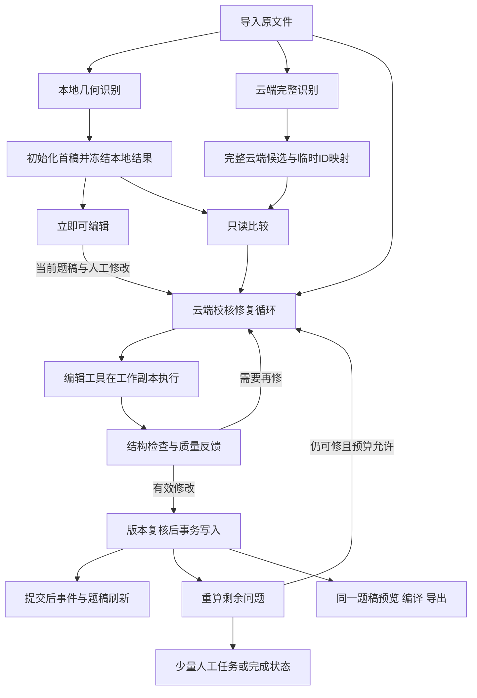

# 云端自动修复：代码级开发任务书

核对基线：`867600a`。此文件是可直接交给执行 Agent 的任务书；新符号与数据结构均标为“新增”，并非当前已实现。任务书依据主代理读取和三名 Luna low 只读探索；未执行产品改造或重新跑产品验收。

## 0. 执行目标与授权

用户已经明确改变产品方向：本地快速出初稿，云端独立识别，云端校核调用编辑工具自动修复。只有系统解决不了的剩余问题交给用户。原 A34 文档中的“模型仅能建议”“只能答案级”“必须逐项接受”不再约束这次改造。

执行本任务，不要止步于重新写设计。依以下顺序完成相互可验证的提交，不需要每一步重新请求产品授权。保留现有事务、用户编辑保护和发布正确性；普通界面不新增版本、哈希、调用链或诊断页面。

本轮核心包括题干、选项、答案、题组与行内作答位置，不得只放宽答案自动填写就宣告完成。Reading PDF/DOCX 为验收范围；不重写本地几何识别，不扩建通用 Agent 平台。

## 1. 已核实的代码事实

| 落点 | 现状 | 本次处理 |
|---|---|---|
| `src-tauri/src/processing/scheduler.rs::run_job_inner`，约281行 | 本地识别与 `generate_cloud_reading_outline` 已并发；本地完成后先冻结，再调用 `set_item_status_ready` | 保留并发；把首稿初始化移动到冻结之前 |
| 同文件 `set_item_status_ready`，约1205行 | 已经调用 `migrate_single_item`，随后发布状态事件 | 修正“只有打开UI才播种”的旧描述：后台也播种，但时序太晚 |
| `library/migration.rs::migrate_single_item`，约155行 | revision优先、shadow兜底；已有稿还可能走旧shadow修复 | 抽取单纯的首次初始化，不能把兼容修复泛化为新稿覆盖 |
| `library/repository.rs::seed_canonical_ds`，117行 | SQL只填 `canonical_ds_json IS NULL` | 复用幂等写入条件 |
| `auto_pipeline.rs::generate_cloud_reading_outline`，1397行；`llm_suggestions.rs::make_cloud_paper_generation_input` | 第一遍模型仍产 `CloudReadingOutlineV1` | 升级为保留全文与富内容的完整候选 |
| `schema/recognition_v1.rs::RecognitionCandidateV1`，131行 | 扁平比较视图，没有完整passage；题干多为纯文本 | 继续用作差异索引，不把它冒充完整可渲染题稿 |
| `llm_gateway.rs::run_llm_gateway`，23行 | JSON请求/响应；没有原生 `tool_calls` 分发循环 | 新增明确的应用层工具协议与真实执行器 |
| `reconcile/commands.rs::run_recognition_cycle_core_with_channels`，约457行 | 比较、旧A3/A4、答案自动写入、保存结果耦合 | 拆出只读比较，新云端修复路径只有一个写入负责人 |
| `authoring_v2_commands.rs::apply_patch`，1102行 | 已有19类命令，包含改文本、内容、题组、选项、答案 | 复用领域命令，工具只开放子集 |
| `authoring_v2_commands.rs::validate_authoring`，1069行 | schema标识 + Rust反序列化 | 不把它当语义正确/可发布证明 |
| `ielts_grammar/quality.rs::validate_identifier_and_reference_closure`，427行 | 已有ID/引用闭合规则 | 提取复用，避免另写一套不同规则 |
| `library/repository.rs::apply_editor_commands_tx_with`，266行 | 事务、版本检查、requestId幂等、附加写入回调 | 复用机器写入事务；增加可信编辑来源和操作影响范围 |
| `reconcile/adjudicate.rs::undo_patch_for`，726行 | 只会撤销 `setAnswer` | 新的结构自动修复需要整批、按目标的before/after记录 |
| `ExamWorkspacePage.tsx`，约95行 | 处理事件到来且无待保存修改时才reload | 补充延后刷新，防止后台改完而画布不更新 |
| `authoring_v2_commands.rs::check_publish_preflight`，391行 | 已返回editVersion；尚未执行实际导出后面的编译检查 | 复用版本字段，将可纯计算的发布检查统一 |

行号用于初始定位；发生并发提交后按符号定位并核对diff归属。

## 2. 数据流：保留三条职责，只有一个写入出口



区分三个数据对象：`localSnapshot`是不可变识别证据；`cloudCandidate`是独立候选；`canonical`是当前权威稿。修复回合另持`readVersion/readSnapshot`作为并发判断依据。不能把用户已编辑的canonical重新投影成“原始本地识别结果”。

## 3. 第一个提交：首稿初始化与冻结顺序

修改：`processing/scheduler.rs`、`library/migration.rs`，必要时`library/repository.rs`。

新增内部helper `ensure_initial_canonical`（建议名）：从已成功产出的本地artifact取得初稿，调用seed-if-empty；已有稿直接保留。抽取并复用revision/shadow选择逻辑，不复制转换器，不启动 `repair_shadow_seed` 覆盖路径。

`run_job_inner` 顺序固定为：

```text
await local_result
→ ensure_initial_canonical（错误向上传递）
→ 获取相互一致的DS与editVersion，保留原始本地识别结果
→ freeze_local_candidate_snapshot
→ 发布“可以编辑”事件
→ 收取已经并行运行的云端结果
→ 云端修复
```

若工作区曾提前播种或用户已经编辑，仍使用原始本地artifact作本地证据，当前DS作修复基线；不能把两个对象混成一个。读取DS与版本须来自同一次数据库读取，冻结函数不得读取新DS却贴旧版本。失败不使用0伪装有效版本。

`set_item_status_ready` 收敛为更新状态/事件；旧数据按需迁移入口可以保留。取消和lease丢失继续阻止后续写入。修复循环继续使用已修好的 `run_cycle_in_blocking_boundary`。

验收：无云和有云分别导入新文件，停留题库不打开工作区也能建立首稿和批次；立即打开、延迟打开结果一致；重复初始化不覆盖用户编辑。

## 4. 第二个提交：可信机器编辑入口

修改：`library/repository.rs`、`library/schema.rs`、`library/commands.rs`、`authoring_v2_commands.rs`。新增 `cloud_repair/tools.rs` 并注册模块。

### 4.1 编辑来源与影响范围

新增后端内部 `EditOrigin::{Human,CloudRepair,Undo}`。由调用入口决定，不能从模型JSON或前端任意字段取值。保留现有人工API的默认Human行为。

为每类允许的命令计算 `EditFootprint`（建议名）：读依赖、写目标和所有被替换/删除的子树。setAnswer必须覆盖answerKey对应项及slot；题组整体替换必须包含组内题干、选项、responseGroups、槽位和答案。索引用稳定ID或语义目标，不用会因排序变化的数组下标。

现有 `mark_command_target_user_edited` 只处理nodeId；`rules::node_provenance`也只找id。不能把这两者直接当完整保护。为人工命令持久化准确的保护目标；建议在 `library_items_v2` 增加内部 `protected_edits_json`，同事务更新，旧稿从已有user_edited标记及可用人工日志导入。旧日志包含自动识别写入，不能一律标成Human；无法识别来源时保守保护目标。它不依赖仅保留200条的journal长期存活。

CloudRepair入口检查footprint与人工保护目标是否相交，覆盖父对象也必须检查其子对象；返回具体受保护目标给模型，允许它缩小修复范围。人工在模型等待期间的新编辑，由提交时baseVersion检查挡住；重新读取后再修，不盲重放旧补丁。不同目标的已保存人工改动不应导致整卷永远停止修复。

模型不得提交 `preserveProvenance`、`restoreProvenanceStatus`、provenance属性、quality、audit、reviewState、源文件路径或发布通过标记。保留内部旧撤销兼容入口；可信代码可以在patch适配层设置preserve语义，但不让模型决定身份。

### 4.2 复用命令，补一个结构原子操作

工具内部复用：`replaceText`、`replaceContent`、`insertNode`、`moveNode`、`deleteNode`（保留槽位保护）、`setAnswer`、`setTaskType`、`setQuestionExpression`、`setResponseCardinality`、`setResponseGroup`、`setOptionBank`、`insertAnswerSlot`。

`setNodeAttrs`只开放本轮需要的展示/交互属性；不能把现有宽白名单原样给模型。`resolveIssue`完全不开放，防止靠标记resolved/ignored代替修复内容。

现有 `setResponseGroup` 只能替换已有组，`replaceContent`禁止丢失answer_slot。新增一个 `upsertTaskGroupBundle`（建议名）处理确有需要的新增/整体结构修复：一次提交题组、该组所属answerSlots与answerKey及插入位置，后端分配/映射ID，校验跨组引用与旧槽位去向，再整组应用。不要让模型用几十个独立调用穿过半成品状态。新资产只能引用已验证的资源目录项；缺失资源保留人工任务，不让模型编造文件地址。

### 4.3 保存、幂等、撤销

网络请求期间不持数据库事务。每个有效编辑批次：工作副本试算→短事务复核版本/取消/有效run→写题稿、修复记录、剩余问题、event_seq→commit后发事件。异常整批回滚。

扩展现有 `editor_journal_v1`，记录可信origin、repairRunId、受影响对象before/after与实际提交结果；字段名可采用`edit_origin/repair_run_id/change_json/result_json`。在`library/schema.rs`追加迁移，不改历史DDL。优先保存受影响根对象，不把每个回合都存成整卷历史版本。

requestId由后端用run/round/toolCall关联生成；重试同一调用复用ID，内容不同不能复用；命中日志返回原结果。跨进程重启由已有队列重取当前稿、重算，不依靠模型会话内存恢复写入。

撤销整个修复run时，将每个目标的首个before和最后after合并；仅当当前目标仍等于after且未被用户修改，才允许回滚这些目标。保留其他目标的新修改；不整份恢复旧DS。撤销、状态、质量重算同事务。有效撤销记录不得被普通200条裁剪提前删除；记录已回收则如实禁用撤销，不提供假按钮。不新增历史版本页面。

## 5. 第三个提交：第一遍云端输出完整候选

修改：`auto_pipeline.rs`、`llm_suggestions.rs`、`llm_gateway.rs`、`reconcile/candidate.rs`、`reconcile/store.rs`；新增 `schema/cloud_repair_v1.rs`（候选与工具消息共用一个新增契约文件），并在`schema/mod.rs`注册。

新增 `generate_cloud_authoring_candidate` / 网关命令 `generate_authoring_candidate`（建议名）。新主链替代 `generate_cloud_reading_outline`；旧命令留作兼容测试，不在同一次导入重复调用两种识别。

完整候选包含passage、富内容instructions/stimulus/prompts、选项库、responseGroups、answerSlots、answerKey、原文定位和无法读取的区域。内部标准化结果复用 `IeltsAuthoringIRV2` 与 `ContentNodeV2`；JSON形状依据现有 `contracts/ielts-authoring-ir-v2.schema.json`、`contracts/content-doc-v2.schema.json` 的内容子结构，不另造一套题型模型。

模型负责识别内容及临时引用；job/source身份、audit、quality、review状态、稳定ID由后端生成或计算。新候选保存在独立候选artifact，不调用seed或覆盖canonical。现有 `RecognitionCandidateV1`保留为比较用投影，完整富内容不能在扁平化时丢掉。

云端首遍仍与本地并发，所以模型先用临时ID自洽引用；本地完成后，由后端按来源文件/题号/题组范围进行唯一映射并重写所有引用。现有题目尽量复用canonical ID，新增节点由后端生成。映射不唯一时请修复回合结合原文件决定，不能任取第一个。`expand_natural_cloud_shape` 的“带taskId/taskType就透传”仅可保留在旧兼容解析，不能授予新工具写入权限。

复用 `main_source_for_cloud`、`prepare_cloud_source_evidence`、`data_url_for_pdf`、`append_pdf_images_to_content`：PDF附件/分页图，DOCX独立提取文本；需要附上用户提供的答案文件和后端登记的资源索引。不得用本地识别结果冒充原文。扫描件页图不可用、DOCX图表证据不完整时说明未覆盖的区域。

没有标准答案时可以保留unresolved；从原文/答案文件提取值不等于“发明答案”，因此不能继续沿用A3“本地空值不送模型”的限制。自动解题并生成答案不是本轮转换修复范围。

## 6. 第四个提交：云端校核真正执行工具

新增 `cloud_repair/mod.rs` 编排；复用第二步的 `cloud_repair/tools.rs`。修改 `llm_gateway.rs`、`llm_suggestions.rs`、`auto_pipeline.rs`、`reconcile/commands.rs`、`processing/scheduler.rs`。

### 6.1 采用应用层JSON工具调用，先不改造供应商SDK

现有网关只读`message.content`，没有native tools协议。本轮明确采用模型JSON工具消息→Rust分发→结果回传的闭环，是真实执行编辑工具，不是JSON建议卡。这样继续兼容目前的OpenAI-compatible服务。不要同时实现第二套native function calling。

新增 `repair_authoring_step` 网关命令，每次返回一个工具调用或finish。允许工具：

| 工具 | 输入 | 返回/作用 |
|---|---|---|
| `read_draft` | section/task/targets选择器 | 当前DS片段、稳定ID、editVersion、保护目标、当前质量问题 |
| `read_source` | 后端sourceFileId与页范围/文本定位 | 原文/页图，附在下一次模型请求；不得访问任意路径 |
| `apply_edits` | 基于本轮快照的一批领域命令、原文依据 | 真执行试算和写入；返回applied/rejected、editVersion、具体错误、剩余问题 |
| `finish` | unresolved目标及简短解释 | 后端最终重算，不信任模型声称“全部通过” |

首轮直接提供原文证据、完整候选、当前DS和比较结果，减少无意义读取。大文件按题组读取；模型必须看到整个文档的范围索引，不能只看到已经发现的差异就宣称整卷核验完成。

示例仅表示新增协议，`slot-27`需由真实read结果提供：

```json
{
  "callId": "call-1",
  "tool": "apply_edits",
  "arguments": {
    "baseVersion": 7,
    "commands": [
      {"op": "setAnswer", "slotId": "slot-27", "value": {"kind": "text", "values": ["example"]}}
    ],
    "evidence": [{"sourceFileId": "answer-source", "pageIndex": 1, "quote": "27 example"}]
  }
}
```

Rust返回的observation使用匹配callId并记录真实结果，下一轮模型可以依据具体错误调整命令。证据结构有效不等于内容一定正确；模型负责语义判断，后端验证来源归属、可访问性、页范围、引用关系和操作有效性。

### 6.2 运行与旧A3/A4的关系

从 `run_recognition_cycle_core_with_channels` 提取 `prepare_reconciliation`（新增建议名）：读取两路候选、做确定性比对、产出修复上下文，不调用模型、不自动写入。可复用`reconcile_batch`，但必须显式关闭两个旧模型runner并禁止执行其auto_apply_candidates。

新云端主链采用“完整识别→一个修复循环”。旧A3/A4模型调用不在其前后再运行；证据抽取/答案形状对齐/错误分类可复用。未启用云端时保留已验证的本地路径。不要仅放宽 `auto_apply_eligible`：该函数仍然只覆盖答案，不能承担本任务。

修复loop建议伪代码：

```text
context = prepare_reconciliation(localSnapshot, cloudCandidate, currentCanonical)
for turn in bounded_budget:
    check_cancel_and_run_ownership()
    message = gateway.repair_authoring_step(context, observations)
    observation = execute_allowed_tool(message, trusted_context)
    append_observation(observation)
    if committed: emit_committed_update()
    if finish / budget_exhausted / repeated_no_progress: break
return recompute_remaining_tasks_from_current_canonical()
```

重试已有题稿时只重新进入云端修复，不重跑会报`editable_draft_exists`的本地导入管道。沿用`retry_processing`入口，按已持久化任务阶段/repair状态路由到已有canonical的repair分支；`queue::retry`返回false时不得谎报重新入队。首次runId持久化，进程恢复复用它；用户明确发起新一轮时才分配新runId。

默认上限可先定6个模型回合，另设整次超时；所有读取、格式纠正均计入预算。连续两次相同无效编辑或重复读相同内容且无新信息时停下。HTTP重试计入总时间预算，不叠加旧A3/A4的各2次调用。使用现有cloud permit限制实际模型请求，并保留blocking执行边界；取消后即使HTTP迟到返回，也不能提交。

### 6.3 校验分层，避免“有一个问题就完全修不动”

每次apply_edits：clone当前稿→执行整批补丁→schema解析→复用ID/引用闭合检查→重算派生instructionSignature与质量→必要的运行时编译诊断→提交或返回错误。

结构非法或引入新的引用破坏则整批拒绝。原稿其他题组已有缺答/未解问题不应阻止当前题组的有效修复；校验以受影响闭合范围和相对原稿新增的机械错误为依据，不要求每次局部编辑都让全卷达到发布标准。程序校验不能证明语义正确，这部分由云端结合原文负责。

重用 `ielts_grammar/quality.rs::validate_identifier_and_reference_closure`，必要时抽为返回诊断的共享函数；不要复制常量/规则。结构修复完成后用 `reading_source_v2::compile_reading_source_v2`检查实际runtime；编译失败的具体目标回给模型，不能只给“编译失败”。

## 7. 第五个提交：剩余问题和真实完成状态

修改：`reconcile/commands.rs`、`reconcile/store.rs`、`schema/recognition_v1.rs`、`ielts_grammar/quality.rs`、`authoring_v2_commands.rs`、`processing/scheduler.rs`。

新修复摘要放入现有批次记录的一个`repair_json`字段（追加migration），建议形状：

```text
repair: {
  status: running | completed | needs_attention | unavailable | cancelled,
  editVersion,
  appliedCount,
  remainingTasks: [{userTaskId, targetIds, questionNumbers, message, action, blocking}],
  undoAvailable
}
```

userTaskId是用户任务标识，与题组taskId区分。现有`chains`保留作兼容诊断，普通文案以repair状态和当前剩余问题为准；修复未运行时不能显示completed。

修复前差异保留内部证据；有效修改提交后按当前canonical、源证据和本次已执行结果重算剩余任务，不能再次比较冻结本地稿而把已修项复活。模型未解决的内容疑问与程序校验问题都要保留；“校验器没报错”不是自动消除内容疑问的理由。

特别处理 `validate_recognition_blockers`：当前会直接把原始`recognitionBlockers`重发为阻塞。针对被修复的目标重新判断其条件；内容条件已满足则移除对应旧阻塞，无法重新确认的来源覆盖问题保留。不能清空全卷blockers，也不能允许模型调用resolveIssue糊过去。

`refresh_quality_report`会保留旧resolution标记。对本次受影响的目标重置过期resolution，再重新评价；有效的其他人工处理保留。

`check_publish_preflight`已经返回editVersion，复用它。抽取当前稿纯检查，让预检、修复最终检查与实际导出使用相同schema/quality/runtime规则；资源实际落盘与hash绑定仍由发布执行。不要切回要求全局humanVerified的旧文件发布路径。模型不能填写“发布通过”。

批次状态、内容和剩余任务一起提交，JSON artifact只作诊断副本；文件日志失败不伪报数据库事务未提交。摘要丢失或旧版日志重启时从已提交稿和journal重建。

## 8. 前端交接：最小接线，不扩建诊断UI

后端先冻结repair返回契约，前端独立提交以下文件：

1. `src/api/recognitionClient.ts`：读取repair字段，兼容旧批次；修复进行中不把中间差异计入用户待办。
2. `src/api/processingClient.ts`：复用`processing://item-updated`，携带/透传提交后的editVersion；每次内容提交增加stateVersion，避免被现有去重丢弃。
3. `src/features/editor/useCanonicalEditor.ts`与`ExamWorkspacePage.tsx`：有未保存命令时记录pendingRemoteVersion，不直接reload覆盖；待保存完成后读取新版本。保存发生冲突时保留本地输入并调用已存在的目标级重放逻辑，仅不冲突部分自动重放；重叠内容保留用户输入并明确待处理，不能默默丢弃。
4. `RecognitionPanel.tsx`、`recognitionDecisions.ts`、`actionableIssues.ts`、`userTasks.ts`：状态收敛为正在修复/已完成/剩余任务；以稳定目标+问题种类合并质量和模型剩余问题，不以文案或单纯总数清零判断完成。保留一个本轮修复撤销入口，走Rust批次撤销，不挪用前端本地undoStack。

机器每个回合已保存后可增量刷新；最后一个事件因dirty未处理也必须在dirty清空后兑现。原有两分钟轮询上限不能成为长任务永远不刷新状态的原因。

发布读取当前DS与版本快照的路径已经存在（`nas_package_v2::publish_items_core`）；沿用。内部对预检版本失效自动重新检查，不要求用户理解版本或手动管理冲突基线。

## 9. 验证与运行顺序

先跑每一步新增的目标测试，再跑总检查；未通过的上游不要反复启动整套长E2E。

```powershell
# 项目根目录 F:\workspace\PDF2Test
cargo test --manifest-path src-tauri/Cargo.toml --lib cloud_repair
cargo test --manifest-path src-tauri/Cargo.toml --lib --no-fail-fast
cargo check --manifest-path src-tauri/Cargo.toml --all-targets
npm run check
npm test
npm run build:app
```

`cloud_repair`测试筛选名为新增约定，必须检查确实执行了用例，不能0个用例当通过。

复用`tauri-cdp-controlled-service.mjs`的真实进程/网关/IPC框架与`scripts/controlled-llm-service.mjs`，新增确定性完整候选和工具对话场景。建议独立入口 `scripts/e2e/tauri-cdp-cloud-repair.mjs`，不让旧“必须出现采用按钮”的断言反过来锁死新产品行为。

新脚本实现后运行：

```powershell
node scripts/e2e/tauri-cdp-cloud-repair.mjs --keep
npm run e2e:chain
npm run e2e:nas-contract
```

`--keep`为新脚本应支持的诊断参数。报告如实记录启动参数；CDP关闭GPU/沙箱的结果不能称作普通桌面默认启动已验证。NAS合约脚本与实际学生runtime加载分别交证据，契约通过不能替代学生端运行。

必须覆盖：

- 首稿未打开UI也可初始化、冻结和启动修复；用户提前打开无竞速。
- 现有29处建议样本：读真实DB前后diff，能自动解决的项目无需点击；保留无法解决的真实原因，不用“卡片数量变少”替代内容修复。
- 至少一条答案、一处重复/错误题干、一组选项、一个题组/行内slot结构修复，经工具实际落库并重开保持。
- 首轮错误引用被拒，第二轮收到真实错误后修正成功；未知工具/越权字段不执行。
- 人工修改答案、题干、选项库；模型返回迟到结果时均不覆盖，包括替换父题组的情况；未保存的前端输入也不丢。
- 重复工具调用、版本变化、取消、进程中断：不重复写、不假完成，已提交结果可恢复。
- 缺答案源、图像证据不可读、模型拒答/失败/预算耗尽：保留题稿并产生准确状态，不编造标准答案。
- 修复后原始blocker不会无条件复活；仍未解决的内容疑问不会被程序校验通过掩盖。
- 撤销整个自动修复后结构与答案一起恢复，保留无关人工修改；有重叠人工修改时不强行恢复旧值。
- PDF和DOCX分别经过真实导入—自动修复—编辑—保存重开—学生预览—导出—实际学生端加载；受控服务和真实供应商结果分开报告。

真实云凭据不可用时完成受控产品路径，并明确剩余验证缺口；不得声称模型真实识别质量已经验收。

## 10. 交付次序与停止条件

推荐提交顺序：①首稿与冻结时序；②机器写入/保护/撤销；③完整云端候选；④工具执行循环和新主链接入；⑤当前稿剩余问题与发布检查；⑥前端接线与真实产品验收。

每个提交先验证本段，不因局部通过停止整个已授权任务。最终交付：文件清单、数据流实现位置、真实自动修复前后样本、剩余人工任务原因、并发编辑与撤销证据、发布/学生端验证边界。

同步更新A34与当前活动计划的旧proposal-only表述，保留历史决策记录但标为已由本轮授权替代。仅提交本人归属文件，不暂存memory与他人在途改动。

禁止以“新增了校核接口但仍只返回建议”“模型改了quality标志”“用户逐项点击后正确”“CLI/schema全部通过”代替本任务完成。
